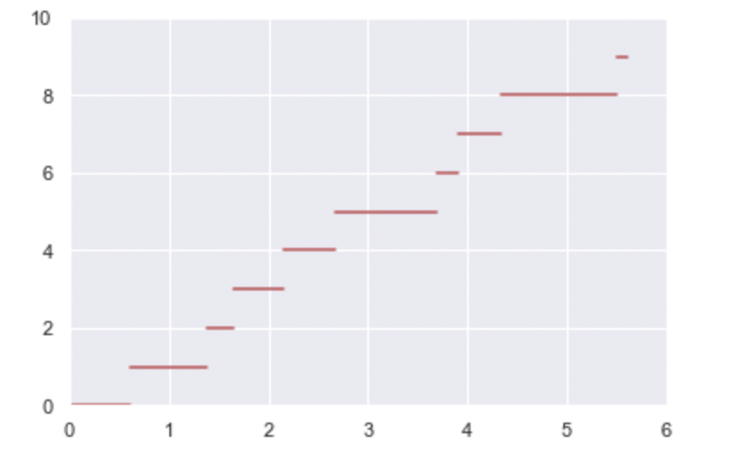
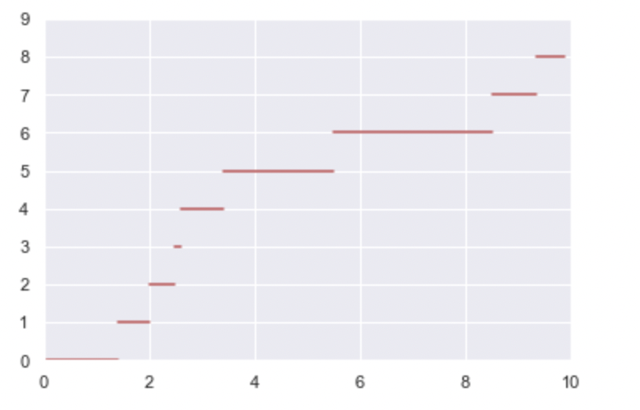
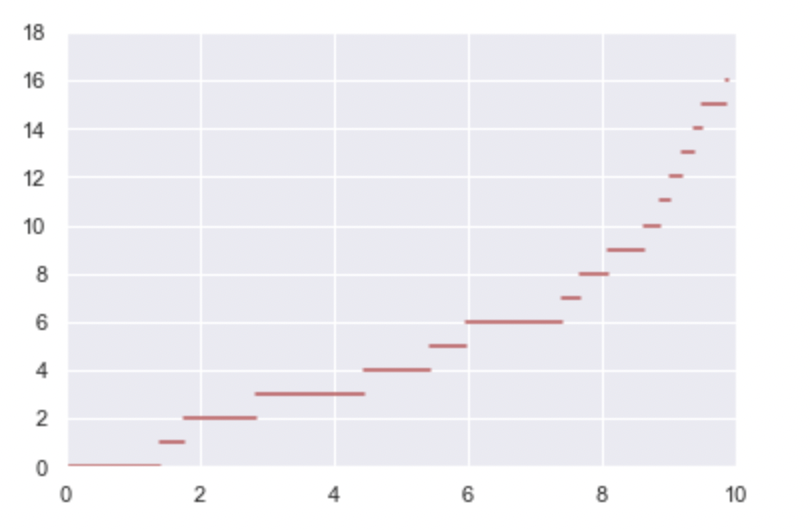
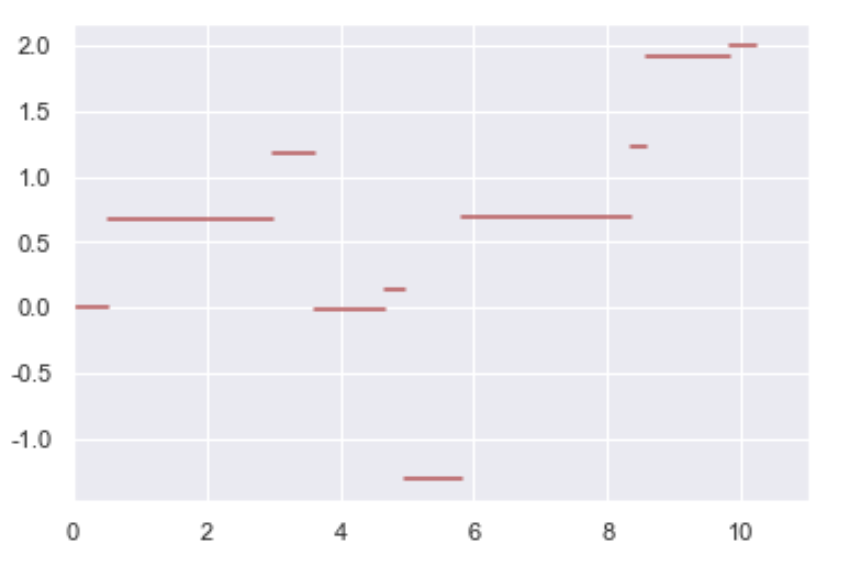

## Poisson 过程的定义

<!-- 两个等价的定义，揭示了Poisson过程的主要性质 -->

Poisson 过程是一个计数过程，$N(t)$ 表示到时刻 $t$ 为止发生事件的数量。参数为 $\lambda$ 的 Poisson 过程的定义是：

定义一：

+ $N(0) = 0$

+ $N(t)$ 具有独立增量性，即 $N(t+s) - N(t)$ 与 $N(t)$ 独立

+ $N(t)$ 具有平稳增量性，即 $N(t_2 + s) - N(t_1 + s)$ 与 $N(t_2) - N(t_1)$ 具有相同分布。且 $N(t+s) - N(s)$ 服从参数为 $\lambda t$ 的 Poisson 分布，即
  $$
  P(N(t+s) - N(s) = n) = e^{-\lambda t} \frac{(\lambda t)^n}{n !}
  $$


定义二：

+ $N(0)=0$
+ $N(t)$ 有平稳增量和独立增量
+ $P(N(h)=1) = \lambda h + o(h)$
+ $P(N(h) \geq 2) = o(h)$

定义二暗含 Poisson 过程在极短的事件内至多发生一次，

此外，Poisson 过程也是一种特殊的 Renewal Process。令 $S_n = \displaystyle\sum_{i=1}^n X_i$，其中 $X_i, \mathrm{i.i.d}$ 服从参数为 $\lambda$ 的指数分布，则其对应的计数过程 $N(t) = \sup\, \{n : S_n \leq t\}$ 就是 Poisson 过程。

## 到达时间间隔与等待时间的分布

记 $T_1$ 为第一个事件的发生时间，则 $P(T_1 > t) = P(N(t) = 0) = e^{-\lambda t}$.

记 $T_2$ 为第一个事件发生到第二个事件发生的时间间隔，那么：

$$
P(T_2 > t + s \mid T_1 = s) = P(N(t+s) - N(s) = 0) = P(N(t) = 0) = e^{-\lambda t}
$$

所以 $T_2$ 与 $T_1$ 独立，且它们都服从参数为 $\lambda$ 的指数分布。

另一个有趣的事情是 $S_n = \displaystyle\sum_{i=1}^n T_i \sim \Gamma(n, \lambda)$

注意到

$$
P\left(S_{n} \leqslant t\right)=P(N(t) \geqslant n)=\sum_{j=n}^{\infty} \mathrm{e}^{-\lambda t} \frac{(\lambda t)^{j}}{j !}
$$

求导有：

$$
f_{S_n}(t)=-\sum_{j=n}^{\infty} \lambda \mathrm{e}^{-\lambda t} \frac{(\lambda t)^{j}}{j !}+\sum_{j=n}^{\infty} \lambda \mathrm{e}^{-\lambda t} \frac{(\lambda t)^{j-1}}{(j-1) !}=\lambda \mathrm{e}^{-\lambda t} \frac{(\lambda t)^{n-1}}{(n-1) !}
$$

小结：Poisson 分布事件的到达时间间隔服从参数为 $\lambda$ 的指数分布，第 $n$ 个事件到达的时刻 $S_n$ 服从 $\Gamma(n, \lambda)$。独立增量性和平稳增量性暗含时间间隔的无记忆性！

## 到达时间的分布

给定 $N(t)=n$，则 $n$ 个事件的到达时间 $S_1, S_2, \dots, S_n$ 与 $n$ 个独立的 $(0, t)$ 上均匀分布随机变量的次序统计量有相同的分布。


## Poisson 过程的分解

如果事件分为两类，I型或者II型，在 $s$ 时刻的概率分别为 $p(s), 1-p(s)$，那么泊松随机变量 $N(t)$ 可分解为 $N(t) = N_1(t) + N_2(t)$，其中 $N_1(t)$ 具有均值 $\lambda t \cdot \frac{1}{t}\int_0^t p(s)\mathrm{ds}$.

进一步，如果 $p(s)=p$ 是常数，那么 $N_1(t), N_2(t)$  是参数为 $\lambda t p, \lambda t(1-p)$ 的泊松过程，且二者是独立的。

<!-- 【infinite server queue】 -->

## 非时齐 Poisson 过程

非时齐的泊松过程允许到达速率是 $t$ 的函数，把平稳增量这个条件放松了。

+ $N(0)=0$,
+ $\{N(t), t \geqslant 0\}$ 有独立增量
+ $P(N(t+h)-N(t) \geqslant 2)=o(h)$
+ $P(N(t+h)-N(t)=1)=\lambda(t) h+o(h)$

令：

$$
m(t)=\int_{0}^{t} \lambda(s) \mathrm{d} s
$$

则 $N(t+s) - N(t)$ 服从均值为 $m(t+s) - m(t)$ 的泊松分布。

对于非时齐泊松分布，其到达时间间隔不一定是独立同分布的。

注意到：

$$
P(T_1 > t) = P(N(t) = 0) = e^{-m(t)}
$$

<!-- 【补全】 -->

$$
f_{S_{n}}(t)=\lambda(t) e^{-m(t) \frac{[m(t)]^{n-1}}{(n-1)!}}
$$


## Poisson 分布的正态近似

当 $\lambda \to \infty$ 时，$\operatorname{Possion}(\lambda) \to_d \mathcal{N}(\lambda, \lambda)$

---

>  Poisson 分布：$P(X=k) = \displaystyle e^{-\lambda} \frac{\lambda^k }{k!}$
> 
>  Gamma 分布 $\Gamma (\alpha, \lambda)$：$f(x)=\displaystyle \frac{\lambda^{\alpha} x^{\alpha-1}}{\Gamma (\alpha)}e^{-\lambda x} .\quad (\alpha > 0)$

---


## 指数分布

指数分布是一种连续型的分布，参数为 $\lambda$ 的指数分布的概率密度函数为

$$
f(x) = \lambda e^{-\lambda x}  \quad (x \geq 0)
$$

其累计分布函数为：

$$
F(x) = 1 - e^{-\lambda x} \quad (x \geq 0) \qquad 
\bar{F}(x) = e^{-\lambda x} \quad (x \geq 0)
$$

期望 $\mathbb{E}[X] = \displaystyle\frac{1}{\lambda}$，方差 $\operatorname{Var}(X) = \displaystyle\frac{1}{\lambda^2}$.

定义一个连续型**非负**随机变量的失效率函数为 $r(t) = \displaystyle\frac{f(t)}{1-F(t)} \simeq \lim_{\mathrm{d}t \to 0} {P}(X \in(t, t+\mathrm{d} t) \mid X>t)$. 指数函数的失效率函数为常数 $\lambda$.

失效率 $r(t)$ 可以解释为，生命分布为 $F$ 的个体活到 $t$ 岁且恰好在此年龄死亡的概率。

**失效率函数可以唯一决定原分布**：

$$
F(t)=1-\exp \left\{-\int_{0}^{t} r(x) \mathrm{d} x\right\}
$$

指数分布的几点性质：

+ 指数分布具有无记忆性，且是唯一具有无记忆性的连续型分布。
  $$
  \mathbb{P}\{X>s+t \mid X>t\}=\mathbb{P}\{X>s\} \quad \forall s, t \geq 0
  $$
  
  或者：
  $$
  \mathbb{P}\{X>s+t\}=\mathbb{P}\{X>s\} \mathbb{P}\{X>t\}\quad \forall s, t \geq 0
  $$

+ $n$ 个独立的参数为 $\lambda$ 的指数分布的和服从 Gamma 分布 $\Gamma (n, \lambda)$，其密度函数为：
  $$
  f(x) = \frac{\lambda^\alpha x^{1-\alpha}}{\Gamma(\alpha)} e^{-\lambda x}
  $$
  当 $n$ 是整数的时候，也可以叫做 Erlang 分布。


> 指数分布、Erlang 分布经常用于建模排队中的 service time. 除了此之外，还有 
>
> hyper-exponential 密度函数形式为 $f_{X}(x)=\sum_{i=1}^{n} f_{Y_{i}}(x) p_{i}$，其中 $Y_i \sim \operatorname{\lambda_i}, \;p_i$ 是一组离散概率分布。它的  coefficient of variation 比指数分布大。
>
> hypo-exponential 是若干个独立的指数分布之和，但不必是同分布的。如果 $X_1 \sim \operatorname{\lambda_1}, X_2 \sim \operatorname{\lambda_2}, \lambda_1 \neq \lambda_2$，那么：
> $$
> X_1 + X_2 \sim \frac{\lambda_1 \lambda_2}{\lambda_1 - \lambda_2} \left( e^{-\lambda_2 x } - e^{-\lambda_1 x} \right)
> $$
> Coxian 是不定个独立的指数分布之和。$Y=\sum_{j=1}^{N} X_{j}$
>
> 等


+ $X_i$ 服从参数为 $\lambda_i$ 的指数分布，则 $\min_i X_i$ 服从参数为 $\sum_{i} \lambda_i$ 的指数分布。
  $$
  P(\min_i X_i \geq t) = P(X_1 \geq t, \dots, X_n \geq t) = \bar{F}^n(t) = e^{- \sum_i \lambda_i t}
  $$

+ 如果 $X_1, \, X_2$  分别是参数为 $\lambda_1, \lambda_2$ 的指数分布，那么 $P(X_1 < X_2) = \displaystyle \frac{\lambda_1}{\lambda_1 + \lambda_2}$. （使用全概率公式）

  推论：${P}\left(X_{i}=\displaystyle\min_{j} X_{j}\right)=P\left(X_i < \displaystyle\min_{j\neq i} X_j\right)=\displaystyle\frac{\lambda_{i}}{\sum_{j=1}^{n} \lambda_{j}}$


## 泊松过程的模拟


### 齐次泊松过程（Homogeneous Poisson Process）

参数为 $\lambda$ 的泊松过程 $\{N(t), \; t \geq 0\}$ 是取整数值的连续时间随机过程。$N(t)$ 表示到时刻 $t$ 为止发生的事件个数，两次事件到达的时间间隔服从指数分布 $\operatorname{Exp}(\lambda)$。在 $T$ 时刻发生的事件数服从参数为 $\lambda T$ 的泊松分布。泊松过程在极短的时间内只会发生一次事件。

模拟泊松过程有两种方法，给定发生次数确定发生时间，或者 给定时间求发生次数和分布。

方法一：

给定泊松过程的事件次数，我们可以用 $n$ 个指数分布 $\operatorname{Exp}(\lambda)$ 的随机数 $X_i, i = 1, \dots, n$ 来得到 $n$ 个事件的发生时间 $S_{k}=\sum_{i=1}^{k} X_{i}, \quad k=1,2, \cdots, n$。

模拟并画出一条轨道的 Python 代码：

```python
lam = 1.5  # 参数为1.5的泊松过程
n = 10  # 事件次数为10
# 10 个参数为 lam 的指数分布随机数
r = np.random.exponential(1 / lam, size=n)
# 10个事件的发生时刻
t = np.hstack([[0], np.cumsum(r)])
# 画出
for i in range(n):
    plt.plot((t[i], t[i+1]), (i, i), c='r')
plt.xlim([0, np.ceil(t.max())])
plt.ylim([0, n])
```

一次运行的结果如下图：



方法二：

上面这个方法是指定发生的次数求时间，这个方法则是，给定时间 $T$，我们知道 $[0, T]$ 内事件发生的次数是一个参数为 $\lambda T$ 的随机变量，设这个随机变量是 $N$；现在已知时间 $T$ 内事件发生了 $N$ 次，根据泊松过程的性质，我们可以生成 $N$ 个独立的 $(0,1)$ 上均匀分布随机数 $U_1, U_2, \dots, U_N$，从小到大排序为 $U_{(1)}, U_{(2)}, \dots, U_{(N)}$，则 $\left(T U_{(1)}, T U_{(2)}, \ldots, T U_{(N)}\right)$即为时刻 $T$ 之前的所有事件的到来时间。

模拟并画出一条轨道的 Python 代码：

```python
lam = 0.5  # 参数为1.5的泊松过程
T = 10  # 时间到T
n = np.random.poisson(lam * T)  # T时间内发生的次数
# 生成n个[0, T]均匀分布随机数并排序
t = np.hstack([[0], np.sort(np.random.random(n) * T)])
for i in range(n):
    plt.plot((t[i], t[i+1]), (i, i), c='r')
plt.plot((t[i+1], T), (n, n), c='r')
plt.xlim([0, T])
plt.ylim([0, n])
```

一次运行的结果如下图：



### 非齐次泊松过程（Nonhomogeneous Poisson Process）

为了生成强度为 $\lambda(t),\: t \geq 0$ 的非齐次的泊松过程到时刻 $T$ 为止的状态，如果 $\lambda (t) $ 满足 $\lambda(t) \leq M, \: \forall t \in [0, T]$，则可以使用拒绝采样法，按照生成参数为 $M$ 的齐次泊松过程的方法去生成各个事件到来时刻，但是以 $\displaystyle\frac{\lambda (t)}{M}$ 的概率实际记录各个时刻。

模拟并画出一条轨道的 Python 代码：

```python
lam = lambda t : t / 3  # 非齐次泊松过程的强度函数
T = 10
M = 10
n = np.random.poisson(M * T)
r = np.sort(np.random.random(n) * T)
t = [0]
# 以 lam(t)/M 的概率保留每个时刻
t += list(filter(lambda x: np.random.random() * M <= lam(x), r))
for i in range(len(t) - 1):
    plt.plot((t[i], t[i+1]), (i, i), c='r')
plt.xlim([0, T])
plt.ylim([0, len(t)])
```

一次运行的结果如下图：




### 复合泊松过程（Compound Poisson Process）

复合泊松过程是一个复合的随机过程：
$$
W=\sum_{i=1}^{N(t)} Y_i
$$
当 $Y=1, a.s.$ 时，这个复合泊松过程就变成了普通的泊松过程。复合泊松过程每次“跳”的距离不再是常数 1，而是一个随机变量。这意味着我们可以用类似于模拟泊松过程的方法，来模拟复合泊松过程。所以，也有两种方法，以下仅展示方法一。

模拟并画出一条轨道的 Python 代码，以下令 $Y \sim \mathcal{N}(0, 1)$。

```python
lam = 1  # 参数为1的泊松过程
n = 10  # 事件次数为10
# 10 个参数为 lam 的指数分布随机数
r = np.random.exponential(1 / lam, size=n)
# 每次跳的幅度服从 N(0, 1)
y = np.random.randn(n)
# 10个事件的发生时刻
t = np.hstack([[0], np.cumsum(r)])
# 画出
j = 0
for i in range(n):
    plt.plot((t[i], t[i+1]), (j, j), c='r')
    j += y[i]
plt.xlim([0, np.ceil(t.max())])
```

一次运行的结果如下图：



