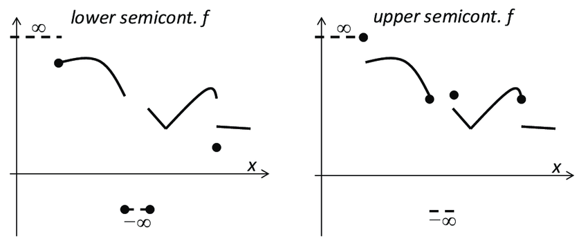

### 半连续 Semi-Continuity

半连续是对连续性的一种弱化，跟连续性类似，它有分析学上的定义，也有拓扑学意义上的定义。

**分析学意义**

称 $f$ 在 $\bar{x}$ 下半连续, 如果 $\displaystyle\liminf _{x \rightarrow \bar{x}} f(x)\geq f(\bar{x})$

称 $f$ 在 $\bar{x}$ 上半连续, 如果 $\displaystyle\limsup _{x \rightarrow \bar{x}} f(x) \leq  f(\bar{x})$

上（下）半连续函数是在各个点都上（下）半连续的函数。

**拓扑学意义**

Let $f$ be a real (or extended-real) function on a topological space. If
$$
\{x: f(x)>\alpha\}
$$
is open for every real $\alpha, f$ is said to be *lower semi-continuous*. If
$$
\{x: f(x)<\alpha\}
$$
is open for every real $\alpha, f$ is said to be *upper semi-continuous*.

最简单的例子是，开集的 indicator function $\mathbf{1}_A(x) = \begin{cases} 1 & x\in A\\ 0 & x \notin A \end{cases}$ 是下半连续的，闭集的 indicator function 是上半连续的。

$\mathrm{R}$ 上的半连续函数：

**等价定义**

$f: X \to \mathrm{\bar{R}}$ 是上半连续的等价于：

+ All superlevel sets $\{x \in X: f(x) \geq y\}$ with $y \in \mathrm{R}$ are closed in $X$.
+ The hypograph $\{(x, t) \in X \times \mathrm{R}: t \leq f(x)\}$ is closed in $X \times \mathrm{R}$.

$f: X \to \mathrm{\bar{R}}$ 是下半连续的等价于：

+ All sublevel sets $\{x \in X: f(x) \leq y\}$ with $y \in \mathrm{R}$ are closed in $X$.
+ The epigraph $\{(x, t) \in X \times \mathrm{R}: t \geq f(x)\}$ is closed in $X \times \mathrm{R}$.

在凸优化中，有时把闭函数定义为 epigraph 为闭集的函数，它与下半连续函数是等价的。

**性质**

+ $f$ 连续当且仅当它是上半连续和下半连续的。
+ 下半连续函数的和是下半连续的；上半连续函数的和是下半连续的。
+ $f$ 下半连续当且仅当 $-f$ 是上半连续的。
+ 紧集上的下半连续函数存在最小值；紧集上的上半连续函数存在最大值。两个联系起来就是紧集上的连续函数存在最值。

