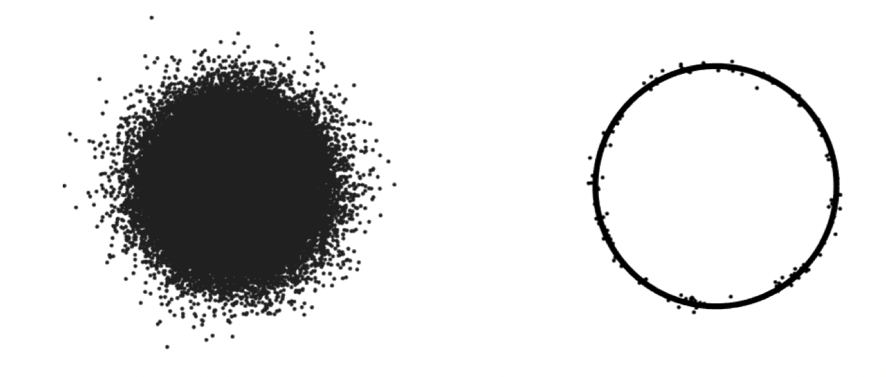

<!-- # Random vectors in high dimensions -->

本书第三章主要讲的是高维空间中的随机向量。

第二章介绍了随机变量的集中程度，自然我们会进一步关注随机向量的集中程度。本章研究的主要内容就是维数非常高的随机向量 $X = (X_1, X_2, \dots, X_n) \in \mathbb{R}^n$。数据科学中高维分布无处不在！

## Concentration of the norm

高维的随机向量 $X$ 的样本是欧式空间中的一个点，因此我们会用**到原点的欧式距离$\|X \|_2$来刻画它的集中程度**。

首先从最简单的随机向量考虑起，如果 $X=(X_1, X_2, ..., X_n)$ 各个分量都是独立零均值且单位方差的随机变量，则：

$$
\mathbb{E}\|X\|_{2}^{2}=\mathbb{E} \sum_{i=1}^{n} X_{i}^{2}=\sum_{i=1}^{n} \mathbb{E} X_{i}^{2}=n \\
$$

这说明大致上 $\lVert X \rVert_2 \sim \sqrt{n}$。 **如果 $X$ 的各个分量都是次高斯随机变量，那么这足以保证 $X$ 大致分布在以 $\sqrt{n}$ 为半径的球面附近了。** 此时成立不等式：

$$
\mathbb{P}\left\{\left|\|X\|_{2}-\sqrt{n}\right| \geq t\right\} \leq 2 \exp \left(-\frac{c t^{2}}{K^{4}}\right) \quad \text { for all } t \geq 0 \\
$$

这意味着，$X$ 的样本点都集中在半径为 $\sqrt{n}$ 的球面附近！

## Isotropic random vectors

不失一般性，只考虑那些零均值的随机向量，这时候它们的协方差矩阵表示为 $\mathbb{E}XX^T$。

协方差矩阵一定是一个半正定矩阵。高斯分布协方差矩阵的特征值和特征向量揭示了分布情况，在最大特征值对应的特征向量方向，分布得更加广泛一些。如果随机向量 $X$ 的协方差矩阵只有几个较大的特征值，而剩余的特征值都很小，说明该随机向量只在很小的几个维度包含信息。

定义 **Isotropic random vectors** 是那些零均值并且满足 $\Sigma=\mathbb{E}XX^T=\mathrm{I}_n$ 的随机向量。这种随机向量的各个分量之间没有相关性，但并不代表它们是独立的。对于一般的随机向量，可以用变换 $Z:=\Sigma^{-1/2}(X - \mu)$ 来标准化，这可以消除分量之间的相关性。

各向同随机向量有一个等价的定义：
$$
X \text{ is isotropic} \Longleftrightarrow \mathbb{E}\langle X, x \rangle ^2 = \|x \|_2^2  \;\; \text{ for all } x \in \mathbb{R}^n
$$
这说明，各向同随机向量投影到任何一个一维分量上都具有单位方差。

各向同随机向量只是一种抽象的存在，但是它所具有的性质非常让人惊讶，而这些性质都可以落到更具体的分布之上。

首先，是 $\mathbb{E}\| X\|_2^2=\operatorname{tr}(\mathbb{E}XX^T)=n$，这是一个显而易见的长度上的性质。

接着，**设 $X, Y$ 都是各向同随机向量，那么 $X, Y$ 的夹角，会呈现出随着维数 $n$ 的增加而趋于正交的特点**。

$$
\mathbb{E}\langle X, Y\rangle^{2}=\mathbb{E}_{Y} \mathbb{E}_{X}\left[\langle X, Y\rangle^{2} \mid Y\right] = \mathbb{E}\langle X, Y\rangle^{2}=\mathbb{E}_{Y}\|Y\|_{2}^{2} = n \\
$$

所以 $|\langle X, Y \rangle| \sim \sqrt{n},\, \|X\| \sim \sqrt{n}, \|Y\| \sim \sqrt{n}$，即有：$| \langle X, Y \rangle| \sim \displaystyle\frac{1}{\sqrt{n}}$。如果$X_i \sim X,\; Y_i \sim Y$，这两个高维空间中的样本点，随着维数的增加，其夹角的余弦值是趋于0的。

举个例子，当 $n$ 很大的时候，从 ${N}(0, \mathrm{I}_n)$ 中抽两个样本点，这两个点几乎是正交的。

最后是关于两个各向同随机向量距离的性质，结合上述两点，联系勾股定理不难注意到:  $\mathbb{E}\| X - Y \|_2^2 = 2n$。

 

接下来是各向同随机向量的例子：

+ 球面上的均匀分布：$X \sim \operatorname{Unif}\left(\sqrt{n} S^{n-1}\right)$

注意，该分布不包含球的内部。这是一个典型的，各分量不相关，但是不独立的随机向量。

> 它各向同的证明要用到曲线积分。

+ 高维对称伯努利分布：$X \sim \operatorname{Unif}\left(\{-1,1\}^{n}\right)$

+ 标准的多元正态分布：$g \sim  N\left(0, I_{n}\right)$

正态分布的一大特点就是不相关即独立。**另一个重要性质是，任意的多元正态分布投影在某条直线上，得到的仍然是正态分布，这是后续定义次高斯随机向量的出发点。**

**Similarity of normal and spherical distributions**

虽然低维的标准正态分布，给我们的感觉是，集中在原点附近的球内，但是，随着维数的增加，它的次高斯性开始显现了，本文最开始提到，$\| g\|$ 在 $n$ 很大的时候集中在半径为 $\sqrt{n}$ 的球面上。

$$
{N} (0, \mathrm{I}_n) \to \operatorname{Unif}\left(\sqrt{n} S^{n-1}\right)\: \text{ as }\: n \to \infty \\
$$

如上图所示，左边表示低维的标准高斯分布，右边表示高维的标准高斯分布。

另外两个例子，分别是用在信号处理和凸几何中的。一个是 *frame*，它是非常稀疏的离散各向同分布。另一个讲的是，对于$\mathrm{R}^n$中每个内点非空的凸集$K$，都可以对应一个零均值随机向量$X$。如果$\Sigma = \mathbb{E} XX^T$，那么$Z \sim \operatorname{Unif}\left(\Sigma^{-1 / 2} K\right)$是一个各向同随机向量。线性变换$\Sigma ^ {-1/2}$可以把凸集$K$的形状变得更加规整。

## Sub-gaussian distributions in higher dimensions

次高斯分布，本质是正态分布集中性质的推广，它的定义思想，来自正态分布的一条重要性质：投影在任意一个方向上都是正态分布，并且分布被这些投影所决定！

因此，**定义 $X$ 是次高斯随机向量，当且仅当对任意的 $x \in \mathrm{R}^n$，$\langle X, x \rangle$ 是次高斯随机变量**，且定义其次高斯模为：

$$
\|X\|_{\psi_{2}}=\sup _{x \in S^{n-1}}\|\langle X, x\rangle\|_{\psi_{2}} \\
$$

如果随机向量 $X=(X_1, \dots, X_n) \in \mathbb{R}^n$ 的各个分量都是次高斯随机变量，那么它自然能成为次高斯随机向量，此时有 $\| X \|_{\psi_2} \leq C \max \|X_i\|_{\psi_2}$ 。分量是 sub-gaussian $\Rightarrow$ 整体是 sub-gaussian。

对于任意的 $n$，可以找到常数 $C$，使得 $X \sim N(0, \mathrm{I}_n)$ 的次高斯模 $\|X \|_{\psi_2} \leq C$。

## Application: Grothendieck’s inequality and semidefinite programming

### Grothendieck’s inequality

令 $A = [a_{ij}] \in \mathbb{R}^{m \times n}$，$A$ 可以看做是 $(\mathbb{R}^m, \| \cdot \|_p)$ 到 $(\mathbb{R}^m, \| \cdot \|_q)$ 的一个线性算子，这里 $0 \leq p, q \leq\infty$，在这种意义下，$A$ 的 $p \to q$ 范数是：
$$
\| A\|_{p \to q} = \max_{\| x\|_p = 1} \|A x\|_q
$$
注意到 $\| A\|_{p \to q} \leq \|A\|_{\infty \to 1}$ 。

一种计算 $\|A \|_{\infty \to 1}$ 的方法是解一个整数二次规划问题：
$$
\begin{aligned}
\max \;& \sum_{i, j} a_{i j} x_{i} y_{j} \\
\text {s.t. } & (x, y) \in\{-1,1\}^{m+n}
\end{aligned}
$$
它可以放松为以下的半定规划：
$$
\begin{aligned}
\max \;& \sum_{i, j} a_{i j}\langle x^{(i)}, y^{(j)}\rangle \\
\text{s.t. }\, & x^{(1)}, \ldots x^{(m)}, y^{(1)}, \ldots, y^{(n)} \text{ are unit vectors in } \left(\mathbb{R}^{d},\|\cdot\|_{2}\right)
\end{aligned}
$$
那么，一个随之而来的问题是，这样的近似效果能有多好？

Grothendieck’s Inequality 回答了这个问题，存在常数 $C$ 使得对任意的 $A \in \mathbb{R}^{m \times n}$ 和任意的 Hilbert 空间 $H$，成立：
$$
\|A\|_{\infty \to 1} \leq \max _{\substack{\text { unit vectors } \\ x^{(i)}, y^{(j)} \in H}} \sum_{i, j} a_{i j}\langle x^{(i)}, y^{(j)}\rangle_{H} \leq C\|A\|_{\infty \rightarrow 1}
$$
Grothendieck’s constant 指的就是最小的满足上式的常数 $C$，其具体的值仍然是一个开放问题，但它大致介于 $\pi/2 \approx 1.57$ 到 $\pi/(2\ln (1+\sqrt2)) \approx 1.78$ 之间。

**Symmetric matrices**

设 $A$ 是一个对称的半正定矩阵，如果对于任何 $x_i \in \{-1, 1\}$，都有：
$$
\left| \sum_{i,j} a_{ij} x_i x_j \right| \leq 1
$$
则对任何 Hilbert 空间 $H$ 和任意单位向量 $u_i, v_j \in H$，成立：
$$
\left| \sum_{i, j} a_{ij} \langle u_i, v_j \rangle \right| \leq 2C
$$

$C$ 是 Grothendieck’s constant。

#### Grothendieck’s identity

令 $x$ 与 $y$ 是 $(\mathbb{R}^d, \|\cdot \|_2) \; (d \geq 2)$ 上的单位向量，$z$ 是单位球上随机一点，则：
$$
\mathbb{E}[\operatorname{sign}(\langle x, z\rangle) \operatorname{sign}(\langle y, z\rangle)]=\frac{2}{\pi} \arcsin (\langle x, y\rangle)
$$
其中 $\operatorname{sign}(x) \in \{-1, 1\}$ 。

实际上，给定 $x$ 和 $y$，问题本质上是分析随机给出一个超平面，$x, y$ 位于超平面同侧或是异侧的概率。

设 $\theta$ 是 $x, y$ 的夹角（锐角），则：
$$
\begin{aligned}
\mathbb{E}[\operatorname{sign}(\langle x, z\rangle) \operatorname{sign}(\langle y, z\rangle)] & = \mathbb{P}(x, y\text{ lie in same half}) − \mathbb{P}(x, y \text{ lie in different halves}) \\
& = 1 - 2 \mathbb{P}(x, y \text{ lie in different halves}) \\
& = 1 - \frac{2\theta}{\pi} \\
& = \frac{2}{\pi} \arcsin (\langle x, y \rangle )
\end{aligned}
$$
**modified version of Grothendieck’s Identity**

如果 $g \sim N(0, \mathrm{I}_n)$，$u, v$ 是单位向量，则：
$$
\mathbb{E} [\operatorname{sign}\langle g, u\rangle \operatorname{sign}\langle g, v\rangle] =\frac{2}{\pi} \arcsin \langle u, v\rangle
$$

### Semidefinite relaxation

对于如下 NP-hard 的优化问题：
$$
\begin{aligned}
\max \; & x^T A x \\
\text{s.t. } & x_i \in \{-1, 1\} \;\text{ for } i = 1, \dots, n
\end{aligned} \tag{1}
$$
它有等价的形式：
$$
\begin{aligned}
\max \; & \langle A, xx^T\rangle \\
\text{s.t. } & x_i \in \{-1, 1\} \;\text{ for } i = 1, \dots, n
\end{aligned}
$$
用矩阵变量 $X$ 替代 $xx^T$，$x_i=\pm 1$ 推出 $X$ 的对角线元素都是1，原问题进一步的转换形式是：
$$
\begin{aligned}
\max \; & \langle A, X\rangle \\
\text{s.t. } & X_{ii}=1 \;\text{ for } i = 1, \dots, n \\
& \text{rank}(X) = 1
\end{aligned}
$$
$X$ 是一个秩一的半正定矩阵。记 $\mathrm{I}_i$ 表示对角线第 $i$ 个元素为1、其它元素为0的矩阵，则 $X_{ii}= 1 \Leftrightarrow \langle \mathrm{I}_i, X \rangle = 1$，于是得到原问题的 semidefinite form 的表达：
$$
\begin{aligned}
\max \; & \langle A, X\rangle \\
\text{s.t. } & \langle \mathrm{I}_i, X\rangle = 1  \;\text{ for } i = 1, \dots, n \\
& X \in \mathrm{S}^n_{+}, \; \text{rank}(X)=1
\end{aligned}
$$
上式与 (1) 是完全等价的。将秩为一这个条件去除，就可以得到原问题的半定松弛问题：
$$
\begin{aligned}
\max \; & \langle A, X\rangle \\
\text{s.t. } & \langle \mathrm{I}_i, X\rangle = 1  \;\text{ for } i = 1, \dots, n \\
& X \in \mathrm{S}^n_{+}
\end{aligned} \tag{2}
$$
$X$ 是半正定矩阵，**因此它可以看成是一组基向量的 Gram 矩阵**，设这组基为 $\{x_1, x_2, \dots, x_n\}$，则 $X_{ii}=1$ 意味着 $\|x_i\|_2 = 1$，则式(2)还有等价的形式：
$$
\begin{aligned}
\max \; & \sum_{i, j = 1}^n a_{ij} \langle x_i, x_j \rangle \\
\text{s.t. } & \|x_i \|_2 = 1 \;\text{ for } i = 1, \dots, n
\end{aligned}
$$

### Guarantee of relaxation

给定一个半正定矩阵 $A$，用 $\text{INT}(A)$ 表示整数规划问题 (1) 的最优值，$\text{SDP}(A)$ 表示半定松弛问题 (3) 的最优值，则：
$$
\text{INT}(A) \leq \text{SDP}(A) \leq 2 C \cdot \text{INT}(A)
$$
其中 $C$ 是 Grothendieck’s constant。可以暂时认为 $C \approx 1.78$

## Application: Maximum cut for graphs

对于无向图 $G=(V, E)$，将节点分成两部分，连接这两部分的边就称为一个割 (cut)。图 $G$ 的最大割，记为 $\text{MAX-CUT}(G)$ ，是割的最大值。计算最大割是 NP-hard 的。

设 $A$ 是 $G$ 的邻接矩阵 (adjacency matrix)，用 $x_i \in\{-1, 1\}, i = 1, \dots, n$ 标记节点的类别，则图 $G$ 的割为：
$$
\text{CUT}(G, x) = \frac{1}{4} \sum_{i, j= 1}^n A_{ij} (1 - x_i x_j)
$$
最大割就是：
$$
\operatorname{MAX}-\operatorname{CUT}(G)=\frac{1}{4} \max \left\{\sum_{i, j=1}^{n} A_{i j}\left(1-x_{i} x_{j}\right): x_{i}=\pm 1 \text { for all } i\right\} \text {. }
$$

**0.5-approximation**

对 $x$ 取期望，得：
$$
\mathbb{E} \operatorname{CUT}(G, x)=\frac{1}{4} \sum_{i, j=1}^{n} A_{i j}=\frac{1}{2}|E|
$$

## Kernel trick, and tightening of Grothendieck’s inequality

### Tensor

张量是多维数组，定义张量 $A=[a_{i_1i_2...i_k}]^{n_1 \times n_2 \times \cdots\times n_k}$ 与 $B=[b_{i_1i_2...i_k}]^{n_1 \times n_2 \times \cdots\times n_k}$ 的内积为：
$$
\langle A, B \rangle = \sum_{i_1, \dots, i_k} a_{i_1 \dots i_k} b_{i_1 \dots i_k}
$$
这个定义与通常的矩阵内积和向量内积都是相容的。

对向量 $u \in \mathbb{R}^n$，定义其 $k$ 阶张量积为：
$$
u^{\otimes k} = [u_{i_1} u_{i_2} \cdots u_{i_k}] \in \mathbb{R}^{n \times n \times \cdots \times n }
$$
当 $k=2$ 时，$u \otimes u = uu^T \in \mathbb{R}^{n \times n}$。

注意到 $\langle u^{\otimes k}, v^{\otimes k} \rangle = \langle u, v\rangle^k $

