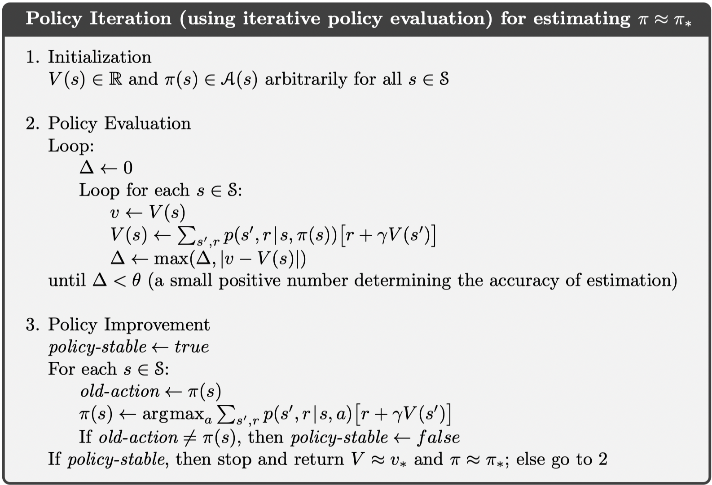
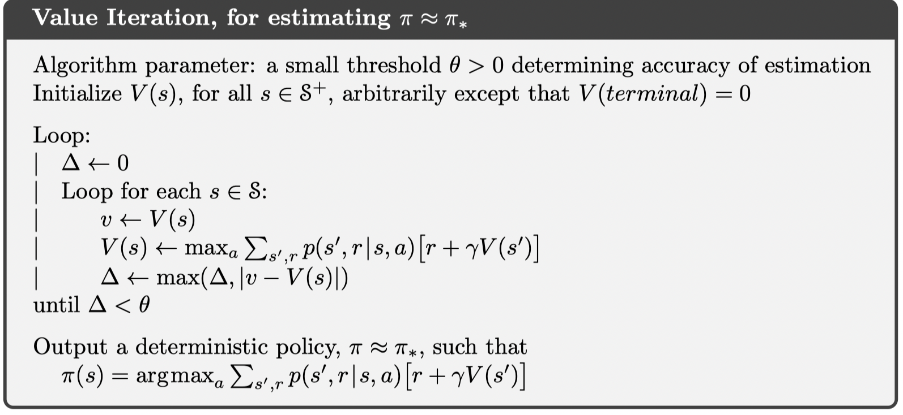

Lecture2 主要介绍了 MRP、MDP 的概念，以及在 model-based 情况下的策略评估、策略改进（PI + VI）。

对应到 Sutton 的书是 Chaper 3 Finite Markov Decision Processes 和 Chapter 4 Dynamic Programming。

---

## Basics

+ Model: mathematical models of dynamics and reward
+ Policy: function mapping agent’s states to actions
+ Value function: future rewards from being in a state and/or action when following a particular policy

一个 Markov Process 由状态集 $\mathcal{S}$ 和转移概率 $P$ 组成，如果状态集是有限的，那么转移概率 $P$ 可以用一个矩阵来表示。

Markov Reward Process is a Markov Chain + rewards

定义：

discounted sum of rewards

$$
\begin{aligned}
G_t &= r_t + \gamma r_{t+1} + \gamma^2 r_{t+2} + \cdots\\
 &= r_t + \gamma G_{t+1}\\
\end{aligned}  \qquad (0 \leq\gamma \leq1) 
$$

expected returen from starting in state $s$

$$
V(s) = \mathbb{E} [G_t \mid s_t = s]
$$

Value function estimates that how good it is to be in a given state.

对于一个 MRP，我们能够计算出在一个状态的期望收益的折现：
$$
V(s)=\underbrace{R(s)}_{\text {Immediate reward }}+\underbrace{\gamma \sum_{s^{\prime} \in S} P\left(s^{\prime} \mid s\right) V\left(s^{\prime}\right)}_{\text {Discounted sum of future rewards }}
$$
对于有限状态的 MRP，可以用更简洁的矩阵表示：
$$
\left(\begin{array}{c}
V\left(s_{1}\right) \\
\vdots \\
V\left(s_{N}\right)
\end{array}\right)=\left(\begin{array}{c}
R\left(s_{1}\right) \\
\vdots \\
R\left(s_{N}\right)
\end{array}\right)+\gamma\left(\begin{array}{ccc}
P\left(s_{1} \mid s_{1}\right) & \cdots & P\left(s_{N} \mid s_{1}\right) \\
P\left(s_{1} \mid s_{2}\right) & \cdots & P\left(s_{N} \mid s_{2}\right) \\
\vdots & \ddots & \vdots \\
P\left(s_{1} \mid s_{N}\right) & \cdots & P\left(s_{N} \mid s_{N}\right)
\end{array}\right)\left(\begin{array}{c}
V\left(s_{1}\right) \\
\vdots \\
V\left(s_{N}\right)
\end{array}\right)
$$
也就是：
$$
V = R + \gamma P V
$$
从解析的角度来说，有：
$$
V = (I - \gamma P)^{-1} R
$$

> 因为 $I- \gamma P$ 的特征值都非0，所以它一定是可逆的。

计算一个矩阵的逆，从数学上来说是很麻烦的，可能不稳定而且计算量大。上面这个问题本质上还是解一个线性方程组，所以通常使用迭代法。

> 数学上，解线性方程组有两类方法：矩阵分解法和迭代法。矩阵分解法（如 LU 分解）适用于小规模的稠密矩阵，而迭代法（如 Jacobi 迭代法）适用于大规模稀疏矩阵。

Markov Decision Process is Markov Reward Process + actions

这时候转移概率 $P(s^\prime\mid s, a)$ 就变成了现在的状态和行为的函数。It defines the dynamics of the MDP.

MDP 是一个六元组 $(T, \mathcal{S}, \mathcal{A}, R, P, \gamma)$

$T= \infty$, infinite horizon; $T < \infty$, finite horizon.

A trajectory of a MDP begins like:

$$
S_{0}, A_{0}, R_{1}, S_{1}, A_{1}, R_{2}, S_{2}, A_{2}, R_{3}, \ldots
$$

Policy specifies what action to take in each state. It can be deterministic or stochastic.

MDP + $\pi(a \mid s)$ = MRP

where
$$
\begin{aligned}
R^{\pi}(s) &=\sum_{a \in A} \pi(a \mid s) R(s, a) \\
P^{\pi}\left(s^{\prime} \mid s\right) &=\sum_{a \in A} \pi(a \mid s) P\left(s^{\prime} \mid s, a\right)
\end{aligned}
$$
这说明，评估 MDP 的 policy 可以用计算 MRP 的状态值一样的方法。

State-value function for policy $\pi$
$$
v^{\pi}(s) \doteq \mathbb{E}_{\pi}\left[G_{t} \mid S_{t}=s\right]
$$
Action-value function for policy $\pi$
$$
q^{\pi}(s, a) \doteq \mathbb{E}_{\pi}\left[G_{t} \mid S_{t}=s, A_{t}=a\right]
$$
Their relations
$$
\begin{aligned}
& v^\pi(s) = \sum_{a \in \mathcal{A}} \pi(a\mid s) q_\pi(s, a) \\
& q^\pi(s, a) = r(s, a) + \sum_{s^{\prime} \in \mathcal{S}} p(s^{\prime} \mid s, a) v_\pi(s^\prime) \\
\end{aligned} \tag{$\ast$}
$$

## MDP control

Value functions define a partial ordering over policies.
$$
\pi_1 \geq \pi_2 :\; v^{\pi_1}(s) \geq v^{\pi_2}(s) \;\;\forall s \in \mathcal{S}
$$
最优的 policy 不一定是唯一的，但是最优的值函数是唯一的。

Optimal policy for a MDP in an infinite horizon problem is

+ Deterministic
+ Stationary

### Policy Iteration

分为两步

1. Policy evaluation: evaluate the state value functions of a given policy

Dynamic programming for policy evaluation

$$
V_k^\pi(s) = \sum_{a \in \mathcal{A}}   \pi(a| s)  \left( r(s, a) + \gamma \sum_{a\in \mathcal{A}} p(s^\prime| s, a) V_{k-1}^\pi(s^\prime) \right)
$$
$V_k^\pi(s)$ is exact value of $k$-horizon value of state $s$ under policy $\pi$. 

2. Policy improvement: find a better policy

The core step of improvement:
$$
\pi_{i+1}(s) = \underset{a}{\operatorname{argmax}} \; q^{\pi_i}(s, a)
$$

### Value Iteration

PI converges faster than VI.

