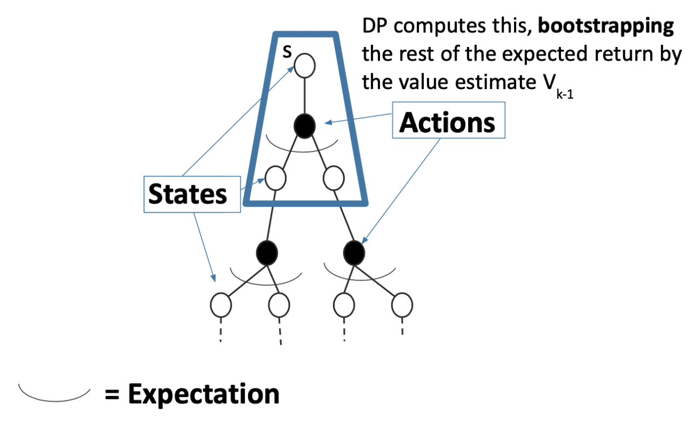

Lecture3 主要介绍当我们不知道模型的各个参数的时候，如何评价一个 policy.

### Recall

+ Definition of Return
+ Definition of State Value Function
+ Definition of State-Action Value Function

Dynamic programming for policy evaluation

$$
V^{\pi}(s) \leftarrow \mathbb{E}_{\pi}\left[r_{t}+\gamma V_{k-1} \mid s_{t}=s\right]
$$

## Policy Evaluation without a Model

### Monte Carlo Policy Evaluation

- If trajectories are all finite, sample set of trajectories \& average returns
- Does not require MDP dynamics/rewards
- No bootstrapping
- Does not assume state is Markov (handles non-Markovian domains)
- Can only be applied to episodic MDPs
- Averaging over returns from a complete episode
- Requires each episode to terminate

Monte Carlo methods can be incremental in an episode-by-episode sense, but not in a step-by-step (online) sense.

Monte Carlo is particularly useful when a subset of states is required. One can generate many sample episodes starting from the states of interest, averaging returns from only these states, ignoring all others.

#### First-Visit

Initialize $N(s)=0, G(s)=0 \;\; \forall s \in S$
Loop

- Sample episode $i=s_{i, 1}, a_{i, 1}, r_{i, 1}, s_{i, 2}, a_{i, 2}, r_{i, 2}, \ldots, s_{i, T_{i}}$
- Define $G_{i, t}=r_{i, t}+\gamma r_{i, t+1}+\gamma^{2} r_{i, t+2}+\cdots \gamma^{T_{i}-1} r_{i, T_{i}}$ as return from time
step $t$ onwards in $i$ th episode
- For each time step $t$ till the end of the episode $i$
  - If this is the **first** time $t$ that state $s$ is visited in episode $i$
    - Increment counter of total first visits: $N(s)=N(s)+1$
    - Increment total return $G(s)=G(s)+G_{i, t}$
    - Update estimate $V^{\pi}(s)=G(s) / N(s)$

**Properties**

+ Unbiased

+ Consistent

By SLLN, the sequence of averages of the estimates converges to the expected value.

#### Every-Visit

Initialize $N(s)=0, G(s)=0 \; \forall s \in S$
Loop

- Sample episode $i=s_{i, 1}, a_{i, 1}, r_{i, 1}, s_{i, 2}, a_{i, 2}, r_{i, 2}, \ldots, s_{i, T_{i}}$
- Define $G_{i, t}=r_{i, t}+\gamma r_{i, t+1}+\gamma^{2} r_{i, t+2}+\cdots \gamma^{T_{i}-1} r_{i, T_{i}}$ as return from time
step $t$ onwards in $i$ th episode
- For each time step $t$ till the end of the episode $i$
  - state $s$ is the state visited at time step $t$ in episodes $i$
  - Increment counter of total visits: $N(s)=N(s)+1$
  - Increment total return $G(s)=G(s)+G_{i, t}$
  - Update estimate $V^{\pi}(s)=G(s) / N(s)$

**Properties**

+ Biased

+ Consistent, and better MSE

#### Incremental Monte Carlo

A more computationally efficient way is:
$$
V^{\pi}(s)=V^{\pi}(s) \frac{N(s)-1}{N(s)}+\frac{G_{i, t}}{N(s)}=V^{\pi}(s)+\frac{1}{N(s)}\left(G_{i, t}-V^{\pi}(s)\right)
$$

$$
V^{\pi}(s)=V^{\pi}(s)+\alpha\left(G_{i, t}-V^{\pi}(s)\right)
$$

Incremental MC with $\alpha>\displaystyle\frac{1}{N\left(s_{i t}\right)}$ could help in non-stationary domains.

**Monte Carlo Policy Evaluation Key Limitations**

+ Generally high variance estimator
  + Reducing variance can require a lot of data
+ Requires episodic settings
  + Episode must end before data from that episode can be used to update the value function

**Problem of maintaining exploration**

### MC off-policy evaluation

Aim: estimate *target policy* $\pi$ given episodes generated under *behavior policy* $b$

Requirement
$$
\pi(a \mid s)>0 \Longrightarrow b(a\mid s) > 0  \tag{coverage}
$$
*Importance-sampling ratio*
$$
\rho_{t: T-1} \doteq \frac{\prod_{k=t}^{T-1} \pi\left(A_{k} \mid S_{k}\right) p\left(S_{k+1} \mid S_{k}, A_{k}\right)}{\prod_{k=t}^{T-1} b\left(A_{k} \mid S_{k}\right) p\left(S_{k+1} \mid S_{k}, A_{k}\right)}=\prod_{k=t}^{T-1} \frac{\pi\left(A_{k} \mid S_{k}\right)}{b\left(A_{k} \mid S_{k}\right)}
$$
Given episodes from $b$
$$
\mathbb{E}\left[\rho_{t: T-1} G_{t} \mid S_{t}=s\right]=v_{\pi}(s)
$$
Unbiased and consistent.

+ Ordinary importance sampling — uausally unbiased; **may not converge**

  $$
  V(s) \doteq \frac{\sum_{t \in \mathcal{T}(s)} \rho_{t: T(t)-1} G_{t}}{|\mathcal{T}(s)|}
  $$

+ Weighted importance sampling — biased but lower variance
  $$
  V(s) \doteq \frac{\sum_{t \in \mathcal{T}(s)} \rho_{t: T(t)-1} G_{t}}{\sum_{t \in \mathcal{T}(s)} \rho_{t: T(t)-1}}
  $$

### Temporal Difference Learning

> “If one had to identify one idea as central and novel to reinforcement learning, it would undoubtedly be temporal-difference (TD) learning.”   – Sutton and Barto 2017

$$
V^{\pi}(s)=V^{\pi}(s)+\alpha\left(G_{i, t}-V^{\pi}(s)\right)
$$
Replace $G_{i,t}$ by bootstraping $r_t + \gamma V^\pi(s_{t+1})$ .
$$
V^{\pi}\left(s_{t}\right)=V^{\pi}\left(s_{t}\right)+\alpha(\underbrace{\left[r_{t}+\gamma V^{\pi}\left(s_{t+1}\right)\right]}_{\text {TD target }}-V^{\pi}\left(s_{t}\right))
$$

+ TD error
  $$
  \delta_{t}=r_{t}+\gamma V^{\pi}\left(s_{t+1}\right)-V^{\pi}\left(s_{t}\right)
  $$

+ Can immediately update value estimate after $\left(s, a, r, s^{\prime}\right)$ tuple

+ Don't need episodic setting

+ Biased, but generally less high variance than MC

+ TD(0) converges to true value with tabular representation

+ TD(0) does not always converge with function approximation

TD(0) converges to DP policy $V^\pi$ for the MDP with the maximum likelihood model estimates

> Maximum likelihood Markov decision process model
> $$
\begin{gathered}
 \hat{P}\left(s^{\prime} \mid s, a\right)=\frac{1}{N(s, a)} \sum_{k=1}^{K} \sum_{t=1}^{L_{k}-1} \mathbb{1}\left(s_{k, t}=s, a_{k, t}=a, s_{k, t+1}=s^{\prime}\right) \\
 \hat{r}(s, a)=\frac{1}{N(s, a)} \sum_{k=1}^{K} \sum_{t=1}^{L_{k}-1} \mathbb{1}\left(s_{k, t}=s, a_{k, t}=a\right) r_{t, k}
\end{gathered}
> $$

TD exploits Markov structure.

Monte Carlo ES
