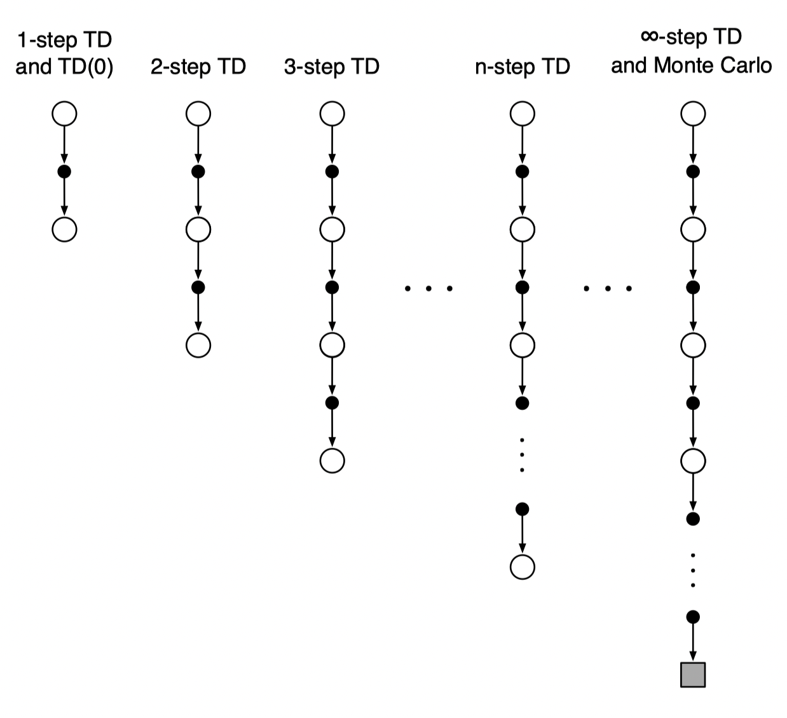
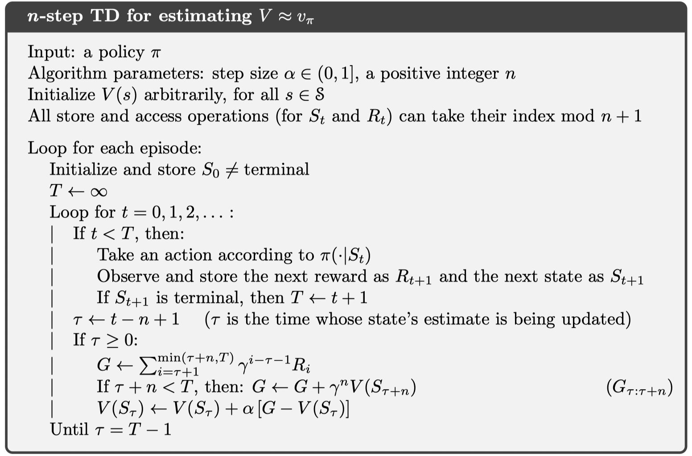

The idea of $n$-step TD

Monte Carlo target
$$
G_{t} \doteq R_{t+1}+\gamma R_{t+2}+\gamma^{2} R_{t+3}+\cdots+\gamma^{T-t-1} R_{T}
$$

1-step TD target
$$
G_{t: t+1} \doteq R_{t+1}+\gamma V_{t}\left(S_{t+1}\right)
$$
2-step TD target
$$
G_{t: t+2} \doteq R_{t+1}+\gamma R_{t+2}+\gamma^{2} V_{t+1}\left(S_{t+2}\right)
$$
n-step TD target
$$
G_{t: t+n} \doteq R_{t+1}+\gamma R_{t+2}+\cdots+\gamma^{n-1} R_{t+n}+\gamma^{n} V_{t+n-1}\left(S_{t+n}\right)
$$
State-value learning algorithm for using n-step returns is
$$
V_{t+n}\left(S_{t}\right) \doteq V_{t+n-1}\left(S_{t}\right)+\alpha\left[G_{t: t+n}-V_{t+n-1}\left(S_{t}\right)\right], \quad 0 \leq t<T
$$

