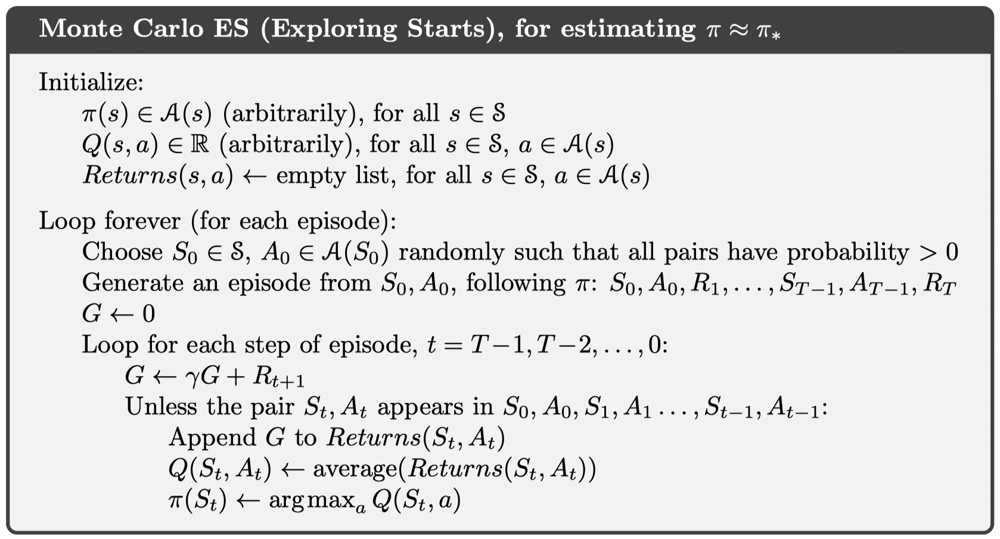
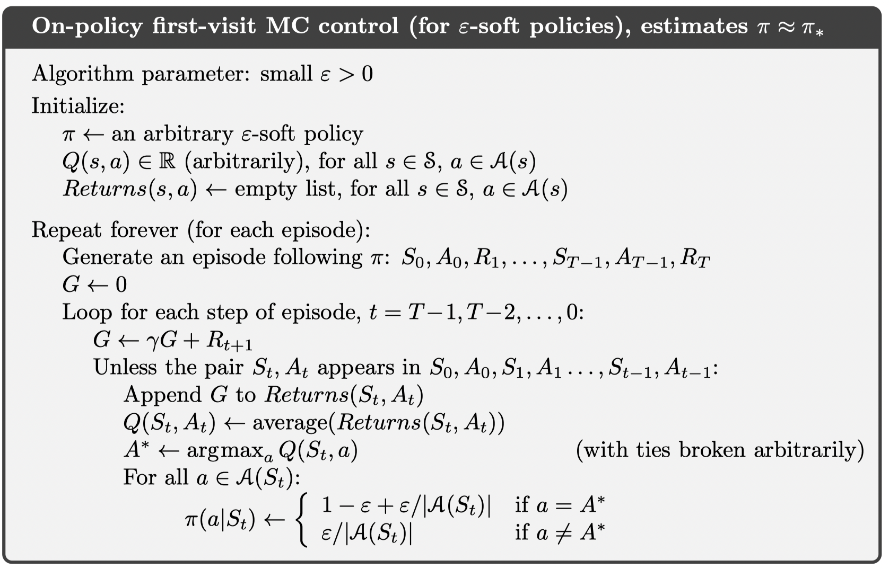

Lecture 4 主要介绍无模型的 control。

- On-policy learning
  - Direct experience
  - Learn to estimate and evaluate a policy from experience obtained from following that policy
- Off-policy learning
  - Learn to estimate and evaluate a policy using experience gathered from following a different policy

## Monte Carlo Control

### Monte Carlo with Exploring Starts

### On-policy MC Control

Maintain an $\epsilon$-greedy policy

Only achieve the best policy among the $\epsilon$-greedy policies.

**Greedy in the Limit of Infinite Exploration (GLIE)**

- All state-action pairs are visited an infinite number of times
$$
\lim _{i \rightarrow \infty} N_{i}(s, a) \rightarrow \infty
$$
- Behavior policy (policy used to act in the world) converges to greedy policy
$\lim _{i \rightarrow \infty} \pi(a \mid s) \rightarrow \arg \max _{a} Q(s, a)$ with probability 1

A simple GLIE strategy is $\epsilon$-greedy where $\epsilon$ is reduced to 0 with the following rate: $\epsilon_{i}=1 / i$

GLIE Monte-Carlo control converges to the optimal state-action value function $Q(s, a) \to Q^\ast(s, a)$.

### Off-policy MC Control

Require that the behavior policy be soft, to ensure each pair of state and action be visited.

## TD Control

### On-policy SARSA

Quintuple of events $(S_t, A_t, R_t, S_{t+1}, A_{t+1}) \to \text{SARSA}$  
$$
Q\left(S_{t}, A_{t}\right) \leftarrow Q\left(S_{t}, A_{t}\right)+\alpha\left[R_{t+1}+\gamma Q\left(S_{t+1}, A_{t+1}\right)-Q\left(S_{t}, A_{t}\right)\right]
$$
SARSA for finite-state and finite-action MDPs converges to the optimal action-value, $Q(s, a) \rightarrow Q^{*}(s, a)$, under the following conditions:

1. The policy sequence $\pi_{t}(a \mid s)$ satisfies the condition of GLIE
2. The step-sizes $\alpha_{t}$ satisfy the Robbins-Munro sequence such that
  $$
  \begin{aligned}
  &\sum_{t=1}^{\infty} \alpha_{t}=\infty \\
  &\sum_{t=1}^{\infty} \alpha_{t}^{2}<\infty
  \end{aligned}
  $$

### Off-policy Q-learning

$$
Q\left(S_{t}, A_{t}\right) \leftarrow Q\left(S_{t}, A_{t}\right)+\alpha\left[R_{t+1}+\gamma \max _{a} Q\left(S_{t+1}, a\right)-Q\left(S_{t}, A_{t}\right)\right]
$$

### Maximization Bias
