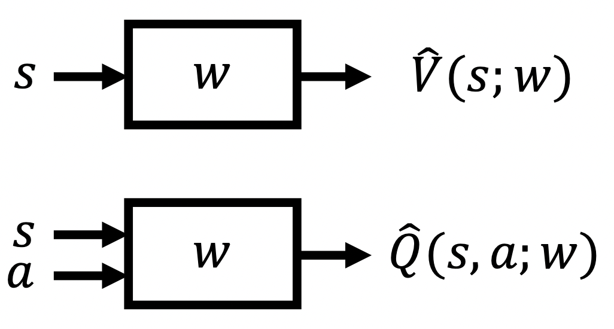

Many real world problems have enormous state and/or action spaces, so tabular representation is insufficient.

## Value Function Approximation

Represent a (state/state-action) value function with a parameterized function instead of a table

Many possible function approximators including

- Linear combinations of features
- Neural networks
- Decision trees
- Nearest neighbors
- Fourier/wavelet bases

Stochastic-gradient Descent
$$
\min_{\mathbf{w}_t} [v_\pi(S_t) - \hat{v}(S_t, \mathbf{w}_t)]^2
$$
By applying gradient descent

$$
\begin{aligned}
\mathbf{w}_{t+1} & \doteq \mathbf{w}_{t}-\frac{1}{2} \alpha \nabla \left[v_{\pi}\left(S_{t}\right)-\hat{v}\left(S_{t}, \mathbf{w}_{t}\right)\right]^{2} \\
&=\mathbf{w}_{t}+\alpha\left[v_{\pi}\left(S_{t}\right)-\hat{v}\left(S_{t}, \mathbf{w}_{t}\right)\right] \nabla \hat{v}\left(S_{t}, \mathbf{w}_{t}\right)
\end{aligned}
$$

$$
\mathbf{w}_{t+1} \doteq \mathbf{w}_{t}+\alpha\left[U_{t}-\hat{v}\left(S_{t}, \mathbf{w}_{t}\right)\right] \nabla \hat{v}\left(S_{t}, \mathbf{w}_{t}\right)
$$

If $U_t$ is an **unbiased** estimate, $\mathbf{w}_t$ is guaranteed to converge to a local optimum.

### Monte Carlo VFA

Use $G_t$ as an unbiased estimat of $v_\pi(S_t)$

$$
\mathbf{w} \leftarrow \mathbf{w}+\alpha\left[G_{t}-\hat{v}\left(S_{t}, \mathbf{w}\right)\right] \nabla \hat{v}\left(S_{t}, \mathbf{w}\right)
$$

### Semi-gradient TD(0)

$$
\mathbf{w} \leftarrow \mathbf{w}+\alpha\left[R+\gamma \hat{v}\left(S^{\prime}, \mathbf{w}\right)-\hat{v}(S, \mathbf{w})\right] \nabla \hat{v}(S, \mathbf{w})
$$

>  **The idea of state aggregation**

## Linear Approximators

A linear function is one of the most important special cases.
$$
\hat{v}(s, \mathbf{w}) \doteq \mathbf{w}^{\top} \mathbf{x}(s) \doteq \sum_{i=1}^{d} w_{i} x_{i}(s)
$$

The vector $\mathbf{x}(s)$ is called a *feature vector* representing state $s$.

Specifically, if $\hat{v}(S_t, \mathbf{w}) = \mathbf{x}(s)^T \mathbf{w}$, then

$$
\mathbf{w} \leftarrow \mathbf{w}+
\alpha\left[U_{t}-\mathbf{x}(s)^T \mathbf{w} \right] \mathbf{x}(s)
$$

**MC update**
$$
\mathbf{w} \leftarrow \mathbf{w}+
\alpha\left[G_{t}-\mathbf{x}(s)^T \mathbf{w} \right] \mathbf{x}(s)
$$
**TD update**
$$
\begin{aligned}
\mathbf{w}_{t+1} & \doteq \mathbf{w}_{t}+\alpha\left(R_{t+1}+\gamma \mathbf{w}_{t}^{\top} \mathbf{x}_{t+1}-\mathbf{w}_{t}^{\top} \mathbf{x}_{t}\right) \mathbf{x}_{t} \\
&=\mathbf{w}_{t}+\alpha\left(R_{t+1} \mathbf{x}_{t}-\mathbf{x}_{t}\left(\mathbf{x}_{t}-\gamma \mathbf{x}_{t+1}\right)^{\top} \mathbf{w}_{t}\right)
\end{aligned}
$$
The expected next weight vector can be written
$$
\mathbb{E}\left[\mathbf{w}_{t+1} \mid \mathbf{w}_{t}\right]=\mathbf{w}_{t}+\alpha\left(\mathbf{b}-\mathbf{A} \mathbf{w}_{t}\right)
$$
where
$$
\mathbf{b} \doteq \mathbb{E}\left[R_{t+1} \mathbf{x}_{t}\right] \in \mathbb{R}^{d} \quad \text { and } \quad \mathbf{A} \doteq \mathbb{E}\left[\mathbf{x}_{t}\left(\mathbf{x}_{t}-\gamma \mathbf{x}_{t+1}\right)^{\top}\right] \in \mathbb{R}^{d \times d}
$$
Hence we obtain *TD fixed point*
$$
\mathbf{w}_{\mathrm{TD}} \doteq \mathbf{A}^{-1} \mathbf{b}
$$
Semi-gradient TD(0) converges to this point.

## Control Methods with Approximation

