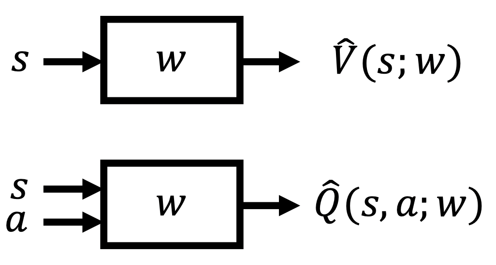

Many real world problems have enormous state and/or action spaces, so tabular representation is insufficient.

### Value Function Approximation

Represent a (state/state-action) value function with a parameterized function instead of a table

Many possible function approximators including

- Linear combinations of features
- Neural networks
- Decision trees
- Nearest neighbors
- Fourier/ wavelet bases

$$
\begin{aligned}
\mathbf{w}_{t+1} & \doteq \mathbf{w}_{t}-\frac{1}{2} \alpha \nabla\left[v_{\pi}\left(S_{t}\right)-\hat{v}\left(S_{t}, \mathbf{w}_{t}\right)\right]^{2} \\
&=\mathbf{w}_{t}+\alpha\left[v_{\pi}\left(S_{t}\right)-\hat{v}\left(S_{t}, \mathbf{w}_{t}\right)\right] \nabla \hat{v}\left(S_{t}, \mathbf{w}_{t}\right)
\end{aligned}
$$

### Monte Carlo VFA

