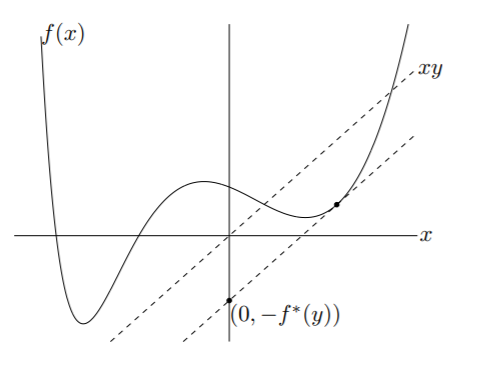
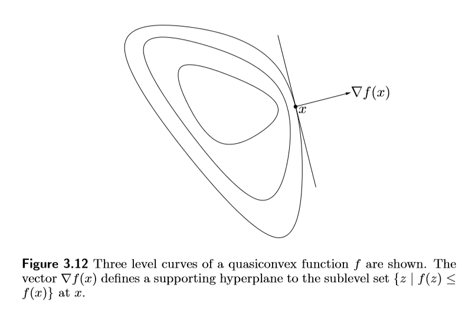

<!-- #! https://zhuanlan.zhihu.com/p/452821674 -->

说完了凸集，下一个要介绍的肯定就是凸函数啦~

凸函数的相关性质在优化中的地位不言而喻~！

## 凸函数

$f: \mathrm{R}^n \to \mathrm{R}$ 是凸函数，如果 $f$ 的定义域是凸集，并且 $\forall x, y, \theta \in [0, 1]$ 成立：

$$
f(\theta x+(1-\theta )y) \leq \theta f(x) + (1-\theta) f(y)\\
$$

如果 $\theta \in (0, 1), x\neq y$ 时上面的不等号严格成立，那么就说这个函数是**严格凸**（strict convex）的。

几何上看，凸函数要求 $(x, f(x))$ 和 $(y, f(y))$ 这条线段位于函数图形的上方。

对应的，我们还有定义“凹函数”（concave function），当 $-f$ 是凸函数时，$f$ 被称为凹函数。

对于仿射函数，它是既凸又凹的。同时，**既凸又凹的函数只有仿射函数**。

如果 $f$ 是凸函数，那么 $g(t)=f(x+tv)$ 也是凸函数，反过来的结论也成立。**这说明，凸函数限制在任何一条直线上都是凸的！** 凸函数的概念完全可以从欧式空间推广到一般的线性空间，**在一般的线性空间上，这条性质成为我们判断凸函数的重要依据。**

凸函数还具有良好的分析性质，比如，凸函数在它定义域的相对内点集上是连续的；凸函数的不连续点只可能出现在它的相对边界上。

### 凸函数定义域延拓

有时候我们会把一个凸函数的定义域延拓到整个 $R^n$ 空间中：

$$
\tilde{f}(x)=\left\{\begin{array}{ll}f(x) & x \in \operatorname{dom} f \\ \infty & x \notin \operatorname{dom} f\end{array}\right.\\
$$

可以证明，这样延拓的凸函数也满足凸函数的定义。（在定义好关于$\infty$的运算后）。这样的定义在函数表示上有一定的意义。

### Indicator function

设 $C$ 是一个凸集，令函数 $I_C(x) = 0, \forall x \in C$，即在集合 $C$ 上的取值为0，此时：
$$
\tilde{I}_{C}(x)= \begin{cases}0 & x \in C \\ \infty & x \notin C\end{cases}\\
$$
$\tilde{I}_C$ 叫做集合 $C$ 的 indicator function。

> Indicator function 的共轭函数是 support function：
> $$
> S_{C}(y) = \sup \,\{ y^T x \mid x \in C\}\\
> $$

### 一阶条件（first order condition）

可微的凸函数满足一阶条件：

$$
f(y) \geq f(x)+\nabla f(x)^{T}(y-x)\quad\forall x,y \in \mathrm{dom}f\\
$$

这个不等式揭示了凸函数的局部特性，那就是在一点的切平面是整个函数的 **global underestimate** 。

如果上面的不等号严格成立，那么这个函数是严格凸的。这里的条件是**充分必要**的。

### 二阶条件（second order condition）

如果定义在**开凸集**上的二阶可微函数 $f$ 满足 $\nabla^2f\succeq0$，那么 $f$ 是凸函数。

如果 $\nabla^2f\succ0$，那么 $f$ 是严格凸的。

> 当 $f$ 严格凸时，不一定能推出 $\nabla^2f$ 正定。比如 $f(x)=x^4$，二阶导数在 $x=0$ 处为 $0$。

关于一阶条件和二阶条件的证明，要用到泰勒展开。在此从略。

例：

$$
f(x) = (1/2) x^T P x + q^T x + r\\
$$

因为 $\nabla^2 f = P$，所以，当 $P \succeq 0$ 正定时，$f$ 是凸函数；当 $P \preceq 0$ 负定时，$f$ 是凹函数。

### 凸函数的例子

+ 指数函数、多项式函数，绝对值函数都是凸的；对数函数是凹的。
+ 最大值函数 $f(x)=\max _{i} x_{i}$ 是凸的。

$$
\begin{aligned}f(\theta x+(1-\theta) y) &=\max _{i}\left(\theta x_{i}+(1-\theta) y_{i}\right) \\& \leq \theta \max _{i} x_{i}+(1-\theta) \max _{i} y_{i} \\&=\theta f(x)+(1-\theta) f(y) , \quad \theta \in [0,1]\end{aligned}\\
$$

> $f(x)=\log \left(e^{x_{1}}+\cdots+e^{x_{n}}\right)$ 在 $\mathbf{R}^{n}$ 上是凸的。有估计式：
> $$
> \max \left\{x_{1}, \ldots, x_{n}\right\} \leq f(x) \leq \max \left\{x_{1}, \ldots, x_{n}\right\}+\log n \\
> $$
> 这个函数是最大值函数的一个光滑近似。

+ $f(x,y) = \displaystyle\frac{x^2}{y} (\operatorname{dom} f=\mathbf{R} \times \mathbf{R}_{++}=\left\{(x, y) \in \mathbf{R}^{2} \mid y>0\right\})$ 是一个 *Quadratic-over-linear function*， 它是凸的。
+ $f(x)=(\Pi_{i=1}^n x_i)^{\frac{1}{n}},x_i>0$ 是凹函数，容易证明 $\nabla^2f$ 是半负定的。
+ $f(X)=\log \det X$ 是 $\mathrm{S}_{++}^n$ 上的凹函数。它是一个定义在矩阵空间上的函数。它的证明要用到线性空间中凸性的性质，即凸函数限制在任意一条直线都是凸的。

### 下水平集（sublevel sets）

定义 $f: \mathbf{R}^n \to \mathbf{R}$ 的 $\alpha-\text{sublevel\; set}$ 为：

$$
C_{\alpha}=\{x \in \operatorname{dom} f \mid f(x) \leq \alpha\}\\
$$

易证 $f$ 是凸函数的时候 $C_\alpha$ 是个凸集。（该性质说明凸函数是拟凸的）

从而这里给出了判断凸集的另一个方法：**能被写成某个凸函数的 *$\alpha$-sublevel set* 的集合是凸集**。反之，一个函数的 sublevel set 是凸的，并不能反推出它是凸函数（事实上这个函数是拟凸的）。

> 例：$S=\{x \mid x^T Ax+c^T x+ b \leq 0, A\succeq 0\}$  是凸集。

对于 $f$ 是凹函数有相应的结论：$\{x \in \operatorname{dom} f  \mid f(x) \geq \alpha\}$ 是凸集。

### Epigraph

一个函数的 $f:\mathbf{R}^n\to \mathbf{R}$ 的 *epigraph* 是指：

$$
\text { epi } f=\{(x, t) \mid x \in \operatorname{dom} f, f(x) \leq t\}\\
$$

$\text{epi} f$ 是 $\mathbf{R} ^{n+1}$ 的子集，是函数图形的上方。

**$\text{epi} f$ 是凸集当且仅当 $f$ 是凸函数。** 所以 epigraph 也是一种主要的判断凸函数的方法。这个证明非常容易，只需要反复使用定义即可。

对应于凹函数我们定义 *hypograph*：

$$
\text { hypo } f=\{(x, t) \mid t \leq f(x)\}\\
$$

**$\text{hypo} \;f$ 是凸集当且仅当 $f$ 是凹函数。**

> 例：$f(X)=\lambda_{\max} (X), X \in \mathrm{S}_n$ 的 epigraph $\{(X, t)\mid tI - X \succeq 0\}$ 是凸集（由定义证），从而 $f$ 是凸函数。类似可得 $f(X)=\lambda_{\min} (X), X \in \mathrm{S}_n$ 是凹函数。

### 琴生不等式（Jesen inequality）

琴生不等式是凸函数的重要性质。

对 $x_{1}, \ldots, x_{k} \in \operatorname{dom} f$ 和 $\theta_{1}, \ldots, \theta_{k} \geq 0, \theta_{1}+\cdots+\theta_{k}=1$ 成立：

$$
f\left(\theta_{1} x_{1}+\cdots+\theta_{k} x_{k}\right) \leq \theta_{1} f\left(x_{1}\right)+\cdots+\theta_{k} f\left(x_{k}\right)\\
$$

这是有限个点的情况。该不等式还能扩展到无限和、积分等情况。

> If $p(x) \geq 0$ on $S \subseteq \operatorname{dom} f, \int_{S} p(x) \mathrm{d} x=1$, then:
> $$
> f \left( \int _ { S } p ( x ) x \mathrm{d} x \right) \leq \int _ { > S } f ( x ) p ( x ) \mathrm{d} x
> $$

对某些凸函数应用琴生不等式可以得到许多著名的不等式，比如 Holder 不等式：

$$
\sum_{i=1}^{n} x_{i} y_{i} \leq\left(\sum_{i=1}^{n}\left|x_{i}\right|^{p}\right)^{1 / p}\left(\sum_{i=1}^{n}\left|y_{i}\right|^{q}\right)^{1 / q}\\
$$

## 保持函数凸性的操作

### 若干凸函数非负的加权和

$f=w_1f_1 + w_2 f_2 + \cdots + w_n f_n$， $f_i$ 凸，$w_i > 0 \Longrightarrow f$ 凸。

这意味着所有的凸函数形成了一个凸锥！

可以推广到无穷和的情况，如果 $f(x,y)$ 对 $x$ 是凸的，并且 $w(y)>0$，那么 $g(x)=\displaystyle\int f(x,y)w(y) \mathrm{d}y$ 是凸的。

### 与仿射函数的复合

如果 $A$ 是一个矩阵，那么 $g(x)=f(A x+b)$ 与 $f$ 有相同的凹凸性。

如果加上可微的条件，那么根据复合函数的求导法则，就有：
$$
\nabla g = A^T \nabla f, \quad \nabla^2 g = A^T \nabla^2 f A\\
$$
所以显然 $g$ 与 $f$ 会有相同的凹凸性。

例：$e^{ax+by+c}$ 是凸函数。

### 逐点取最大值（上确界）

$f(x)=\max \left\{f_{1}(x), \ldots, f_{m}(x)\right\}$，$f_i$ 凸，则 $f$ 凸。对于凹函数，则是取最小值（下确界）。

在 *infinite* 的情况下，如果 $f(x,y)$ 对 $x$ 是凸的，那么 $g(x) = \displaystyle\sup_y f(x,y)$ 也是凸的。

> 证明要用到 epigraph，因为 $\operatorname{epi} g=\displaystyle\bigcap_{y \in \mathcal{A}} \operatorname{epi} f(\cdot, y)$，且凸集的交仍然是凸的，所以 $\operatorname{epi} g$ 也是凸的。

例：

支撑函数 $S_C(x) = \sup \{x^T y \mid y \in C\}$，是一族线性函数的上确界，所以不管 $C$ 是不是凸集，$S_C$ 都是凸函数。  

$f(X) = \lambda_{\max} (X)$ 可以表示为 $\sup \,\{y^TX y \mid \|y \|_2 = 1\}$，是一列线性函数的上确界，所以 $\lambda_{\max}$ 是凸函数。

事实上，绝大多数的凸函数，都能够表示成一族仿射函数的上确界函数，这种方法也是判断凸函数最常用的方法。这与凸集可以表示成一族半平面的交，是一样的。（凸函数可以通过 epigraph 转换成凸集。）

> In other words, a convex function is the pointwise supremum of the set of all affine global underestimators of it.

### 函数复合

考虑一般函数复合的情况：$f(x) = h(g(x))$

在一元的情况下，求导可得：

$$
f^{\prime \prime}(x)=h^{\prime \prime}(g(x)) g^{\prime}(x)^{2}+h^{\prime}(g(x)) g^{\prime \prime}(x)\\
$$

能够得到如下的判断法则：

+ $f$ is convex if $h$ is convex and nondecreasing, and $g$ is convex.
+ $f$ is convex if $h$ is convex and nonincreasing, and $g$ is concave.
+ $f$ is concave if $h$ is concave and nondecreasing, and $g$ is concave.
+ $f$ is concave if $h$ is concave and nonincreasing, and $g$ is convex.

简单来说，**凸函数批上一件单增且凸的外衣仍然是凸的**。当 $g$ 是多元函数的时候，上述法则仍然成立，只不过需要把 $h$ 换成延拓定义域之后的 $\tilde{h}$

这个结论可以直接用定义证明。

$g$ 是凸函数：$g(\theta x+(1-\theta) y) \leq \theta g(x)+(1-\theta) g(y)$

$h$ 单调递增：$h(g(\theta x+(1-\theta) y)) \leq h(\theta g(x)+(1-\theta) g(y))$

$h$ 是凸函数：$h(\theta g(x)+(1-\theta) g(y)) \leq \theta h(g(x))+(1-\theta) h(g(y))$

结合起来有：$h(g(\theta x+(1-\theta) y)) \leq \theta h(g(x))+(1-\theta) h(g(y))$

### 特殊情况下的下确界函数

如果 $f(x,y)$ 对 $(x,y)$ 是凸的，$C$ 是一个非空凸集，那么 $g(x)=\displaystyle\inf_{y \in C} \;f(x, y)$ 是凸的。

$$
\begin{aligned}g\left(\theta x_{1}+(1-\theta) x_{2}\right) &=\inf _{y \in C} f\left(\theta x_{1}+(1-\theta) x_{2}, y\right) \\& \leq f\left(\theta x_{1}+(1-\theta) x_{2}, \theta y_{1}+(1-\theta) y_{2}\right) \\& \leq \theta f\left(x_{1}, y_{1}\right)+(1-\theta) f\left(x_{2}, y_{2}\right) \\& \leq \theta g\left(x_{1}\right)+(1-\theta) g\left(x_{2}\right)+\epsilon\end{aligned}\\
$$

另外，也可以通过 $\mathrm{epi }\;g$ 来证明凸性：
$$
\text { epi } g=\{(x, t) \mid(x, y, t) \in \text { epi } f \text { for some } y \in C\}\\
$$
是某个凸集的投影。

例：

点 $x$ 到集合$S$ 的距离：
$$
\operatorname{dist}(x, S)=\inf _{y \in S}\|x-y\|\\
$$
当 $S$ 是凸集时，$\operatorname{dist}(x, S)$ 是凸函数。

### 函数的透视

透视操作是保持凸（凹）性的。

如果 $f: \mathrm{R}^n \to \mathrm{R}$， $f$ 的透视（perspective）被定义为 $g : \mathrm{R}^{n+1} \to \mathrm{R}$：
$$
g(x, t) = t f(x/t)\\
$$
$g$ 的定义域为 $\operatorname{dom} g=\{(x, t) \mid x / t \in \operatorname{dom} f, t>0\}$

$g$ 的凸性可以轻松由 epigraph 和凸集的透视仍然是凸的 来得到：
$$
\begin{aligned}(x, t, s) \in \mathbf{e p i} g & \Longleftrightarrow \quad t f(x / t) \leq s \\& \Longleftrightarrow \quad f(x / t) \leq s / t \\& \Longleftrightarrow \quad(x / t, s / t) \in \mathbf{e p i} f\end{aligned}\\
$$
例：

$f = -\log x$ 是 $\mathrm{R}_{++}$ 上的凸函数，则它的透视：
$$
g(x, t)=-t \log (x / t)=t \log (t / x)=t \log t-t \log x\\
$$
也是凸的。

## 共轭函数（Conjugate Function）

这是一个非常重要的概念，在凸分析里，共轭函数有至关重要的地位！

定义函数$f(x)$的共轭函数为：

$$
f^{\ast}(y)=\sup _{x \in \operatorname{dom} f}\left(y^{T} x-f(x)\right)\\
$$

共轭函数是多个仿射函数的上确界，**因此是一定是凸函数**。共轭函数的定义域是上确界值有限的 $y$ 的值。

一些例子：

+ $f(x)=ax+b$，注意到 $xy-ax-b$ 只在 $y=a$ 时有界，因此共轭函数只在 $y=a$ 处有定义，并且 $f^\ast(y)=-b$
+ $f(x)=x^2$，$\displaystyle\sup_{x\in R} xy - x^2 = \frac{y^2}{4}=f^\ast(y)$
+ $f(x)=\frac{1}{2}x^T Qx,(Q\in \mathrm{S}^n_{++})$ 的共轭函数是 $f^\ast(y)=\frac{1}{2}y^T Q^{-1}y$
+ $f(x)=|x|$ 的共轭函数是 $f^{\star}(y)=\left\{\begin{array}{ll}0 & \text { if }|y| \leq 1 \\ \infty & \text { if }|y|>1\end{array}\right.$

共轭函数具有鲜明的几何意义：

当 $f(x)$ 是一元函数的时候，如上图所示，$f^\ast(y)$ 表示以 $y$ 为斜率且过原点的直线，与$f(x)$ 的图像的最大距离（或者其负数）。

当 $f(x)$ 是 $n$ 元函数的时候，$f^\ast(y)$ 表示以 $(-y, 1)$ 为法向量（n+1维）且过原点的平面，与 $f(x)$ 的图像的最大距离（或者其负数）。

设$f(x)=\|x\|$代表$\mathbf{R}^n$中的一种范数，其对偶范数为$\|\cdot \|_\ast$，我们能得到共轭函数：
$$
f^{\ast}(y)=\left\{\begin{array}{ll}0 & \|y\|_\ast \leq 1 \\ \infty & \text { otherwise }\end{array}\right.\\
$$

### Fenchel’s inequality

根据共轭函数的定义，下式是显然的：

$$
f(x)+f^\ast(y)\ge x^T y\\
$$

应用到上面的例子，还能得到：

$$
x^{T} y \leq(1 / 2) x^{T} Q x+(1 / 2) y^{T} Q^{-1} y\\
$$

### 共轭函数的共轭

如果 $f$ 是凸函数，并且$\mathbf{epi} f$是闭集，那么 $f^{\ast\ast}=f$。

### 可微分函数的共轭

如果 $f$ 是凸函数并且一阶可微，那么根据凸函数的极值理论，容易得到，使得 $y^T x-f(x)$ 最大的 $x^\ast$ 满足：

$$
y=\nabla f(x^\ast)\\
$$

从而我们有：

$$
f^{\ast}(y)=x^{* T} \nabla f\left(x^{\ast}\right)-f\left(x^{\ast}\right),\quad(y=\nabla f(x^\ast))\\
$$

欲求 $f^\ast(y)$，只需要解 $y=\nabla f(z)$ 得到向量 $z$

> 可微函数$f$的共轭，也叫做$f$的 **Legendre变换**。

### 其他性质

+ 对 $a > 0, b \in \mathbf{R}$，$g(x)=af(x)+b$ 的共轭函数是 $g^{\ast}(y) = af^{\ast}(y/a) - b$.

+ 如果$f(u, v)=f_{1}(u)+f_{2}(v)$，且$f_1, f_2$都是凸函数，那么：

$$
f^{\ast}(w, z)=f_{1}^{\ast}(w)+f_{2}^{\ast}(z)\\
$$

## 拟凸函数（Quasiconvex functions）

> 拟凸这节写的不是特别完善，挖坑以后填了。

**如果一个函数的下水平集是凸的，那么就称这个函数是拟凸的。**

$$
S_{\alpha}=\{x \in \operatorname{dom} f \mid f(x) \leq \alpha\} \;\text{  convex} \Longleftrightarrow f \;\text{  quasiconvex}\\
$$

$f$ 拟凹（quasiconcave）当且仅当 $-f$ 是拟凸的。即，对于拟凹的函数 $f$ 来说，上水平集 $\{x \mid f(x) \geq \alpha\}$ 是凸的。

既拟凸又拟凹的函数叫做拟线性函数（quasilinear），拟线性函数的所有水平集 $\{x \mid f(x) = \alpha\}$ 都是凸的。

**凸函数一定是拟凸函数，但拟凸函数不一定是凸函数。** 比如 $f(x)=\sqrt{|x|}$ 就不是凸函数，但是是拟凸的。

很多凸函数具有的良好性质，可以推广到拟凸函数上。

一个定义在凸集上的函数是拟凸函数，**当且仅当** $\forall x, y \in \mathrm{dom} f, 0\le \theta \le 1$，成立：
$$
f(\theta x+(1-\theta) y) \leq \max \{f(x), f(y)\}\\
$$
这意味着，**线段上的函数值，一定小于等于两个端点函数值最大的那一个**。这个既可以当做拟凸函数的性质，也能当做拟凸函数的定义。

> 拟凸（quasiconvex）两种等价定义的证明：
>
> $$
> \forall \alpha , L_{\alpha}=\{x| f(x)\le \alpha\}  \text{ convex}\Leftrightarrow f(\lambda x + (1-\lambda)y)\le \max\{f(x), f(y)\}
> $$
>
> + 如果 $f(\lambda x + (1-\lambda)y)\le \max\{f(x), f(y)\}$，那么 $\forall \alpha,$ 设 $x, y \in L_{\alpha}$，就有 $f(x)\le \alpha, f(y) \le \alpha$，从而 
>
> $$
> f(\lambda x+(1-\lambda )y)\le \max\{f(x), f(y)\}\le\alpha\\
> $$
>
> 所以 $\lambda x+ (1-\lambda)y \in L_{\alpha}$，所以 $L_{\alpha}$ 是凸集。
>
> + 如果 $L_{\alpha}$ 是凸集，$\forall x, y$， 设 $\alpha=\max \{f(x), f(y)\}$，从而 $x, y \in L_{\alpha}$，那么 $\lambda x + (1-\lambda) y \in L_{\alpha}$ 并且
>
> $$
> f(\lambda x + (1-\lambda)y)\le\alpha= \max\{f(x), f(y)\}\\
> $$

有时候，这个定义也叫做 Jensen's inequality for quasiconvex functions.

针对这个性质还有另一个版本：
$$
f(x)\le f(y) \Rightarrow f(\theta x+(1-\theta)y)\le f(y)\\
$$

> 一些资料上把这个当做拟凸函数的定义，并且当不等号严格成立时，称$f$是**严格拟凸**的。

来看一些例子：

+ $f(x_1, x_2)=x_1x_2, (x_1, x_2 > 0)$，容易看到 $\nabla^2 f$ 是不定的，因此既不是凸函数也不是凹函数。但是 $\{x\mid x_1x_2\ge\alpha\}$ 是凸集，所以 $f$ 是拟凹函数。

+ 线性分式函数 $f(x)=\displaystyle\frac{a^{T} x+b}{c^{T} x+d} \; (\operatorname{dom} f=\left\{x \mid c^{T} x+d>0\right\})$ 是拟线性的，因为

$$
\begin{aligned}S_{\alpha} &=\left\{x \mid c^{T} x+d>0,\left(a^{T} x+b\right) /\left(c^{T} x+d\right) \leq \alpha\right\} \\&=\left\{x \mid c^{T} x+d>0, a^{T} x+b \leq \alpha\left(c^{T} x+d\right)\right\}\end{aligned}\\
$$

是凸集

+ 因为

$$
\operatorname{rank}(X+Y) \geq \min \{\operatorname{rank} X, \operatorname{rank} Y\}\\
$$

所以 $f(X)=\operatorname{rank}(X)$ 是 $\mathrm{S}_+^n$ 上的拟凹函数。

+ 向上取整函数 $\operatorname{ceil}(x)=\inf \{z \in \mathbf{Z} \mid z \geq x\}$ 是拟凸的。

### $\mathrm{R}$ 上的拟凸函数

结合上述的性质，可以给出 $\mathrm{R}$ 上的拟凸函数的特性：

$\mathrm{R}$ 上的拟凸函数，要么是单调的，要么在一个点左边单调递减，右边单调递增。

所以 $\mathrm{R}$ 上的拟凸函数也满足至多是单峰的（unimodal）这一特点。

### 可微分的拟凸函数

类似于凸函数，当函数可微时，可以推导出拟凸函数需要满足的一阶条件和二阶条件。

#### 一阶条件

定义在凸集上的函数 $f$ 拟凸， 当且仅当 $\forall x, y \in \operatorname{dom} f$，有：

$$
f(y) \leq f(x) \Longrightarrow \nabla f(x)^{T}(y-x) \leq 0\\
$$

该条件也有鲜明的几何意义。$\nabla f(x)$ 导出了过点 $x$ 的对下水平集 $\{y\mid f(y)\le f(x)\}$ 的支撑超平面。（高维情况很难想象，不妨考虑一维情况，这时候支撑超平面就退化为一个点，下水平集是一个区间）

> 注意到 $\nabla f(x_0)^T(y-x_0)=0$ 对于给定的 $x_0$，表示的是一个平面。

虽然拟凸函数和凸函数在一阶条件上具有相似性，但是拟凸函数并不能用一阶条件来判断全局的最小值。使拟凸函数的梯度为0的点不一定是 global minimizer.

#### 二阶条件

假如定义在凸集上的函数 $f$ 是二阶可微的，那么 $f$ 拟凸，当且仅当 $\forall x \in \operatorname{dom} f, y \in \mathrm{R}^n$ 有：

$$
y^{T} \nabla f(x)=0 \Longrightarrow y^{T} \nabla^{2} f(x) y \geq 0\\
$$

在一维的情况下，这个条件简化为：

$$
f^{\prime}(x)=0 \Longrightarrow f^{\prime \prime}(x) \geq 0\\
$$

这个条件，意味着 $\nabla^2 f$ 在 $\nabla f^{\perp}$ 是半正定的，暗示 $\nabla^2f$ 至多有一个负特征值。

> $\mathrm{span}\{\nabla f\}$ 是一维的，从而 $\nabla f^{\perp}$是 $n-1$ 维的。如果 $\nabla^2f$ 在 $\nabla f^{\perp}$ 是正定的，那么才能说明 $f$ 是拟凸的。

### 保持拟凸性的操作

#### 拟凸函数非负加权和的最大值

这里就用之前提到过的第二种定义方式进行证明即可。同样可以推广到逐点上确界的情况。

例：$\lambda_{\max }(X, Y)=\sup _{u \neq 0} \displaystyle\frac{u^{T} X u}{u^{T} Y u}=\sup \{\lambda | \operatorname{det}(\lambda Y-X)=0\}$，其中$X\in S^n, Y\in S^n_{++}$，$\lambda_{\max}$是拟凸的，叫做 $(X,Y)$ 的广义特征值。

#### 函数复合

如果 $g: \mathrm{R}^n \to \mathrm{R}$ 是拟凸的，并且 $h: \mathrm{R} \to \mathrm{R}$ 是单调非减的，那么 $f = h \circ g$ 是拟凸的。

#### 最小化

如果 $f(x, y)$ 对 $(x, y)$ 是拟凸的，并且 $C$ 是凸集，那么 $g(x) = \displaystyle\inf_{y \in C} f(x, y)$ 是拟凸的。

## 对数凹/对数凸函数

简单讲，$f>0$，并且 $\log f$ 是凹函数，那么 $f$ 就称为对数凹的。

对数凹还可以用 $f(\theta x+(1-\theta) y) \geq f(x)^{\theta} f(y)^{1-\theta}, \forall \theta \in [0, 1]$ 来定义。从这里看，凸函数可以视作一种“算术平均”，对数凸则是“几何平均”。

如果 $h$ 凸，那么 $e^h$ 也是凸函数，从而我们知道，对数凸函数也是凸函数。

对数凹函数常见于统计学。统计学中的似然函数，是一个经常要取对数的函数，**欲求参数的极大似然估计值，其实就是一个关于似然函数的优化问题**，如果似然函数是对数凹的，那么求对数似然函数的最大值，就是一个凸优化问题！这是研究对数凹函数的目的所在。

+ 标准正态分布的累计分布函数 $\Phi(x)=\displaystyle\frac{1}{\sqrt{2 \pi}} \int_{-\infty}^{x} e^{-u^{2} / 2} d u$ 是对数凹的。
+ 多元正态概率密度函数是 $f(x)=\displaystyle\frac{1}{\sqrt{(2 \pi)^{n} \operatorname{det} \Sigma}} e^{-\frac{1}{2}(x-\bar{x})^{T} \Sigma^{-1}(x-\bar{x})}$ 是对数凹的。
+ 指数分布的密度函数 $f(x) = \lambda e^{-\lambda x}$ 是对数凹的。

**事实上，很多常见的概率分布函数，都是对数凹的。**

如果 $f$ 具有良好的光滑性，通过 $\log f$ 的凹凸性，我们可以得到一些关于 $f$ 的性质：
因为：

$$
\nabla^{2} \log f(x)=\frac{1}{f(x)} \nabla^{2} f(x)-\frac{1}{f(x)^{2}} \nabla f(x) \nabla f(x)^{T}\\
$$

于是可以得到 $f$ 对数凹的一个充要条件：

$$
f(x) \nabla^{2} f(x) \preceq \nabla f(x) \nabla f(x)^{T}\\
$$

在一元函数的情况，就是：$f\cdot f^{''}\leq(f^{'})^2$

此外，对数凸/凹性是对乘法保持封闭的。因为：

$$
h(x)=f(x)g(x)\Rightarrow \log h(x) = \log f(x) + \log g(x)\\
$$

容易看出，**如果概率密度函数是对数凹的，那么多个密度函数相乘的结果也是对数凹的**。

对于积分，也有结果：

$$
f \;\text{ log-concave} \Rightarrow g(x) = \int f(x, y)  \mathrm{d} y \;\text{ log-concave}\\
$$

应用到密度函数的卷积上：

$$
(f * g)(x)=\int f(x-y) g(y) d y\\
$$

**这说明 $f, g$ 如果 log-concave，那么它们的卷积也是对数凹的！**

## 广义不等式下的凸性

通过上一章提到的广义不等式，可以借助 proper cone 定义多元函数的“单调递增”和“严格单调递增”。

$f: \mathrm{R}^n \to \mathrm{R}$ 叫做 $K$*-nondecreasing* 如果：

$$
x \preceq_{K} y \Longrightarrow f(x) \leq f(y),\\
$$

K*-increasing* 如果：

$$
x \preceq_{K} y, x \neq y \Longrightarrow f(x)<f(y) .\\
$$

类似可以定义 $K$*-nonincreasing* 和 $K$*-decreasing*.

例子：

+ $f$ 是 $K=\mathrm{R}^n_+$ 上的 $K$*-nondecreasing* 函数如果：$x_{1} \leq y_{1}, \ldots, x_{n} \leq y_{n} \Longrightarrow f(x) \leq f(y)$
+ $f(X)=\mathrm{det} X$ 是 $\mathrm{S}^n_{+}$ 上的 *increasing* 函数。

> 如果$X$是半正定矩阵，那么$|X+I|>|X|$。（借助特征值证明）

+  $f(X)=\mathrm{tr} X^{-1}$是 $\mathrm{S}^n_{++}$ 上的 *decreasing* 函数。

### 单调性的梯度条件

对于这种新的单调性，我们可以用广义不等式下的梯度条件去判断。

+ $f$ is *K-nondecreasing* $\Leftrightarrow$ $\nabla f(x) \succeq_{K^{\ast}} 0 \quad\forall x \in \mathrm{dom} f$
+ $f$ is *K-increasing* $\Leftrightarrow$ $\nabla f(x) \succ_{K^{\ast}} 0\quad\forall x \in \mathrm{dom} f$

函数的梯度在对偶不等式的情况下是非负的。其实 $\nabla f(x) \succeq_{K^{\ast}} 0$ 这里暗指的，就是 $f$ 在 $K$ 中的每一个方向都是单调递增的。

### 广义不等式下的凸性

进一步，通过 proper cone 还能把函数的凸性推广到向量值函数上：

令 $K$ 是一个 proper cone，如果 $\forall x, y$，都有：

$$
f(\theta x+(1-\theta) y) \preceq_{K} \theta f(x)+(1-\theta) f(y), \quad \;\forall \theta \in [0, 1]\\
$$

就说 $f$ 是 $K$*-convex* 的。

特别地，如果：

$$
f(\theta x+(1-\theta) y) \prec_{K} \theta f(x)+(1-\theta) f(y), \quad \;\forall \theta \in (0,1)\\
$$

就说 $f$ 是 *strictly* $K$*-convex* 的。

$f$ 的定义域不必拘泥于欧式空间！**proper cone 定义好了序的关系，使我们可以研究任意向量空间到向量空间的映射的凸性！** 并且这种定义包容了我们通常理解的凸性。

例：

矩阵函数 $g: \mathrm{R}^{m \times n} \rightarrow \mathrm{S}^{n}$：

$$
g(X)=X^{T} A X+B^{T} X+X^{T} B+C\\
$$

其中 $A \in \mathbf{S}^{m}, B \in \mathbf{R}^{m \times n}$,  $C \in \mathbf{S}^{n}$, 是凸函数当且仅当 $A \succeq 0$.

---

## 第二部分

这是一条分割线，如果有时间，我会在下面继续补充一些重要的知识。

### 一元凸函数的分析性质

### 仿射变换 (affine transformation)

形式上的，仿射变换定义为：
$$
f(\lambda x + (1-\lambda)y) = \lambda f(x) + (1-\lambda) f(y) \qquad 0\leq \lambda \leq 1
$$

如果还满足 $f(0) = 0$，那么这就成了线性变换（linear transformation）。

给定仿射变换 $f(x)$，$g(x) = f(x) - f(0)$ 是一个线性变换。

> 线性变换的两个条件：
>
> + 加性 additive    $T(x+y) = Tx + Ty$ 
> + 齐性 homogeneous    $T(\lambda x) = \lambda Tx$

性质：

+ 对于集合 $S$，$f(\operatorname{aff} S) = \operatorname{aff} f(S)$

