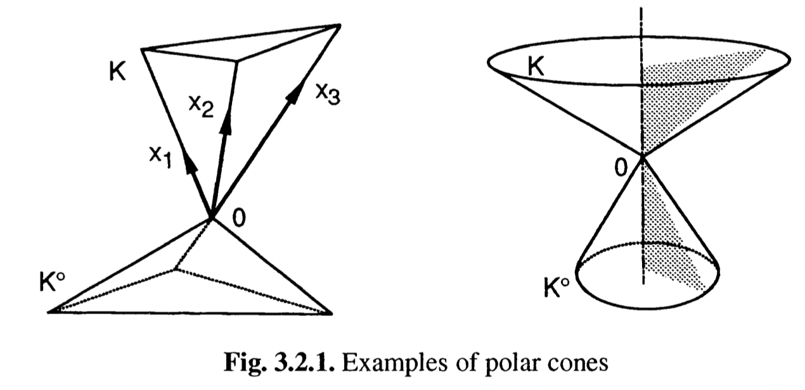
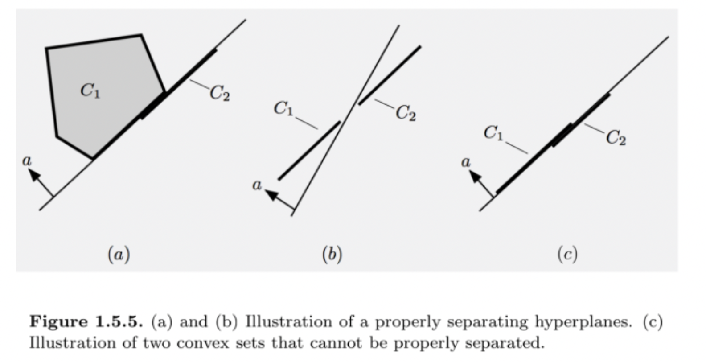
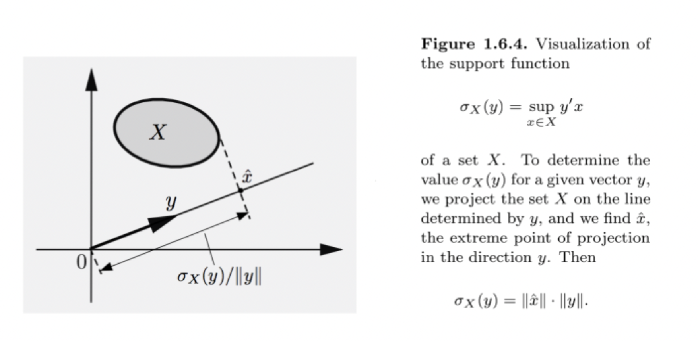

这是 convex set 的第二部分

---

## 仿射无关 (affinely independent)

定义 $x_{1}, x_{2}, \ldots, x_{k}$ 仿射无关，当且仅当 $x_{2}-x_{1}, \ldots, x_{k}-x_{1}$ 线性无关。否则就称是仿射相关的。

关于仿射更多的性质：

+ $x_{0}+\operatorname{span}\left\{x_{1}-x_{0}, \ldots, x_{k}-x_{0}\right\}=\operatorname{aff}\left\{x_{0}, \ldots, x_{k}\right\}$
+ $\left\{x_{0}, \ldots, x_{k}\right\}$ 包含 $0 \Rightarrow \operatorname{aff}\left\{x_{0}, \ldots, x_{k}\right\}=\operatorname{span}\left\{x_{0}, \ldots, x_{k}\right\}$
+ 线性无关的向量组也是仿射无关的
+ 如果 $x_1, x_2, \dots, x_k$ 仿射无关，那么 $0=\sum_{i=0}^{k} \alpha_{i} x_{i}, 0=\sum_{i=0}^{k} \alpha_{i}$ 有唯一解 $\alpha_{0}=\alpha_{1}=\cdots=\alpha_{k}=0$

## 仿射变换 (affine transformation)

仿射变换是指满足以下条件的函数：

$$
F(\lambda x+(1-\lambda) y)=\lambda F(x)+(1-\lambda) F(y), \quad \lambda \in \mathrm{R}
$$

一些性质：

+ 对于仿射变换 $F$， $T(x) = F(x) - F(0)$ 是线性变换。
+ 如果 $S$ 是仿射集，那么 $F(S)$ 也是仿射集，即仿射集在仿射变换的作用下也是仿射的。
+ $F(\operatorname{aff} M)=\operatorname{aff}(F(M))$

## 包算子 (Closure operator)

In mathematics, a closure operator on a set $S$ is a function $\mathrm{cl}: \mathcal{P}(S) \rightarrow \mathcal{P}(S)$ from the power set of $S$ to itself that satisfies the following conditions for all sets $X, Y \subseteq S$

$$
\begin{array}{ll}
& X \subseteq \operatorname{cl}(X) \quad & \text{(cl is extensive)} \\
& X \subseteq Y \Rightarrow \operatorname{cl}(X) \subseteq \operatorname{cl}(Y) \quad & \text{(cl is monotone)} \\ 
& \operatorname{cl}(\operatorname{cl}(X))=\operatorname{cl}(X) \quad & \text {(cl is idempotent) }
\end{array}
$$

Closure operators are also called "**hull operators**".

闭包算子是集合到集合的映射，满足扩展性、单调性、幂等性。

这是一个拓扑学的概念，最简单的例子，就是欧式空间中的闭包。

一个拓扑空间可以很容易地引出一个闭包算子。

容易验证，affine hull、convex hull、conic hull 是包算子。

## Topological properties of convex sets

凸集有很好的拓扑性质。

+ $C$ 是凸集 $\Longrightarrow \operatorname{int} C$ 和 $\operatorname{cl} C$ 都是凸的

+ $C$ 是紧的 $\Longrightarrow \operatorname{conv} C$ 也是紧的 （$\operatorname{conv} C$ 的任意点列都有收敛子列）
+ $C$ 有界 $\Longrightarrow \operatorname{cl} C$ 是紧集  $\Longrightarrow\operatorname{conv} (\operatorname{cl}C)$ 是紧集 $\Longrightarrow\operatorname{conv} C$ 有界

包算子 $\operatorname{conv}$ 保持紧性，但是不保持闭性（$x^2y=1$ 的函数图像的凸包是一个开集），除非集合有界。

由此可定义闭凸包算子 
$$
\overline{\operatorname{conv}} S := \bigcap_{\begin{array}{c} &S \subset U \\ &S \text{ convex,\,closed} \end{array} } U = \operatorname{cl} (\operatorname{conv} S)
$$

对于非空集合 $S$

+ $\overline{\operatorname{conv}} S=\operatorname{cl}(\operatorname{conv} S)$
+ 如果 $S$ 有界，那么 $\overline{\operatorname{conv}} S=\operatorname{conv}(\operatorname{cl} S)=\operatorname{cl}(\operatorname{conv} S)$

类似地，包算子 $\operatorname{cone}$ 也是不保持闭性的，如 $\{(x, y) \in \mathrm{R}^2 \mid y \geq 1\}$，其锥包不是闭的。

由此可以定义闭锥包算子：
$$
\overline{\operatorname{cone}} S:= \operatorname{cl} (\operatorname{cone} S)
$$
若 $S$ 是紧集且 $0 \notin \operatorname{conv} S$, 则 $\overline{\operatorname{cone}} S=\operatorname{cone} S$ .

## Relative topology

如果一个凸集 $C$ 有内点，那么 $C$ 的仿射包一定是全空间。但是，比如说三维空间中的一张纸，它在 $\mathrm{R}^3$ 不存在内点，但是在二维空间中，却是有内点的。

相对内点(相对拓扑)的概念就是为了处理这种问题的。相对内点的定义是：

$$
\operatorname{ri} C=\{x \in C \mid B(x, r) \cap \text { aff } C \subseteq C \;\text { for some } r>0\}\\
$$

**“相对”二字指的是相对凸集的仿射包**。

常见集合的相对内点：

| $C$  |$\operatorname{aff} C$|$\operatorname{dim} C$ | $\operatorname{ri} C$ |
| :--: | :--: | :--: | :--: |
| $\{x\}$ | $\{x\}$ | $0$ | $\{x\}$ |
| $[a, b]$ | line generated by $a$ and $b$ | $1$ | $(a, b)$ |
| $B(x, r)$ | $\mathrm{R}^n$ | $n$ | $\operatorname{int} B(x, r)$ |

相对内点并不是一个单调的操作， $A \subseteq B$ 并不意味着 $\operatorname{ri} A \subseteq \operatorname{ri} B$ . 如 $\{0\}$ 和 $[0, 1]$ .

由相对内点可以引出相对闭包：
$$
\operatorname{rbd} C = \operatorname{cl} C \backslash \operatorname{ri} C
$$
相对内点对凸集十分重要，因为**非空的凸集必然存在相对内点**。闭凸集可以分解为相对内点集和相对边界集。

对凸集而言

+ $\operatorname{aff}(\mathrm{cl} C)=\operatorname{aff} C=\operatorname{aff}(\operatorname{ri} C)$
+ $\mathrm{ri}(\mathrm{ri} C)=\operatorname{ri} C=\operatorname{ri}(\operatorname{cl} C)$
+ $\mathrm{cl} C=\mathrm{cl}(\mathrm{ri} C)$
+ $\operatorname{rbd} C=\operatorname{rbd}(\operatorname{ri} C)=\operatorname{rbd}(\operatorname{cl} C)$
+ $F(\operatorname{ri} C) = \operatorname{ri} F(C)$  for any affine map $F$

引入相对内点的作用就是，可以把一个不满维的集合，通过改变拓扑，将它变成满维的。

如果两个凸集 $C_1, C_2$ 满足 $\operatorname{ri} C_1 \cap \operatorname{ri} C_2 \neq \emptyset$，那么：

$$
\begin{aligned}
\operatorname{ri}\left(C_{1} \cap C_{2}\right) &=\operatorname{ri} C_{1} \cap \operatorname{ri} C_{2} \\
\operatorname{cl}\left(C_{1} \cap C_{2}\right) &=\operatorname{cl} C_{1} \cap \operatorname{cl} C_{2} \\
\operatorname{ri}\left(C_{1}+C_{2}\right)&=\operatorname{ri} C_{1}+\operatorname{ri} C_{2} \\
\end{aligned}
$$

下面是三个相对内点最重要的性质

**Line segment principle**

If $C$ is a convex set, $x \in \operatorname{ri}(C)$ and $\bar{x} \in \operatorname{cl}(C)$, then all points on the line segment connecting $x$ and $\bar{x}$, except possibly $\bar{x}$, belong to $\operatorname{ri}(C)$ .

**Nonemptiness of Relative Interior**

If $C$ is a nonempty convex set, then $\operatorname{ri} (C)$ is a nonempty convex set, and has the same affine hull as $C$ .

**Prolongation Lemma / Stretching principle**

$x \in \operatorname{ri}(C)$ if and only if every line segment in $C$ having $x$ as one endpoint can be prolonged beyond $x$ without leaving $C$.

i.e, if $C$ convex
$$
x \in \operatorname{ri} C \Leftrightarrow \forall z \in C, \exists \mu>1, \mu x+(1-\mu) z \in C .
$$

## 凸集的表示

**Caratheodory’s theorem**：

$S$ 是 $\mathrm{R}^n$ 的子集，那么， $x \in \operatorname{conv} S$，当且仅当存在一个至多包含 $S$ 中 $n+1$ 个点的 $A \subset S$，使得 $x$ 是 $A$ 中点的凸组合。

这个定理反过来是显然的，如果 $x$ 是 $A$ 中点的凸组合，那么必然 $x \in \operatorname{conv} S$。

现在设 $x \in \operatorname{conv} S$，那么根据凸包的定义，不妨设存在 $k > n, \lambda _i > 0$，使得 $x = \sum_{i=0}^k \lambda_i x_i$， 现在 $x_i - x_0 \: (1 \leq i \leq k)$ 这超过 $n$ 个的向量族必然是线性相关的，这样就可以采用线性相关的定义来证明 $x$ 只需要用 $k-1$ 个点的凸组合来表示就行了。

例：设 $S = \{(0, 0), (0, 1), (1, 1), (1,0)\}$，$S$ 表示的是单位正方形的四个点，$\operatorname{conv} S$ 就是一个单位正方形。在这个单位正方形里随便取一个点，总能找到由 $S$ 中三个点组成的三角形覆盖住这个点。

关于 $\operatorname{coni} S$ 成立一个类似的定理，只不过点数从 $n+1$ 减少到了 $n$ 个。

**W. Fenchel and L. Bunt**：

如果 $S \subset \mathrm{R}^n$ 是一个**连通**的凸集，则 $x \in \operatorname{conv} S$ 可以被表示成 $S$ 中 $n$ 个点的凸组合；这个结论可以被放宽至 $S$ 有不超过 $n$ 个连通分量。

**Minkowski and Weyl**：polyhedron representation

有界多面体可由其极点唯一决定。对于无界的多面体，可以由极点和方向来决定（extreme points and extreme rays）。

这写下来就是：对任何 $P = \{x \mid Ax \leq b\}$，总能找到两个点集 $V, R$ ，使得：

$$
P = \operatorname{conv}(V) + \operatorname{coni}(R)\\
$$

也就是说，多面体可以表示成一个凸集和一个锥的 Minkowski sum。这个定理在一些教材中也叫做 resolution theorem.

## 投影算子

对于集合 $C$ 和集合外一点 $x$，$x$ 到 $C$ 的投影被定义为 $\arg \min _{y\in C} \|y - x \|$

对于闭子空间，我们有一个经典的投影分解：
$$
x = \mathrm{p}_V(x) + \mathrm{p}_{V^\perp}(x)
$$
一个点到闭凸集 $C$ 的投影是唯一的，由此可以定义投影算子：
$$
x \mapsto \mathrm{p}_{C}(x)
$$

成立：
$$
\langle x - \mathrm{p}_C(x), y - \mathrm{p}_C(x)\rangle \leq 0, \quad \forall y \in C
$$

$x_0$ 是 $x$ 到 $C$ 的投影点当且仅当 $\langle x - x_0, y - x_0\rangle \leq 0, \; \forall y \in C$

投影算子是非扩张的 (nonexpansive)：
$$
\left\|\mathrm{p}_{C}\left(x_{1}\right)-\mathrm{p}_{C}\left(x_{2}\right)\right\| \leq \left\|x_{1}-x_{2}\right\|
$$

但它并不是一个压缩映射 (contraction)，上面的不等号是可以取等的。

## 几类重要的锥

### Polar cone

**对于闭凸锥来说，非常有意义的一点是，它可以认为是介于 subspace 与 general convex set 之间的产物。**

锥 $K$ 的极锥定义为：
$$
K^{\circ}=\left\{s \in \mathbb{R}^{n}:\langle s, x\rangle \leqslant 0 \text { for all } x \in K\right\}
$$
如果 $K$ 是一个超平面，那么 $K^\circ = K^\perp$ . 实际上，**极锥就可以看成是正交补的推广**，此时内积小于等于0可以看成是正交的推广。

注意到极锥一定是闭凸锥；它的定义刚好是对偶锥反过来， $K^\circ = - K ^\ast$ .

极运算是反序的，如果锥 $K_1 \subseteq K_2$，那么 $K_2^\circ \subseteq K_1^\circ$ .

#### Polar Cone Theorem

对任何非空的锥 $K$，有：
$$
K^{\circ \circ} = \overline{\operatorname{conv}} K
$$
特别的，如果 $C$ 是一个闭凸锥，那么：$K^{\circ \circ} = K$ . (Farkas Lemma)

**这个定理一定程度上说明了“子空间、正交补”和“闭凸锥、极运算”是类似的。**

#### 闭凸锥的投影

根据投影定理很容易得到：
$$
\langle x - \mathrm{p}_K(x), \,\mathrm{p}_K(x) \rangle = 0 \,\text{ and }\, \langle x -  \mathrm{p}_K(x), \, y\rangle \leq 0 \;\; \forall y \in K \Rightarrow x - \mathrm{p}_K(x) \in K^{\circ}
$$
这点跟投影到子空间是非常类似的。对闭凸锥还成立：
$$
\begin{array}{c}
\mathrm{p}_{K}(x)=0 \Longleftrightarrow x \in K^{\circ} \\
x \in K \quad \Longleftrightarrow \quad\langle s, x\rangle \leqslant 0 \text { for all } s \in K^{\circ} \\
\mathrm{p}_{K}(x)+\mathrm{p}_{K^{\circ}}(x)=x \\
\end{array}
$$
**(Moreau定理)** 设 $K$ 是一个闭凸锥，则下面两个说法等价

1. $x=x_{1}+x_{2}$ with $x_{1} \in K, x_{2} \in K^{\circ}$ and $\left\langle x_{1}, x_{2}\right\rangle=0$;
2. $x_{1}=\mathrm{p}_{K}(x)$ and $x_{2}=\mathrm{p}_{K^{\circ}}(x)$.

### Tangent cone

对于光滑的集合，在某一点我们可以用超平面来近似。但是，凸跟光滑没有必然的联系，在集合 $S$ 的一点 $\bar{x}$，我们用切锥来表示这种近似 (first-order approximation of sets)：
$$
\mathrm{T}_{S}(\bar{x})=\left\{d \mid \exists S \supseteq\left\{x_{k}\right\} \rightarrow \bar{x},\left\{t_{k}>0\right\} \rightarrow 0, \; \lim _{k \rightarrow \infty} \frac{x_{k}-\bar{x}}{t_{k}}=d\right\} = \overline{\operatorname{cone}}(S-x)
$$
**切锥一定是闭的，但不一定是凸的**，如 $K=\left\{(x, y) \in \mathbb{R}^{2} \mid x, y \geq 0, x y=0\right\}, \mathrm{T}_{K}(0)=K$.

切锥作为一阶近似，与光滑集合边界上的超平面近似的相容的。不难发现，单位圆上一点的切锥就是它这点的切线。切锥可以看成是若干个半平面的交。

令 $S$ 是一个适当的光滑曲面
$$
S:=\left\{x \in \mathbb{R}^{n} \mid c_{i}(x)=0 \text { for } i=1, \ldots, m\right\}
$$
则 $\mathrm{T}_S(x) = \left\{d \in \mathbb{R}^{n}\mid\left\langle\nabla c_{i}(x), d\right\rangle=0 \text { for } i=1, \ldots, m\right\}$

另一个例子是：
$$
S:= \{x \in \mathbb{R}^n \mid c(x) \leq 0\}
$$
如果 $c(\bar{x}) = 0$ 并且 $\nabla c(\bar{x}) \neq 0$，则 $\mathrm{T}_S(\bar{x}) = \{d \in \mathbb{R}^n \mid \langle c(\bar{x}), d\rangle \leq 0\}$

切锥是一个一般性的概念，闭凸锥的切锥有更简洁的表示。

如果 $C$ 是一个闭凸锥，那么 $\mathrm{T}_C(x) = \overline{\operatorname{cone}} (C-x)$，自然 $\mathrm{T}_C(x)$ 是一个闭凸集。

### Normal cone

集合 $C$ 在 $x$ 处的法锥，定义为：
$$
\mathrm{N}_{C}(x)=\{v  \mid \langle v, y - x\rangle \leq 0, \, \forall y \in C\}
$$

法锥是切锥的极锥，因此一定是闭凸锥。

令 $C_1, C_2$ 是非空的闭凸集，则：
$$
\begin{gathered}
\mathrm{T}_{C_{1}+C_{2}}\left(x_{1}+x_{2}\right)=\mathrm{cl}\left[\mathrm{T}_{C_{1}}\left(x_{1}\right)+\mathrm{T}_{C_{2}}\left(x_{2}\right)\right] \text{ and }
\mathrm{N}_{C_{1}+C_{2}}\left(x_{1}+x_{2}\right)=\mathrm{N}_{C_{1}}\left(x_{1}\right) \cap \mathrm{N}_{C_{2}}\left(x_{2}\right) \\
\mathrm{T}_{C_{1} \cap C_{2}}(x) \subset \mathrm{T}_{C_{1}}(x) \cap \mathrm{T}_{C_{2}}(x) \text { and } \mathrm{N}_{C_{1} \cap C_{2}}(x) \supset \mathrm{N}_{C_{1}}(x)+\mathrm{N}_{C_{2}}(x)
\end{gathered}
$$
取 $x \in C, s \in \mathbb{R}^n$，以下结论是等价的：

+ $s \in \mathrm{N}_C(x)$
+ $x = \mathrm{p}_C(x+s)$

即 $x + \mathrm{N}_C(x) = \mathrm{p}_C^{-1}(x)$ .

### Recession cone

对一个任意的集合 $C$，它的 **recession cone** 被定义为：

$$
\operatorname{rec}(C)=\{y \mid x + ty \in C, \;  \forall x \in C, \; \forall t \geq 0\}
$$

$C$ 的回收锥可以理解为是 $C$ 内所有可以无限延伸的方向生成的锥。凸集 $C$ 有界当且仅当 $\operatorname{rec}(C) = \{0\}$ .

凸集的 recession cone 是一个凸锥。特别地，多面体 $\{x \mid Ax = b\}$ 的 recession cone 是 $\{y \mid Ay=0\}$。

**Lineality Space**

集合 $C$ 的 Lineality Space 定义为：
$$
\operatorname{lin}(C) = \operatorname{rec}(C) \cap (-\operatorname{rec}(C))
$$
$d \in \operatorname{lin}(C)$ 当且仅当 $\forall x \in C$，整条直线 $\{d \mid x + \alpha d, \alpha \geq 0\}$ 都包含在 $C$ 中。

**Decomposition of a Convex Set**

设 $C$ 是一个非空凸集，则对于任意包含在 $\operatorname{lin}(C)$ 中的子空间 $S$，成立分解式：
$$
C = S + (C \cap S^{\perp})
$$

### Barrier cone

对一个任意的集合 $C$，它的 **barrier cone** 被定义为集合 $\{y \mid |y^T x| < +\infty, \; \forall x \in C\}$。即非零向量 $y$ 是包含 $C$ 的半平面 $\{x \mid y^T x \leq \alpha\}$ 的法向。不论集合 $C$ 是什么，它的 barrier cone 也是一个凸锥！

如果 $C$ 是一个非空的闭凸集，那么 $C$ 的 recession cone 是它的 barrier cone 的对偶锥。

## Extreme points

称 $x$ 是凸集 $C$ 的极点，如果不存在两点 $x_1, x_2\;(x_1 \neq x_2)$，使得
$$
x = \frac{1}{2}(x_1 + x_2)
$$

+ 闭区间 $[a, b]$ 的极点是 $a$ 和 $b$
+ 单位球的任意一点都是极点
+ 半平面、仿射集没有极点

极点的等价定义：

+ $x$ 是 $C$ 的一个 face
+ $C\backslash \{x\}$ 是凸的

一般用 $\operatorname{ext} C$ 来表示 $C$ 的极点集。注意算子 $\operatorname{ext}$ 不满足单调性。

凸紧集必然存在极点。令 $\bar{x}$ 是连续函数 $x \to \| x \|^2$ 在 $C$ 上的最小值点，容易验证 $\bar{x}$ 是极点。

如果一个集合不包含一条直线，那么它必然包含一个极点。

如果 $F$ 是 $C$ 的一个 face，那么 $\operatorname{ext} F \subseteq \operatorname{ext} C$ .

**H. Minkowski 定理** ：对凸紧集 $C \subset \mathrm{R}^n$ 满足：$C = \operatorname{conv} (\operatorname{ext} C)$

Converse Minkowski's Theorem：假设 $C$ 是非空凸紧集, 集合 $D \subseteq C$ 满足 $\overline{\operatorname{conv}} D=C$，则有 $\operatorname{ext} C \subset \operatorname{cl} D$

> **Krein–Milman theorem** — A compact convex subset of a Hausdorff locally convex topological vector space is equal to the closed convex hull of its extreme points.
>
> 这是 Minkowski 定理在无穷维的推广。

### Face

Let $C$ be a convex set. A face of $C$ is a subset $F$ of $C$ such that
1. $F$ is convex, and
2. given any line segment $L \subseteq C$, if $\operatorname{ri}(L) \cap F \neq \emptyset$, then $L \subseteq F$.

Faces that are nonempty and proper subsets of $C$ are called *proper faces*.

+ The intersection of two faces of $C$ is a face of $C$
+ A face of a face of $C$ is a face of $C$
+ Any proper face of $C$ lies on its relative boundary $\operatorname{rbd}(C)$

### Exposed Face

A set $F \subseteq C$ is an exposed face of $C$ if there is a supporting hyperplane $H$ of $C$ such that $F = C\cap H$

*An exposed face is a face.*

For polyhedra, all the faces are exposed.

## Hyperplane seperation

引入了相对拓扑之后，超平面分离定理还能有进一步的细化。

对于超平面 $H = \{x\mid a^T x = b\}$，凸集的分离根据其程度可分为以下三种：

+ weak seperation

$$
\sup_{x \in C_{1}} a^{T} x \leq \inf_{x \in C_{2}} a^{T} x
$$

+ proper seperation

$$
\sup _{x_{1} \in C_{1}} a^{T} x_{1} \leq \inf _{x_{2} \in C_{2}} a^{T} x_{2} \, , 
\quad \inf _{x_{1} \in C_{1}} a^{T} x_{1}<\sup _{x_{2} \in C_{2}} a^{T} x_{2}
$$

+ strict seperation

$$
\sup_{x \in C_{1}} a^{T} x < \inf_{x \in C_{2}} a^{T} x
$$

恰当分离指的是在弱分离的基础上，并且超平面不同时包含 $C_1$ 和 $C_2$ 。

弱分离存在很平凡的情况，比如上图(c)。

### 强分离

**闭凸集与集合外一点的强分离性** 是投影定理的直接推论，分离超平面的法向直接就是投影方向。

两个不相交的闭凸集可以被强分离，当且仅当它们的回收锥不相交。

> $\operatorname{rec}(C_1) \cap \operatorname{rec}(C_2) = \emptyset \Rightarrow C_1 - C_2$ is closed. 对 $0$ 和 $C_1 - C_2$ 用点与闭凸集的强分离定理。

### 恰当分离

**两个凸集可以被恰当分离当且仅当它们的相对内点集不相交。**

## 近似的凸集表示定理

> HDP

## 对偶范数的进一步理解

当我们在研究 $X = \mathrm{R}^n$ 的时候（此时没有引入范数），我们会发现 $\mathrm{R}^n$ 的对偶空间 $X^\ast$ 和 $\mathrm{R}^n$ 是线性同构的（只需要纯代数的证明），如果我们在 $\mathrm{R}^n$ 中引入范数，那么它的对偶空间的元素，也会有随之定义的算子范数，**这个对偶空间里的算子范数就是对偶范数**！

在 $\mathrm{R}^n$ 空间中，范数 $\| \cdot \|$ 的对偶范数被定义为：

$$
\|z\|_{\ast}=\sup \left\{z^{T} x \mid\|x\| \leq 1\right\} \\
$$

我们知道 $(\mathrm{R}^n, \|\cdot \|)$ 是一个 Banach space，该空间上每一个元素 $z$ 都能诱导出一个 linear functional：

$$
f_z(x) = z^T x \\
$$

这个 linear functional $f_z$ 的算子范数就是 $z$ 的对偶范数！所以，**$(\mathrm{R}^n, \| \cdot \|)$ 的对偶空间是 $(\mathrm{R}^n, \|\cdot \|_\ast)$**。

> $\mathrm{R}^n$ 上的所有线性泛函都具有形式：$f(x) = a^T x$. 
>
> 见：https://math.stackexchange.com/questions/3377554/show-that-any-linear-function-f-mathbbrn-to-mathbbr-is-of-the-form-fx

根据对偶范数的定义可以得到不等式：

$$
\|x \| \cdot \|z\|_\ast \leq |x^T z| \\
$$

在矩阵空间 $\mathrm{R}^{m\times n}$ 上，类似的，有限维线性空间与其对偶空间都是线性同构的，假如我们在 $\mathrm{R}^{m\times n}$ 引入谱范数（spectrum norm），即矩阵最大的奇异值，类似可以在矩阵空间上构造线性泛函：

$$
f_Z (X) = \operatorname{tr}(Z^T X) \\
$$

这个由矩阵 $Z$ 诱导出的线性泛函，它的算子范数：

$$
\|Z\|_{2 *}=\sup \left\{\operatorname{tr}\left(Z^{\top} X\right) \mid\|X\|_{2} \leq 1\right\} = \sum_i\sigma_i(Z) \\
$$

就是核范数（nuclear norm），即矩阵所有奇异值的和。

## 支撑函数

一个集合 $C$ 的支撑函数（support function）定义为：

$$
S_C(y) = \sup\, \{y^Tx \mid x \in C\}
$$

容易看到，支撑函数是一个齐次函数（homogeneous），并且不论集合 $C$ 是什么，$S_C$ 都是凸函数！

例子：

+ 单点集 $\{a_0\}$ 的支撑函数是 $S(y) = a_0^T y$
+ 半径为 1 的单位球的支撑函数是 $S(y) = \| y\|_2$
+ $\mathcal{U} = \{x \mid \| x - \mu \| \leq 1\}$ 的支撑函数是 $S_{\mathcal{U}} (y) = y^T \mu + \| y\|_\ast$ （这个在鲁棒优化里面有应用）

下面这个定理说明，一个闭凸集被它的支撑函数完全刻画：

**如果 $C$ 和 $D$ 是闭凸集，那么 $C = D$ 当且仅当 $S_C = S_D$**。

假如 $S_C = S_D$，先证明 $D \subseteq C$；假如说存在一点 $x_0 \in D, x_0 \notin C$，因为 $C$ 是闭集，而闭集和闭集外一点是可以找到超平面严格分割的，于是，存在 $a \neq 0$，使得 $a^T x_0 > b$，且 $a^T x < b, \,\forall x  \in C$，这意味着：

$$
\sup _{x \in C} a^{T} x \leq b<a^{T} x_{0} \leq \sup _{x \in D} a^{T} x \\
$$

与 $S_C = S_D$ 矛盾，这就证明了 $D \subseteq  C$，于是 $D=C$。

### 支撑函数的几何意义

对于每一个 $a \in \mathrm{R}^n$ ，借助支撑函数都能找到包含 $C$ 的一个支撑超平面：

$$
H_a = \{ y \mid  y^T a \leq S_C(a)\} \\
$$

这个超平面以 $a$ 为法向量。

在上图中 $y$ 引出的支撑超平面就是虚线标的那条。

**利用支撑函数可以证明，一个闭凸集等于它所有的支撑半平面的交集。**

