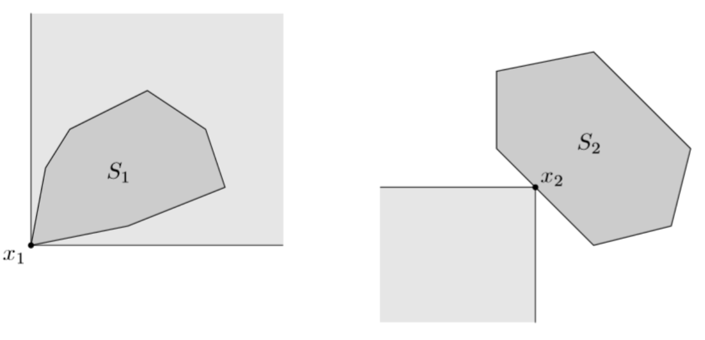
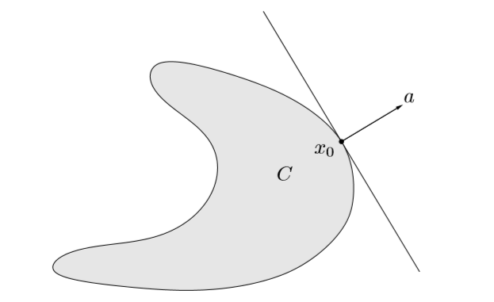
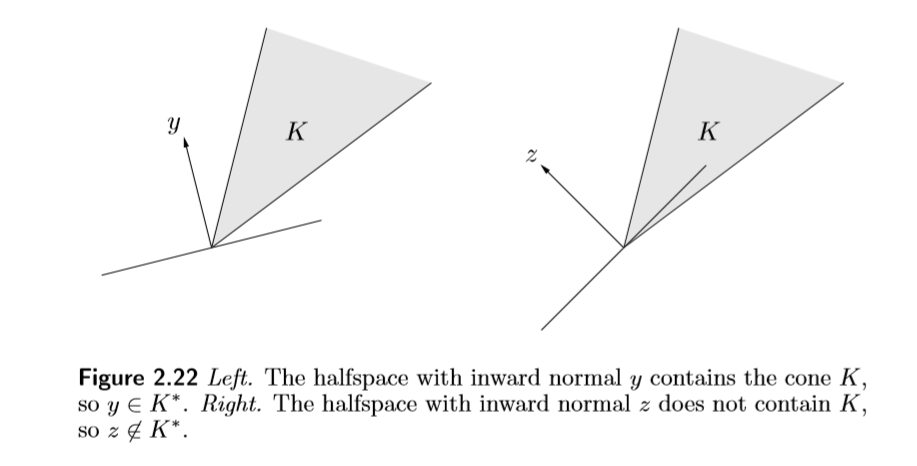
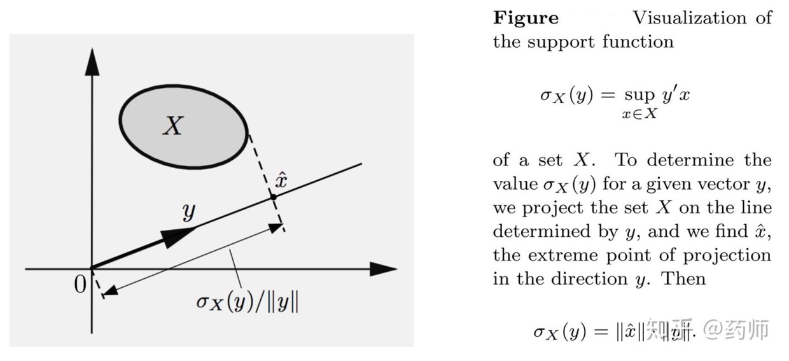

<!-- #! https://zhuanlan.zhihu.com/p/441144463

# Convex Set -->

凸的背后，往往蕴含着非常好的性质，这也就是我们要去研究凸集的原因。凸，在优化理论扮演着非常重要的角色。本文是我的一个注记，不会包含太多证明，主要取自Boyd的 《convex optimization》、GTM 264 《Functional Analysis, Calculus of Variations and Optimal Control》。

未经特别说明，讨论的空间都是 $\mathrm{R}^n$ 。

## 仿射和凸集

### 仿射集

一个集合 $C$ 是仿射集（affine set），如果对任意 $x_1, x_2 \in C$ 和 $\theta \in \mathrm{R}$ 都有：

$$
\theta x_1 + (1-\theta)x_2 \in C\\
$$

需要注意的是这里的 $\theta$ 取值是全体实数（而不是介于0到1之间）。这意味着仿射集中任意两点连成的直线位于集合内。

仿射集可以写成一个线性子空间的仿射，即存在子空间 $V$ 使得：

$$
C=V+x_{0}=\left\{v+x_{0} \mid v \in V\right\}\\
$$

类比非齐次线性方程组的解是一个仿射子集而对应的齐次线性方程组的解是一个线性子空间。

定义 $x_1, x_2, \dots, x_n$ 的 **affine combination** 为：
$$
\theta_1 x_1 + \cdots + \theta_n x_n \qquad \text{where } \; \sum_{i=1}^n \theta_i = 1
$$
对任意一个集合$C$，我们可以定义它的仿射包 （affine hull）为其所有点的 affine combination：

$$
\text { aff } C=\left\{\theta_{1} x_{1}+\cdots+\theta_{k} x_{k} \mid x_{1}, \ldots, x_{k} \in C, \theta_{1}+\cdots+\theta_{k}=1\right\}\\
$$

仿射包是包含这个集合的最小仿射集。

> affine hull、convex hull、conic hull 可以由内向外来定义（各个点的组合），也可以由外向内定义（所有包含该集合的xx的交）。

例：

+ 

affine independence

通过仿射包可以定义相对内点（relative interior）这一概念。仿射集可以认为是一个平移后的子空间，所以仿射包能揭示一个集合真正的维度。

相对内点与内点是有所不同的，比如考虑一个三维空间中的正方形。这个正方形内部的点，不是内点，但是是相对内点，只要我们把空间缩小为一个特定的二维空间，其相对内点就会变成真正的内点。再考虑三维空间中的一个球面，它的相对内点集是空集。

相对内点准确的定义是：

$$
\text { relint } C=\{x \in C \mid B(x, r) \cap \text { aff } C \subseteq C \; \text { for some } r>0\}\\
$$

其中 $B(x, r)=\{y \mid\|y-x\| \leq r\}$。通过相对内点还可以引出相对边界这一概念。还是上面那两个例子，正方形的相对边界就是正方形的四条边，球面的相对边界就是自己。

### 凸集

一个集合 $C$ 是凸集（convex set），如果对任意 $x_1, x_2 \in C$ 和 $\theta \in [0, 1]$ 都有：

$$
\theta x_1 + (1-\theta)x_2 \in C\\
$$

仿射集自然是凸集的一种，类比于仿射集的相关概念，我们可以得到**凸包**（*convex hull* ）的定义：

$$
\operatorname{conv} C=\left\{\theta_{1} x_{1}+\cdots+\theta_{k} x_{k} \mid x_{i} \in C, \theta_{i} \geq 0, i=1, \ldots, k, \theta_{1}+\cdots+\theta_{k}=1\right\}\\
$$

集合 $\mathrm{C}$ 的凸包是包含集合 $\mathrm{C}$ 的最小凸集。

### 锥

在优化理论中，锥（Cones）是一个无限大的集合，与日常所接触的圆锥有所不同。

一个集合$C$是锥，如果对任意 $x \in C$ 和 $\theta \geq 0$ 都有：

$$
\theta x \in C\\
$$

**锥不一定是凸的**。如果一个锥是凸的，就称它是一个**凸锥**（convex cone）。比如 $y=|x|$ 的图像就是一个锥，但不是凸锥。但是 $y\ge |x|$ 就是一个凸的锥了。注意到任何锥都包含原点 $\mathbf{0}$。

类似的可以得到锥包（conic hull ），它是包含某个集合的最小的凸锥。

$$
\operatorname{coni}(C) = \{\theta_1 x_1 + \cdots +\theta_k x_k \mid x_i \in C, \theta_i \geq 0, i=1, ..., k\}\\
$$

### 示例

下面列举一些凸集的例子：

+ 空集、一个点、一个线段、全空间

+ 超平面和半平面

$\mathrm{R}^n$ 中超平面有形式：

$$
\left\{x \mid a^{T} x=b\right\}, \quad a \neq 0\\
$$

$a$ 是这个超平面的法向。也可以写成：

$$
\left\{x \mid a^{T}\left(x-x_{0}\right)=0\right\} ,\quad a \neq 0\\
$$

一个超平面将全空间分成了两个半平面，一个半平面有形式：

$$
\left\{x \mid a^{T} x\leq b\right\}, \quad a \neq 0\\
$$

+ 球、椭球

欧式空间中的球有形式：

$$
B\left(x_{c}, r\right)=\left\{x \mid\left\|x-x_{c}\right\|_{2} \leq r\right\}=\left\{x \mid\left(x-x_{c}\right)^{T}\left(x-x_{c}\right) \leq r^{2}\right\}\\
$$

其中 $x_c$ 是球心，$r$ 是半径。另一种常用的表达方式是：

$$
B\left(x_{c}, r\right)=\left\{x_{c}+r u \mid\|u\|_{2} \leq 1\right\}\\
$$

椭球会借助一个正定矩阵来表示：

$$
\mathcal{E}=\left\{x \mid\left(x-x_{c}\right)^{T} P^{-1}\left(x-x_{c}\right) \leq 1\right\}\\
$$

$x_c$ 是椭球的球心，$P = P^T$ 是正定矩阵。椭球各个轴的方向是 $P$ 的特征向量的方向，每个半轴的长度是 $\sqrt{\lambda_i}$，即特征值开根号。另一种表达方式是：

$$
\mathcal{E}=\left\{x_{c}+A u \mid\|u\|_{2} \leq 1\right\}\\
$$

+ 正规锥（norm cones）

$$
C=\{(x, t) |\|x\| \leq t\} \subseteq \mathbf{R}^{n+1}\\
$$

也被叫做二阶锥（second order cones）、冰淇淋锥（ice-cream cones）。

+ 凸多面体（polyhedron）

$$
\mathcal{P}=\left\{x | a_{j}^{T} x \leq b_{j}, j=1, \ldots, m, c_{j}^{T} x=d_{j}, j=1, \ldots, p\right\}\\
$$

线性规划的可行域是一个 polyhedron；当一个 polyhedron 有界时，也经常叫 polytope。非负象限是一个特殊的 polyhedron：

$$
\mathbf{R}_{+}^{n}=\left\{x \in \mathbf{R}^{n} \mid x_{i} \geq 0, i=1, \ldots, n\right\}=\left\{x \in \mathbf{R}^{n} \mid x \succeq 0\right\}\\
$$

非负象限既是一个锥，也是一个凸多面体，因此有一个特殊的名称，polyhedral cone，一般可表示为 $\{x \mid Ax \geq 0\}$。

+ 单纯形 （simplex）

单纯形是一类重要的凸多面体，它由 $k+1$ 个不在同一个平面的点 $v_0, \dots, v_k \in \mathbf{R}^n$ 的凸组合构成。

$$
C=\operatorname{conv}\left\{v_{0}, \ldots, v_{k}\right\}=\left\{\theta_{0} v_{0}+\cdots+\theta_{k} v_{k} \mid \theta \succeq 0,1^{T} \theta=1\right\}\\
$$

不同的两个点、不共线的三个点、不共面的四个点，它们生成的凸包，分别构成了一维、二维、三维的单纯形。

特别地，unit simplex，或者说 probability simplex，由 $n$ 个直角坐标单位向量的凸组合构成：

$$
x \succeq 0, \quad \mathbf{1}^{T} x \leq 1\\
$$

离散型随机变量的概率分布就是一个典型的 unit simplex。

+ 半定矩阵锥（positive semidefinite cone）

我们用记号 $\mathrm{S}^n$ 来表示所有的 $n$ 阶实对称矩阵组成的集合， $\mathrm{S}^n_+$ 表示所有的半正定矩阵，$\mathrm{S}^n_{++}$ 表示所有的正定矩阵。其中，$\mathrm{S}_{+}^n$ 是一个闭的 convex cone。所有的 $n$ 阶方阵是一个线性空间，$\mathrm{S}^n_{+}$ 是这个线性空间的一个锥。
半定矩阵锥，让我们 **对凸集的认识，从欧式空间，飞跃到了抽象的线性空间！** 这让我们得以在矩阵空间上考虑优化问题。这也是锥线性规划的起点！

+ 几类重要的锥

对一个任意的集合 $C$，它边界点 $x_0$ 的 **normal cone** 指的是集合 $\{y \mid y^T (x - x_0) \leq 0,\; \forall x \in C\}$。即 $y$ 与任何以 $x_0$ 为端点的线段都不构成锐角。不论集合 $C$ 是什么，它的 normal cone 都是一个凸锥！

对一个任意的集合 $C$，它的 **barrier cone** 被定义为集合 $\{y \mid |y^T x| < +\infty, \; \forall x \in C\}$。即非零向量 $y$ 是包含 $C$ 的半平面 $\{x \mid y^T x \leq \alpha\}$ 的法向。不论集合 $C$ 是什么，它的 barrier cone 也是一个凸锥！

对一个任意的集合 $C$，它的 **recession cone** 被定义为集合 $\{y \mid x - ty \in C, \;  \forall x \in C, \; \forall t \geq 0\}$。$C$ 的回收锥可以理解为是 $C$ 内所有可以无限延伸的方向生成的锥。凸集的 recession cone 是一个凸锥；特别地，多面体 $\{x \mid Ax = b\}$ 的 recession cone 是 $\{y \mid Ay=0\}$。

如果 $C$ 是一个非空的闭凸集，那么 $C$ 的 recession cone 是它的 barrier cone 的对偶锥。

+ 几类概率约束

给定一个离散型随机变量 $X$，$P(X=a_i)=p_i, i=1,2,...n$，已知概率分布 $\vec{p}$ 构成一个标准的单纯形，这是一个凸集，且以下概率约束对 $\vec{p}$ 也是凸的：

1. $\alpha \leq \mathbb{E}f(X)\leq \beta$，其中 $f$ 是给定的函数
2. $\mathbb{P}(X > \alpha)\leq \beta$
3. $\mathbb{E}X^2\leq \alpha, \,  \mathbb{E}X^2 \geq \alpha$
4. $\mathrm{Var}(X)\geq \alpha$（ $\mathrm{Var}(X) \leq \alpha$ 不是凸的约束）

此外，KL散度 $D_{KL}(p \lVert q)=\displaystyle\sum_{i=1}^n p_i \log \displaystyle\frac{p_i}{q_i}$ 对 $(p, q)$ 是凸的。

### 极点

称 $x$ 是凸集 $C$ 的极点，如果不存在两点 $x_1, x_2\;(x_1 \neq x_2)$，使得
$$
x = \frac{1}{2}(x_1 + x_2)
$$

+ 闭区间 $[a, b]$ 的极点是 $a$ 和 $b$

+ 单位球的任意一点都是极点

+ 半平面、仿射集没有极点

一般用 $\operatorname{ext} C$ 来表示 $C$ 的极点集。

凸紧集必然存在极点。令 $\bar{x}$ 是连续函数 $x \to \| x \|^2$ 在 $C$ 上的最小值点，容易验证 $\bar{x}$ 是极点。

**H. Minkowski** 对凸紧集 $C \subset \mathrm{R}^n$ 满足：$C = \operatorname{conv} (\operatorname{ext} C)$

### 凸集的表示

**Caratheodory’s theorem**：

$S$ 是 $\mathrm{R}^n$ 的子集，那么， $x \in \operatorname{conv} S$，当且仅当存在一个至多包含 $S$ 中 $n+1$ 个点的 $A \subset S$，使得 $x$ 是 $A$ 中点的凸组合。

这个定理反过来是显然的，如果 $x$ 是 $A$ 中点的凸组合，那么必然 $x \in \operatorname{conv} S$。

现在设 $x \in \operatorname{conv} S$，那么根据凸包的定义，不妨设存在 $k > n, \lambda _i > 0$，使得 $x = \sum_{i=0}^k \lambda_i x_i$， 现在 $x_i - x_0 \: (1 \leq i \leq k)$ 这超过 $n$ 个的向量族必然是线性相关的，这样就可以采用线性相关的定义来证明 $x$ 只需要用 $k-1$ 个点的凸组合来表示就行了。

例：设 $S = \{(0, 0), (0, 1), (1, 1), (1,0)\}$，$S$ 表示的是单位正方形的四个点，$\operatorname{conv} S$ 就是一个单位正方形。在这个单位正方形里随便取一个点，总能找到由 $S$ 中三个点组成的三角形覆盖住这个点。

关于 $\operatorname{coni} S$ 成立一个类似的定理，只不过点数从 $n+1$ 减少到了 $n$ 个。

**W. Fenchel and L. Bunt**：

如果 $S \subset \mathrm{R}^n$ 是一个**连通**的凸集，则 $x \in \operatorname{conv} S$ 可以被表示成 $S$ 中 $n$ 个点的凸组合；这个结论可以被放宽至 $S$ 有不超过 $n$ 个连通分量。

**Minkowski and Weyl**：polyhedron representation

有界多面体可由其极点唯一决定。对于无界的多面体，可以由极点和方向来决定（extreme points and extreme rays）。

这写下来就是：对任何 $P = \{x \mid Ax \leq b\}$，总能找到两个点集 $V, R$ ，使得：
$$
P = \operatorname{conv}(V) + \operatorname{coni}(R)\\
$$
也就是说，多面体可以表示成一个凸集和一个锥的 Minkowski sum。这个定理在一些教材中也叫做 resolution theorem.

参考：https://scaron.info/robotics/polyhedra-and-polytopes.html

### 保持凸性的操作

+ 凸集的交、和、差、直积

如果 $C_1, C_2$ 是凸集，那么 $C_1 \bigcap C_2, \;C_1 + C_2, \; C_1 - C_2, \; C_1 \times C_2$  是凸集。

例：

半正定矩阵锥是**无穷多个**半平面的交：

$$
\mathrm{S}^n_+=\bigcap_{z \neq 0}\left\{X \in \mathbf{S}^{n} \mid z^{T} X z \geq 0\right\}\\
$$

所以它是凸的。**无穷多个凸集的交，仍然是凸集**。

> 由于 $f(X) = z^T Xz$ 是一个线性函数，所以 $\left\{X \in \mathbf{S}^{n} \mid z^{T} X z \geq 0\right\}$ 实质是 $\mathrm{S}^n_+$ 中的半平面。

要注意**两个凸集的并不是凸集**。事实上，如果 $C_1, C_2$ 是凸集，那么成立：

$$
\operatorname{conv}(C_1\cup C_2) = C_1 + C_2\\
$$

+ 仿射变换（affine transformation）

如果 $C$ 是一个凸集，$f$ 是一个有着形式 $f(x)=Ax+b$ 的仿射函数，那么 $f(C), f^{-1}(C)$ 都是凸集。

比如椭球就可以看作是球的仿射。

例：

形如 $A(x)=x_{1} A_{1}+\cdots+x_{n} A_{n} \preceq B$ 的叫做线性矩阵不等式（linear matrix inequality)，其中 $A_i, B \in \mathrm{S}^m$，其解集 $\{x \mid A(x) \preceq B\}$ 是一个凸集，它是 $\mathrm{S}^n_{+}$ 在仿射函数 $f: \mathrm{R}^n \to \mathrm{S}^m_+,\;\; f(x)=B-A(x)$ 下的逆像。

+ 透视函数（perspective functions）

定义透视函数 $P: \mathrm{R}^{n+1} \to \mathrm{R}^n$，$\operatorname{dom} P=\mathrm{R}^n \times R_{++}$ 且 $P(z, t) = z/t$，那么，如果凸集 $C \subseteq \operatorname{dom} P$ ，那么 $P(C) = \{P(x) \mid x \in C\}$。

一个凸集在透视函数的映射下仍然是凸的。透视函数的作用可以理解为是“针孔摄像头”！

+ 线性分数变换（Linear fractional transformation）

线性分数变换指的是：

$$
f(x) = \displaystyle\frac{Ax +b}{c^T x + d}, \operatorname{dom} f = \{x \mid c^T x + d > 0\}\\
$$

凸集，在线性分数变换下的像/原像，都是凸的。

## 广义不等式（generalized inequalities）

### 正规锥（proper cones）

这是一个很重要的概念！如果一个锥是闭凸，并且内点集非空（solid），并且 pointed，就称它为 proper cone。

> pointed: $x \in K, -x \in K \Longrightarrow x = 0$; cone $K$ Contains no line。

乍一看这个概念很突兀。**proper cone 最重要的作用是能定义一个集合上的偏序关系（partial ordering）**：

$$
x \preceq_{K} y \Longleftrightarrow y-x \in K\;\; , \;x \prec_{K} y \Longleftrightarrow y-x \in \mathbf{int}K\\
$$

如果取 $K=\mathrm{R}_+$，那么得到的序关系就是正常的实数比较。

如果取 $K=\mathrm{R}^{n}_+$，那么向量 $\vec{x}\preceq\vec{y}$ 当且仅当每个分量  $x_i \leq y_i$。

$\mathrm{S^{n}_+}$ 是 $\mathrm{S^n}$ 中的一个 $\mathrm{proper\; cone}$，$X\preceq_{K} Y$，当且仅当 $Y-X$ 是半正定的；$X\prec_{K} Y$，意味着 $Y-X$是正定的，所以很多时候我们直接简写 $X\succ 0$ 来声明$X$是正定矩阵；同时简写 $x \succ 0$ 声明向量 $x$ 的各个分量都大于0。 

这样的偏序关系有非常良好的性质：

+ 传递性：

$$
x \preceq_{K} y \;\text { and }\; y \preceq_{K} z \Longrightarrow x \preceq_{K} z\\
$$

+ 加性：

$$
x \preceq_{K} y \;\text { and }\; u \preceq_{K} v \Longrightarrow x+u \preceq_{K} y+v\\
$$

以上的 $\preceq_K$ 均可换成 $\prec_K$ 。虽然《convex optimization》书上列了很多性质，但是大都不太重要（我认为）。

更多 proper cone 的例子：

+ 单调非负锥（monotone nonnegative cone）：

$$
K_{m+} = \{x \in \mathrm{R}^n \mid x_1 \geq x_2 \geq \cdots \geq x_n \geq 0\}\\
$$

+ 多项式锥（cone of polynomials）：

$$
K=\left\{c \in \mathrm{R}^{n} \mid c_{1}+c_{2} t+\cdots+c_{n} t^{n-1} \geq 0 \;\; \text { for } t \in[0,1]\right\}\\
$$

### 最大和最小元素

有了序关系，自然就会考虑这样一个偏序集的最大/最小的元素（maximum/minimum）。

显然，如果这样的元素存在，那么必然是唯一的。但实际上，并不是所有的元素都是可比较的（comparable），我们可以藉此定义“极小元”、“极大元”（minimal, maximal），意为，没有元素比它们来的更大/更小，容易知道它们不是唯一的。

比如0是非负象限锥的最小元，但是不是任意两点都是能比较的。

用 $x-K$ 表示，所有的可以与 $x$ 比较的、并且小于等于 $x$ 的元素全体，此时 $x$ 是 $S$ 中的极小元，当且仅当：$(x-K) \cap S=\{x\}$。

类似地，用 $x+K$ 表示所有与 $x$ 可以比较的、并且大于等于 $x$ 的元素全体。

$K=R^2_+$ 的情况如下图，左图的 $x_1$ 是最小点，而右图的 $x_2$ 是极小点

## 分割和支撑超平面定理

### 分割超平面（separating hyperplane）

考虑两个**不相交**的凸集，是不是能找到一个超平面把它们分割开？如果其中一个变成凹集，是不是就做不到了？

对于 $n$ 维空间中的一个超平面，我们习惯用$\left\{x | a^{T} x=b\right\}$来表示。一个超平面将全空间分割成两个半空间。

超平面分割定理，说的就是两个不相交的凸集，一定存在 $a \neq 0$ 的超平面使得在其中一个凸集满足 $a^T x\ge b$，而另一个凸集中成立 $a^T x \leq b$。这个超平面 $\left\{x | a^{T} x=b\right\}$ 就叫做这两个凸集的分割超平面。

进一步，如果不等关系**严格成立**，就说这两个凸集被**严格分割**（strict separation）。

>定义两个凸集的欧几里得距离是这两个集合中两个点距离的下确界：
>$$
>\operatorname{dist}(C, D)=\inf \left\{\|u-v\|_{2} | \;u \in C, v \in D\right\}\\
>$$

乍一看，好像很多的凸集对都是可以被严格分割的。**但注意凸集不一定要是闭的**。

两个开的不相交的凸集很容易找到例子说明它们可能不能被严格分割。当两个不相交的凸集都是闭的，比如 $A=\{(x, y) \mid x y \geq 1, x, y>0\}$和 $B=\{(x, y)  \mid x \leq 0\}$，也可能不能被严格分割。

**严格分割只在某些特定的情况下**，比如**一个闭凸集和这个凸集外的一点**，这两个凸集是可以被严格分割的。如果这个凸集是开的，并且这个点选为凸集的边界点，那么就不能被严格分割。

> **点与凸集的分离定理**，说的正是闭凸集和集合外一点可以被严格分割；利用它，我们进一步才得到下面的**支持超平面定理**。

通过上一段的那个结论，我们可以得到，任意一个闭凸集是所有包含这个凸集的半空间的交。如果这些凸集可以是有限个，就说这个凸集是可以被有限生成的。（finitely generated）

### 支撑超平面（supporting hyperplane）

对凸集 $C$，如果有 $x_{0} \in \mathbf{b d} C=\mathbf{cl} C \backslash \mathbf{ int } C$，并且

$$
a^{T} x \leq a^{T} x_{0}\;\;\; \text { for all } x \in C\\
$$

那么超平面 $\left\{x | a^{T} x=a^{T} x_{0}\right\}$ 就叫做 $C$ 在 $x_0$ 这点的支撑超平面。凸集的任何个边界点都存在支撑超平面，这就是支撑超平面定理。

值得一提的是，支撑超平面定理的逆定理也成立。即如果一个内点集非空的闭集，在每一个边界点上都有一个支撑超平面，那么它是凸的。（虽然这个命题非常直觉，但是证起来可不容易）

分离和支持超平面定理是优化理论非常基本的定理。

## 对偶锥（dual cones）

设 $K$ 是个锥，定义 $K$ 的对偶锥为：

$$
K^{\ast}=\left\{y \mid x^{T} y \geq 0 \;\; \text { for all } x \in K\right\}\\
$$

顾名思义，$K^{\ast}$ 是一个锥，更有意思的是 $K^\ast$ 总是凸的，不论 $K$ 是不是凸的。

例：

+ 线性空间的子空间 $V$ 的对偶锥是其正交补 $V^\perp$。
+ 二阶锥、非负象限锥和半正定锥的对偶锥是其本身，称其为**自对偶锥（self-dual）**。
+ polyhedron cone $\{x \mid Ax \succeq 0\}$ 的对偶锥是 $\{A^Ty \mid y \succeq 0\}$。

> 在 $\mathrm{S}^n$ 上定义 Frobenius 范数，$\mathrm{S}^n_+$ 的自对偶性源自
> $$
> \operatorname{tr}(XY) \geq 0 \;\; \text{ for all} \; X \succeq 0 \Longleftrightarrow Y \succeq 0 \\
> $$

$p$ 范数锥 $K = \{(x, t) \in \mathrm{R}^{n+1} \mid \| x\|_ p\leq t\}$ 的对偶是 $q$ 范数锥 $K^\ast = \{(u, v) \in \mathrm{R}^{n+1} \mid \| u \|_{\ast} \leq v\}$，且 $1/p + 1/q = 2$。

从几何上看，$K^\ast$ 中任意一点与 $K$ 中所有点的夹角不超过90°。

对偶锥有以下性质：

+ $K^\ast$ 闭且凸（closed and convex）
+ $K_1 \subseteq K_2 \Longrightarrow K_2^\ast\subseteq K_1^\ast$
+ 如果 $K$ 有非空内点，那么 $K^\ast$ 不包含任何直线（pointed）
+ $K^{\ast\ast}$  是 $\operatorname{conv} K$ 的闭包，从而，如果 $K$ 是闭且凸的，那么 $K=K^{\ast\ast}$。

> pointed: if $x\in K, -x \in K$，then $x=0$

这些性质说明如果 $K$ 是一个 proper cone，那么 $K^\ast$ 也是一个 proper cone，并且 $K=K^{\ast\ast}$。

### 对偶广义不等式

之前我们已经知道 proper cone $K$ 能诱导出一个偏序关系。现在$K^\ast$也是一个 proper cone，通过 $K^\ast$ 也能定义一个偏序关系了。

此外，通过对偶性可以给出广义不等式的等价命题：

+ $x \preceq_{K} y \Leftrightarrow \lambda^{T} x \leq \lambda^{T} y ,\; \; \forall \lambda \succeq_{K^{\ast}} 0$
+ $x \prec_{K} y \Leftrightarrow  \lambda^{T} x<\lambda^{T} y,\;\;  \forall \lambda \succeq_{K^{\ast}} 0, \lambda \neq 0 .$

通过定义很容易验证上图的结论。

上式的含义是，**对偶锥中的每个元素（向量）可以看成原来锥的一个合法的投影方向，原来锥上两个点在这些合法的投影方向上序不变！** 在锥形式的对偶中就要用到这条性质。

> Since $K=K^{\ast\ast}$, we have $\lambda \preceq_{K^\ast} \mu$ if and only if $\lambda^{T} x \leq \mu^{T} x$ for all $x \succeq_K 0$

### 对偶不等式与最小元/极小元

借助对偶性可以建立起最小元和极小元的相关理论。

对于最小元，$x$ 是 $S$ 的最小元当且仅当，$\forall \lambda \succ_{K^\ast} 0$， $x$ 是问题 $\min_{z\in S} \;\lambda^T z$ 的最优解。

对于极小元，没有充分必要的条件。其充分条件是：如果 $\exists \lambda \succ_{K^\ast} 0$ 并且 $x$ 是问题 $\min_{z\in S} \;\lambda^T z$ 的最优解，那么 $x$ 就是 $S$ 的极小元。（找到一个方向，在这个方向上的投影是最小的）。如果 $S$ 是凸集，这就是充分必要的。

（完结撒花）

---

## 第二部分

这是一条分割线，如果有时间，我会在下面继续补充一些重要的知识。

### 支撑函数

一个集合 $C$ 的支撑函数（support function）定义为：

$$
S_C(y) = \sup\, \{y^Tx \mid x \in C\}
$$

容易看到，支撑函数是一个齐次函数（homogeneous），并且不论集合 $C$ 是什么，$S_C$ 都是凸函数！

例子：

+ 单点集 $\{a_0\}$ 的支撑函数是 $S(y) = a_0^T y$
+ 半径为 1 的单位球的支撑函数是 $S(y) = \| y\|_2$
+ $\mathcal{U} = \{x \mid \| x - \mu \| \leq 1\}$ 的支撑函数是 $S_{\mathcal{U}} (y) = y^T \mu + \| y\|_\ast$ （这个在鲁棒优化里面有应用）

下面这个定理说明，一个闭凸集被它的支撑函数完全刻画：

**如果 $C$ 和 $D$ 是闭凸集，那么 $C = D$ 当且仅当 $S_C = S_D$**。

假如 $S_C = S_D$，先证明 $D \subseteq C$；假如说存在一点 $x_0 \in D, x_0 \notin C$，因为 $C$ 是闭集，而闭集和闭集外一点是可以找到超平面严格分割的，于是，存在 $a \neq 0$，使得 $a^T x_0 > b$，且 $a^T x < b, \,\forall x  \in C$，这意味着：

$$
\sup _{x \in C} a^{T} x \leq b<a^{T} x_{0} \leq \sup _{x \in D} a^{T} x \\
$$

与 $S_C = S_D$ 矛盾，这就证明了 $D \subseteq  C$，于是 $D=C$。

#### 支撑函数的几何意义

对于每一个 $a \in \mathrm{R}^n$ ，借助支撑函数都能找到包含 $C$ 的一个支撑超平面：

$$
H_a = \{ y \mid  y^T a \leq S_C(a)\} \\
$$

这个超平面以 $a$ 为法向量。

在上图中 $y$ 引出的支撑超平面就是虚线标的那条。

**利用支撑函数可以证明，一个闭凸集等于它所有的支撑半平面的交集。**

### 对偶范数的进一步理解

当我们在研究 $X = \mathrm{R}^n$ 的时候（此时没有引入范数），我们会发现 $\mathrm{R}^n$ 的对偶空间 $X^\ast$ 和 $\mathrm{R}^n$ 是线性同构的，如果我们在 $\mathrm{R}^n$ 中引入范数，那么它的对偶空间的元素，也会有随之定义的算子范数！

在 $\mathrm{R}^n$ 空间中，范数 $\| \cdot \|$ 的对偶范数被定义为：

$$
\|z\|_{\ast}=\sup \left\{z^{T} x \mid\|x\| \leq 1\right\} \\
$$

我们知道 $(\mathrm{R}^n, \|\cdot \|)$ 是一个 Banach space，该空间上每一个元素 $z$ 都能诱导出一个 linear functional：

$$
f_z(x) = z^T x \\
$$

这个 linear functional $f_z$ 的算子范数就是 $z$ 的对偶范数！所以，$(\mathrm{R}^n, \| \cdot \|)$ 的对偶空间是 $(\mathrm{R}^n, \|\cdot \|_\ast)$。

> $\mathrm{R}^n$ 上的所有线性泛函都具有形式：$f(x) = a^T x$. 
>
> 见：https://math.stackexchange.com/questions/3377554/show-that-any-linear-function-f-mathbbrn-to-mathbbr-is-of-the-form-fx

根据对偶范数的定义可以得到不等式：

$$
\|x \| \cdot \|z\|_\ast \leq |x^T z| \\
$$

在矩阵空间 $\mathrm{R}^{m\times n}$ 上，类似的，有限维线性空间与其对偶空间都是线性同构的，假如我们在 $\mathrm{R}^{m\times n}$ 引入谱范数（spectrum norm），即矩阵最大的奇异值，类似可以在矩阵空间上构造线性泛函：

$$
f_Z (X) = \operatorname{tr}(Z^T X) \\
$$

这个由矩阵 $Z$ 诱导出的线性泛函，它的算子范数：

$$
\|Z\|_{2 *}=\sup \left\{\operatorname{tr}\left(Z^{\top} X\right) \mid\|X\|_{2} \leq 1\right\} = \sum_i\sigma_i(Z) \\
$$

就是核范数（nuclear norm），即矩阵所有奇异值的和。

### 近似的凸集表示定理

