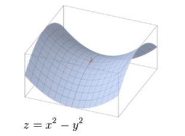

对偶是优化里非常重要的一个工具。

## 拉格朗日对偶函数

对偶问题是研究优化问题的有力武器。考虑一个具有标准形式的优化问题：

$$
\begin{array}{ll}
\operatorname{minimize} & f_{0}(x) \\
\text {subject to } & f_{i}(x) \leq 0, \quad i=1, \ldots, m \\
& h_{i}(x)=0, \quad i=1, \ldots, p
\end{array}
$$

记整个的可行域为$\mathcal{D}$，定义上述问题对应的**拉格朗日函数（Lagrangian）**为

$$
L(x, \lambda, \nu)=f_{0}(x)+\sum_{i=1}^{m} \lambda_{i} f_{i}(x)+\sum_{i=1}^{p} \nu_{i} h_{i}(x)
$$

其中 $\lambda_i, \nu_i$ 称为**拉格朗日乘子（Lagrange multiplier）**，或者对偶变量。 $\operatorname{dom} L=\mathcal{D} \times \mathbf{R}^{m} \times \mathbf{R}^{p}$

接着，我们定义**拉格朗日对偶函数（Lagrange dual function）** $g:  \mathbf{R}^{m} \times \mathbf{R}^p\to \mathbf{R}$：

$$
g(\lambda, \nu)=\inf _{x \in \mathcal{D}} L(x, \lambda, \nu)=\inf _{x \in \mathcal{D}}\left(f_{0}(x)+\sum_{i=1}^{m} \lambda_{i} f_{i}(x)+\sum_{i=1}^{p} \nu_{i} h_{i}(x)\right)
$$

如果拉格朗日函数没有下界，就记 $g=-\infty$。$L(x, \lambda, \nu)$ 是关于 $\lambda,\nu$ 的仿射函数，从而，**对偶函数 $g$ 是一个凹函数，即使原来的优化问题不是凸的**。

假设 $\tilde{x}\in\mathcal{D}$，如果 $\lambda \succeq 0$ ，我们可以得到：

$$
\sum_{i=1}^{m} \lambda_{i} f_{i}(\tilde{x})+\sum_{i=1}^{p} \nu_{i} h_{i}(\tilde{x}) \leq 0
$$

进而：

$$
g(\lambda, \nu)=\inf _{x \in \mathcal{D}} L(x, \lambda, \nu) \leq L(\tilde{x}, \lambda, \nu) \leq f_{0}(\tilde{x})
$$

因为 $g(\lambda, \nu)\leq f_{0}(\tilde{x})$ 对 $\forall \tilde{x}\in\mathcal{D}$ 都成立，对两边取下确界，就有：

$$
g(\lambda, \nu)\leq p^*
$$

$p^*$ 是优化问题的最优值。

这说明，**原优化问题的最优值是对偶函数的一个上界！**这个性质是接下来提出对偶问题的基本出发点。

> 如果是一个 maximize 的问题，拉格朗日函数应为：
> $$
> L(x, \lambda, \nu)=f_{0}(x)-\sum_{i=1}^{m} \lambda_{i} f_{i}(x)+\sum_{i=1}^{p} \nu_{i} h_{i}(x)
> $$
> 对偶函数为：
> $$
> g(\lambda, \nu)=\sup _{x \in \mathcal{D}} L(x, \lambda, \nu) \geq L(\tilde{x}, \lambda, \nu) \geq f_{0}(\tilde{x})
> $$

对偶函数可以用来求一个困难问题的界。例如下面这个非凸最优化问题：

$$
\begin{array}{ll}
\operatorname{minimize} & x^{T} W x \\
\text {subject to } & x_{i}^{2}=1, \quad i=1, \ldots, n
\end{array}
$$

它其实是一个组合问题，向量 $x$ 的每个分量要么是 $1$ 要么是 $-1$。写出它的拉格朗日函数：

$$
\begin{aligned}
L(x, \nu) &=x^{T} W x+\sum_{i=1}^{n} \nu_{i}\left(x_{i}^{2}-1\right) \\
&=x^{T}(W+\operatorname{diag}(\nu)) x-\mathbf{1}^{T} \nu
\end{aligned}
$$

对偶函数：

$$
\begin{aligned}
g(\nu) &=\inf _{x} x^{T}(W+\operatorname{diag}(\nu)) x-\mathbf{1}^{T} \nu \\
&=\left\{\begin{array}{ll}
-\mathbf{1}^{T} \nu & W+\operatorname{diag}(\nu) \succeq 0 \\
-\infty & \text { otherwise }
\end{array}\right.
\end{aligned}
$$

为了得到原问题的一个下界，我们可以取一个特殊的对偶变量：

$$
\nu=-\lambda_{\min }(W) \mathbf{1}
$$

这时

$$
W+\operatorname{diag}(\nu)=W-\lambda_{\min }(W) I \succeq 0
$$

是对偶可行的。最终我们得到原问题的一个下界：

$$
p^{\star} \geq-\mathbf{1}^{T} \nu=n \lambda_{\min }(W)
$$

当然，这个下界也可以将原问题的约束条件放宽成 $\sum_{i=1}^{n} x_{i}^{2}=n$ 来得到。

> 在这里，原问题是一个难解的组合问题，但是对偶问题是一个容易解的SDP。

### 对偶函数与共轭函数

【重写】

回想一下，$f$ 的共轭函数被定义为：

$$
f^{*}(y)=\sup _{x \in \operatorname{dom} f}\left(y^{T} x-f(x)\right)
$$

共轭函数与对偶函数具有紧密的关系。考虑以下问题：

$$
\begin{array}{ll}
\operatorname{minimize} & f_{0}(x) \\
\text {subject to } & A x \preceq b \\
& C x=d
\end{array}
$$

它的对偶函数：

$$
\begin{aligned}
g(\lambda, \nu) &=\inf _{x}\left(f_{0}(x)+\lambda^{T}(A x-b)+\nu^{T}(C x-d)\right) \\
&=-b^{T} \lambda-d^{T} \nu+\inf _{x}\left(f_{0}(x)+\left(A^{T} \lambda+C^{T} \nu\right)^{T} x\right) \\
&=-b^T\lambda -d^T \nu - \sup_x\left(-\left(A^T\lambda +C^T v\right)^T x-f_0(x)\right)\\
&=-b^{T} \lambda-d^{T} \nu-f_{0}^{*}\left(-A^{T} \lambda-C^{T} \nu\right)
\end{aligned}
$$

同时 $g$ 的定义域：

$$
\operatorname{dom} g=\left\{(\lambda, \nu) |-A^{T} \lambda-C^{T} \nu \in \operatorname{dom} f_{0}^{*}\right\}
$$

**一般地，对于某些特殊形式的优化问题，可以通过共轭函数的形式来表示对偶函数。**

## 拉格朗日对偶问题

既然对偶函数的每一个函数值都是原问题的下界，那么是否可以通过计算对偶函数的最大值来逼近原问题的最优值呢？这就导出了**拉格朗日对偶问题**：

$$
\begin{array}{ll}
{\text { maximize }} & g(\lambda, \nu) \\
\text { subject to } & \lambda \succeq 0
\end{array}
$$

其中 $\operatorname{dom} g=\{(\lambda, \nu) |\; g(\lambda, \nu)>-\infty\}$。

求解拉格朗日对偶问题的好处在于，**无论原问题是不是凸问题，对偶问题都是凸优化类问题！**

> 对偶问题的约束条件，往往来源于$\operatorname{dom} g=\{(\lambda, \nu) |\; g(\lambda, \nu)>-\infty\}$这个定义域的要求！

对偶问题同样会有最优值，我们将$(\lambda^*, \nu^*)$称为对偶变量最优值（*dual optimal*）或者最优拉格朗日乘子（*optimal Lagrange multipliers*）。

### 几类优化问题的对偶问题

以下列举一些常见优化问题的对偶问题的形式

#### 线性规划

考虑不等式形式的线性规划：

$$
\begin{array}{ll}
\operatorname{minimize} & c^{T} x \\
\text {subject to } & A x \preceq b
\end{array}
$$

它的对偶函数：

$$
g(\lambda)=\inf_{x} L(x, \lambda)=-b^{T} \lambda+\inf _{x}\left(A^{T} \lambda+c\right)^{T} x
$$

从而：

$$
g(\lambda) =\left\{\begin{array}{ll}
-b^{T} \lambda & A^{T} \lambda+c=0 \\
-\infty & \text { otherwise }
\end{array}\right.
$$

所以它的对偶问题是：

$$
\begin{array}{ll}
\operatorname{maximize} & -b^{T} \lambda \\
\text {subject to } & A^T\lambda +c =0,\; \lambda \succeq 0.
\end{array}
$$

以上是不等式形式的对偶。接下来考虑**标准形式**的线性规划：

$$
\begin{array}{ll}
\operatorname{minimize} & c^{T} x \\
\text {subject to } & A x=b \\
& x \succeq 0
\end{array}
$$

对偶函数：

$$
g(\lambda, \nu)=\left\{\begin{array}{ll}
-b^{T} \nu & A^{T} \nu-\lambda+c=0 \\
-\infty & \text { otherwise }
\end{array}\right.
$$

对偶问题：

$$
\begin{array}{ll}
\text { maximize } & -b^{T} \nu \\
\text { subject to } & A^{T} \nu-\lambda+c =0 
,\; \lambda \succeq 0
\end{array}
$$

也可以写成：

$$
\begin{array}{ll}
\text { maximize } & b^{T} \nu \\
\text { subject to } & A^{T} \nu +\lambda=c,\; \lambda \succeq 0
\end{array}
$$

> 这也是锥形式下线性规划标准形式的对偶。

也可以写成不等式形式：

$$
\begin{array}{ll}
\text { maximize } & b^{T} \nu \\
\text { subject to } & A^{T} \nu  \preceq c
\end{array}
$$

线性规划的不等式形式的对偶问题的形式是等式，而线性规划的等式形式的对偶问题的形式可以写成不等式。

#### 等式约束的二次规划

考虑问题：

$$
\begin{array}{ll}
\operatorname{minimize} & x^{T} x \\
\text {subject to } & A x=b
\end{array}
$$

拉格朗日函数：$$L(x, \nu)=x^{T} x+\nu^{T}(A x-b)$$

$$
\nabla_{x} L(x, \nu)=2 x+A^{T} \nu=0 \Rightarrow x=-(1 / 2) A^{T} \nu
$$

从而有对偶函数：

$$
g(\nu)=L\left(-(1 / 2) A^{T} \nu, \nu\right)=-(1 / 4) \nu^{T} A A^{T} \nu-b^{T} \nu
$$

对偶问题：

$$
\operatorname{maximize} \quad-(1 / 4) \nu^{T} A A^{T} \nu-b^{T} \nu
$$

这是一个**无约束**的凹函数最大化问题！（自然可以转化为无约束的凸优化问题）。从而我们知道，原问题是约束优化问题，对偶问题可能是无约束的问题！

#### QCQP

考虑：

$$
\begin{array}{ll}
\operatorname{minimize} & (1 / 2) x^{T} P_{0} x+q_{0}^{T} x+r_{0} \\
\text {subject to } & (1 / 2) x^{T} P_{i} x+q_{i}^{T} x+r_{i} \leq 0, \quad i=1, \ldots, m
\end{array}
$$

拉格朗日函数：

$$
L(x, \lambda)=(1 / 2) x^{T} P(\lambda) x+q(\lambda)^{T} x+r(\lambda)
$$

其中：

$$
P(\lambda)=P_{0}+\sum_{i=1}^{m} \lambda_{i} P_{i}, \quad q(\lambda)=q_{0}+\sum_{i=1}^{m} \lambda_{i} q_{i}, \quad r(\lambda)=r_{0}+\sum_{i=1}^{m} \lambda_{i} r_{i}
$$

在 $\lambda \succeq 0$ 时，$P(\lambda)$ 是正定的，从而：

$$
g(\lambda)=\inf _{x} L(x, \lambda)=-(1 / 2) q(\lambda)^{T} P(\lambda)^{-1} q(\lambda)+r(\lambda)
$$

所以有对偶问题：

$$
\begin{array}{ll}
\operatorname{maximize} & -(1 / 2) q(\lambda)^{T} P(\lambda)^{-1} q(\lambda)+r(\lambda) \\
\text {subject to } & \lambda \succeq 0
\end{array}
$$

【添加一些问题的对偶】

### 弱对偶性与强对偶性

记 $d^*$ 是对偶问题的最优值，通过上面的推证，我们有：

$$
d^* \leq p^*
$$

这个性质称为**弱对偶性**，它甚至不要求原问题是凸的。

弱对偶性可以推广到取值为无穷的情况：

+ 如果 $p^*=-\infty$，原问题最优值是无界的，则必然有 $d^*=-\infty$，也就是对偶问题不可行。
+ 如果 $d^*=+\infty$，对偶问题最优值无界，也必然成立 $p^*=+\infty$，也就是说，原问题不可行。

> 也可能出现情况：$d^* = -\infty, p^* = + \infty$，即原问题和对偶问题都不可行！
>
> 如线性规划的原问题：
> $$
> \begin{aligned}
> \min \; & x_{1}+2 x_{2} \\
> \text { s.t. } & x_{1}+x_{2}=1 \\
> & 2 x_{1}+2 x_{2}=3
> \end{aligned}
> $$
> 和对偶问题：
> $$
> \begin{aligned}
> \max\; & y_{1}+3 y_{2} \\
> \text { s.t. } & y_{1}+2 y_{2}=1 \\
> & y_{1}+2 y_{2}=2
> \end{aligned}
> $$
> 都不可行！

$p^*-d^*$ 称作**对偶间隙（optimal duality gap）**。如果 $p^*=d^*$，我们就称**强对偶性**成立，这意味着，对偶问题的最优值恰好就是原问题的最优值。因此，如果对偶问题更易求解的话，我们往往能够方便地给原问题提供一个下界。

弱对偶性是一定严格成立的，强对偶性就未必了。

如果原问题是凸的，**通常**来说强对偶性是会成立的。建立在凸性上的成立强对偶性的条件有很多，我们把这些条件称作：**constraint qualifications**。

**Slater's condition** 是强对偶性成立的一个充分条件。如果问题是凸的，并且：
$$
\exists \tilde{x}\in \mathcal{D},\; \mathrm{s.t.\;} \,f_i(\tilde{x})<0, A \tilde{x}=b
$$

这样的点有时候叫做*严格可行（strictly feasible）*。在这个条件成立的同时，对偶可行解（如果有限）是可以取到的。

### 强对偶性成立的问题

### minimax 定理

对于两人零和博弈，可以只使用一个矩阵 $A$ 来表示，用向量 $x, y$ 分别表示两个人的策略，那么 payoff 就是 $\pm\, y^T Ax$，这里说明，强对偶性可以用来证明 minimax 定理的一种特殊情况：
$$
\max_x \:(\min_y y^TAx) = \min_y \: (\max_x y^T A x)
$$
其中 $x, y \geq 0, x^T\mathbf{1}=y^T\mathbf{1}=1$。

> 在优化问题构建的过程中蕴含了博弈论里的 indifference principle

row player 面临如下的优化问题：
$$
\begin{array}{cl}
    \min & \max_{i=1,\dots, n} \; (A^T y)_i \\
    \text{s.t.} & y \geq 0, \, y^T \mathbf{1} = 1 
\end{array}  
$$
等价于：
$$
\begin{array}{cl}
        \min & t \\
        \text{s.t.} & y \geq 0, \, y^T \mathbf{1} = 1  \\
        & A^T y \leq t \mathbf{1}   
    \end{array} 
$$
不难写出它的对偶：
$$
\begin{array}{ll}
    \max & \nu \\
    \text { s.t. } & \lambda \geq 0, \quad \mathbf{1}^{T} \lambda=1 \\
    & A \lambda \geq \nu \mathbf{1} . 
\end{array}\tag{*}
$$
column player 面临的优化问题是：
$$
\begin{array}{cl}
    \max & \min_{i=1,\dots, m} \; (A x)_i \\
    \text{s.t.} & x \geq 0, \, x^T \mathbf{1} = 1 
\end{array}  
$$
实际上这个问题就是(*)式，根据强对偶性，两个问题的最优值相等。

## 几何解释

记 $\mathcal{G}=\left\{\left(f_{1}(x), \ldots, f_{m}(x), h_{1}(x), \ldots, h_{p}(x), f_{0}(x)\right) \in \mathbf{R}^{m} \times \mathbf{R}^{p} \times \mathbf{R} | x \in \mathcal{D}\right\}$，这是一个把目标函数和所有约束都考虑进来的集合。

原问题的最优解可以很容易用 $\mathcal{G}$ 来表示：
$$
p^{\star}=\inf \{t |(u, v, t) \in \mathcal{G}, u \preceq 0, v=0\}
$$
用 $\mathcal{G}$ 还能来表示对偶函数：
$$
g(\lambda, \nu)=\inf \left\{(\lambda, \nu, 1)^{T}(u, v, t) |(u, v, t) \in \mathcal{G}\right\}
$$
从而我们可以得到弱对偶性：
$$
\begin{aligned}
p^{\star} &=\inf \{t |(u, v, t) \in \mathcal{G}, u \preceq 0, v=0\} \\
& \geq \inf \left\{(\lambda, \nu, 1)^{T}(u, v, t) |(u, v, t) \in \mathcal{G}, u \preceq 0, v=0\right\} \\
& \geq \inf \left\{(\lambda, \nu, 1)^{T}(u, v, t) |(u, v, t) \in \mathcal{G}\right\} \\
&=g(\lambda, \nu)
\end{aligned}
$$

## 鞍点

鞍点这个词，顾名思义，来自马鞍。如上图中标注出的点，它**在一个方向上使函数值达到最小，而在另一个方向上使函数达到最大**。在光滑的条件下，判断鞍点的一个充分条件是**函数在一阶导数为零处（驻点）的Heisen矩阵为不定矩阵**。

且先考虑这么一个拉格朗日函数：

$$
\begin{aligned}
\sup _{\lambda \succeq 0} L(x, \lambda) &=\sup _{\lambda \succeq 0}\left(f_{0}(x)+\sum_{i=1}^{m} \lambda_{i} f_{i}(x)\right) \\
&= \begin{cases}f_{0}(x) & f_{i}(x) \leq 0, \quad i=1, \ldots, m \\
+ \infty & \text { otherwise }\end{cases}
\end{aligned}
$$

如果原优化问题不可行，那么 $\sup _{\lambda \succeq 0} L(x, \lambda)$ 可以取到 $+\infty$，而如果 $x$ 满足约束条件，就只能等于目标函数。所以：

$$
p^{\star}=\inf_x \;\sup_{ \lambda \succeq 0} L(x, \lambda)
$$

而根据对偶问题的定义，又有：

$$
d^{\star}=\sup _{\lambda \succeq 0} \inf _{x} L(x, \lambda)
$$

所以弱对偶性等价于：

$$
\sup _{\lambda \succeq 0} \inf _{x} L(x, \lambda) \leq \inf _{x} \sup _{\lambda \succeq 0} L(x, \lambda)
$$

强对偶性等价于：

$$
\sup _{\lambda \succeq 0} \inf _{x} L(x, \lambda) = \inf _{x} \sup _{\lambda \succeq 0} L(x, \lambda)
$$

> 事实上，
> $$
> \sup _{z \in Z} \inf _{w \in W} f(w, z) \leq \inf _{w \in W} \sup _{z \in Z} f(w, z)
> $$
> 总是成立的！这叫做 maxmin-inequality.

称 $\tilde{w} \in W, \tilde{z} \in Z$ 是 $f$ 的鞍点（saddle point），如果

$$
f(\tilde{w}, z) \leq f(\tilde{w}, \tilde{z}) \leq f(w, \tilde{z}), \qquad \forall w \in W, \forall z \in Z
$$

换句话说， $\tilde{w}$ 最小化 $f(w, \tilde{z})$， $\tilde{z}$ 最大化 $f(\tilde{w}, z)($ over $z \in Z)$ :

$$
f(\tilde{w}, \tilde{z})=\inf _{w \in W} f(w, \tilde{z}), \quad f(\tilde{w}, \tilde{z})=\sup _{z \in Z} f(\tilde{w}, z)
$$

所以说，如果 $x^*$ 和 $\lambda^*$ 分别是原问题和对偶问题的最优点，那么 $(x^*, \lambda^*)$ 就是拉格朗日函数的鞍点！反之也是成立的。

## Optimality conditions

### Complementary slackness

<!-- 可以认为这一小节写完了。 -->

对于任意的问题，**如果强对偶性成立**，记 $x^\star$ 和 $(\lambda^\star, \nu^\star)$ 分别是原问题和对偶问题的最优解，那么：

$$
\begin{aligned}
f_{0}\left(x^{\star}\right) &=g\left(\lambda^{\star}, \nu^{\star}\right) \\
&=\inf _{x}\left(f_{0}(x)+\sum_{i=1}^{m} \lambda_{i}^{\star} f_{i}(x)+\sum_{i=1}^{p} \nu_{i}^{\star} h_{i}(x)\right) \\
& \leq f_{0}\left(x^{\star}\right)+\sum_{i=1}^{m} \lambda_{i}^{\star} f_{i}\left(x^{\star}\right)+\sum_{i=1}^{p} \nu_{i}^{\star} h_{i}\left(x^{\star}\right) \\
& \leq f_{0}\left(x^{\star}\right)
\end{aligned}
$$

这意味着：

$$
\sum_{i=1}^{m} \lambda_{i}^{\star} f_{i}\left(x^{\star}\right)=0
$$

进而有：

$$
\lambda_{i}^{\star} f_{i}\left(x^{\star}\right)=0, \quad i=1, \ldots, m
$$

这就是**互补松弛**性！(complementary slackness)

如果 $\lambda_i^*>0$，就有 $f_i(x^*)=0$；如果 $f_i(x^*)<0$，那么 $\lambda_i^*=0$。每一个约束都有与它对应的对偶变量（乘子），如果乘子大于0，那么约束必然是紧的 (binding)；如果约束不是紧的 (unbinding)，那么乘子必然为0。

> *有解* 的线性规划必然成立互补松弛定理，它可以看成是强对偶性下的互补松弛的一个特例。
> 
> 并且，因为线性规划的对偶的对偶就是它本身，这两重对偶的互补松弛性可以揭示线性规划 primal and dual optimality。这是线性规划的 primal-dual method 的思想。

### KKT optimality conditions

进一步假设这些函数都是可微的（并没有凸性的假设）。记 $x^*$ 和 $(\lambda^*, \nu^*)$ 分别是原问题和对偶问题的最优解，且强对偶性成立，因为 $x^*$ 最小化了 $L(x, \lambda^*, \nu^*)$，所以：
$$
\nabla f_{0}\left(x^{\star}\right)+\sum_{i=1}^{m} \lambda_{i}^{\star} \nabla f_{i}\left(x^{\star}\right)+\sum_{i=1}^{p} \nu_{i}^{\star} \nabla h_{i}\left(x^{\star}\right)=0
$$
于是，加上互补松弛条件和问题本身的约束，我们有：

$$
\begin{aligned}
f_{i}\left(x^{\star}\right) & \leq 0, \quad i=1, \ldots, m \\
h_{i}\left(x^{\star}\right) &=0, \quad i=1, \ldots, p \\
\lambda_{i}^{\star} & \succeq  0, \quad i=1, \ldots, m \\
\lambda_{i}^{\star} f_{i}\left(x^{\star}\right) &=0, \quad i=1, \ldots, m \\
\nabla f_{0}\left(x^{\star}\right)+\sum_{i=1}^{m} \lambda_{i}^{\star} \nabla f_{i}\left(x^{\star}\right)+\sum_{i=1}^{p} \nu_{i}^{\star} \nabla h_{i}\left(x^{\star}\right) &=0,
\end{aligned}
$$

这就是KKT条件（*Karush-Kuhn-Tucker conditions*）。总结一下，对任何有着可微目标函数与约束的优化问题，只要强对偶性成立，那么其最优值 $x^*$ 和对偶最优 $(\lambda^*, \nu^*)$ 就必然成立KKT条件。

在这里，**KKT条件的证明，前提是强对偶性，针对的是全局最优点**，利用了对偶函数的性质。

> 简而言之，强对偶性（能取到最优解）$\Rightarrow$ 全局最优点成立KKT条件。**注意这里是全局最优而不是局部最优**！

**强对偶性成立下KKT条件是优化问题最优解的必要条件！**

+ 例如问题：$\min x\\ \text{s.t. }\, x^2\leq 0$ 就在最优点（$x=0$）处**不成立KKT条件**。它的对偶问题是：
  $\max \;-\frac{1}{4\lambda}\\
  st. \lambda > 0$虽然强对偶性还是成立的（$d^*=p^*=0$），但是对偶问题没有办法取到最优解。

如果这个优化问题还是凸的，那么KKT条件还能提供充分性。

利用KKT条件对最优解的充分性，可以把求凸优化的最优解转化为求满足KKT条件的点。

比如等式约束的二次规划问题可以利用KKT条件求解。对
$$
\begin{array}{ll}
\operatorname{minimize} & (1 / 2) x^{T} P x+q^{T} x+r \\
\text {subject to } & A x=b
\end{array}
$$
它的KKT条件是：
$$
A x^{\star}=b, \quad P x^{\star}+q+A^{T} \nu^{\star}=0
$$
写成矩阵形式就是：
$$
\left[\begin{array}{cc}
P & A^{T} \\
A & 0
\end{array}\right]\left[\begin{array}{l}
x^{\star} \\
\nu^{\star}
\end{array}\right]=\left[\begin{array}{c}
-q \\
b
\end{array}\right]
$$

关于KKT条件对局部最优解的论述，参见：[KKT的进一步论述](https://www.jianshu.com/p/c74bd51749e2)

## 替代定理（Theorem of alternatives） 

在这一部分，将要使用对偶理论来讨论一系列约束的可行性。

约束的可行性，可以用优化的理论进行等价表述：

$$
f_{i}(x) \leq 0, \quad i=1, \ldots, m, \quad h_{i}(x)=0, \quad i=1, \ldots, p
$$

这个约束是否可行，可以链接到一个优化问题的最优值上。

$$
\begin{array}{ll}
\operatorname{minimize} & 0 \\
\text {subject to } & f_{i}(x) \leq 0, \quad i=1, \ldots, m \\
& h_{i}(x)=0, \quad i=1, \ldots, p
\end{array} \tag{*}
$$

且：

$$
p^{\star}= \begin{cases}0 & (*) \text { is feasible } \\ \infty & (*) \text { is infeasible }\end{cases}
$$

写出这个优化问题的对偶函数：

$$
g(\lambda, \nu)=\inf _{x \in \mathcal{D}}\left(\sum_{i=1}^{m} \lambda_{i} f_{i}(x)+\sum_{i=1}^{p} \nu_{i} h_{i}(x)\right)
$$

注意到 $g(\lambda, \nu)$ 是齐次函数，即 $g(t\lambda, t\nu)=tg(\lambda, \nu), \forall t > 0$。所以：对偶问题的最优值：

$$
d^{\star}= \begin{cases}\infty & \lambda \succeq 0, \quad g(\lambda, \nu)>0 \text { is feasible } \\ 0 & \lambda \succeq 0, \quad g(\lambda, \nu)>0 \text { is infeasible. }\end{cases}
$$

弱对偶性告诉我们，至少成立 $d^*\leq p^*$，所以，如果 $d^*=\infty$，那么必然 $p^*=\infty$；如果 $p^*=0$，那么必然 $d^*=0$！这说明，这里的原问题和对偶问题，**最多只有一个**是可行（feasible）的！这叫做*weak alternatives*。

> 如果$p^*=\infty,d^*=0$，那么意味着都不可行。一个可行能推出另一个不可行，但一个不可行却不能推出另一个可行，所以称作***弱*** 替代（以区别下面的强替代）

> 回想一下求最大的LP问题的对偶问题没有可行解，那么原问题无上界。

接下来，进一步考虑严格不等式约束的两组条件：

$$
f_{i}(x)<0, \quad i=1, \ldots, m, \quad h_{i}(x)=0, \quad i=1, \ldots, p\tag{1}
$$

$$
\lambda \succeq 0, \quad \lambda \neq 0, \quad g(\lambda, \nu) \geq 0\tag{2}
$$

容易证明，它们满足弱替代性。

有了弱替代性，自然会想到强替代性，能不能在某种条件下，**原问题和对偶问题的可行域有且只有一个可行**呢？

弱替代性不要求原约束条件的凸性。为了得到强替代性，凸性，自然是必须的！

考虑一组“凸”的约束条件：

$$
f_{i}(x)<0, \quad i=1, \ldots, m, \quad A x=b, \;\text{let}\: \mathcal{D}=\cap_i^m \mathrm{dom} f_i  \tag{3}
$$

和它的 *alternative*：

$$
\lambda \succeq 0, \quad \lambda \neq 0, \quad g(\lambda, \nu) \geq 0\tag{4}
$$

这里还需要一个条件，就是式(3)的还要成立 $\exists \tilde{x} \in \mathrm{relint} \mathcal{D}, st. A\tilde{x}=b$，在这种条件下，强替代性是成立的！

> 如果$\mathcal{D}=\mathbf{R}^n$，那么这个条件就总是成立的。

考虑关于(3)式的优化问题： 
$$
\begin{array}{ll}
\operatorname{minimize} & s \\
\text {subject to } & f_{i}(x)-s \leq 0, \quad i=1, \ldots, m \\
& A x=b
\end{array}
$$
如果(3)式的可行域非空，那么上面的优化问题的最优值$p^*<0$。它的对偶问题是：
$$
\begin{array}{ll}
\operatorname{maximize} & g(\lambda, \nu) \\
\text {subject to } & \lambda \succeq 0, \quad \mathbf{1}^{T} \lambda=1
\end{array}
$$
Slater's 条件在这里是成立的，所以强对偶性是成立的！由此不难继续推导出强替代性的成立。

另外，还有一种情况也成立强替代性：

这里也需要对第一个约束，成立$\exists \tilde{x} \in \mathrm{relint} \mathcal{D}, st. A\tilde{x}=b$这个条件。

线性关系是最容易导出强替代性的，下面列举一些例子：

例1：**Farkas 引理**

1. $Ax = b, x \geq 0$
2. $A^T y \geq 0, b^T y < 0$

有且仅有一个可行。可以使用如下的一组对偶

$$
(\mathcal{P})\quad

\begin{array}{ll}
\operatorname{minimize} & \quad c^T x \\
\text {subject to } & A x =b, x \geq 0
\end{array}  \qquad 

(\mathcal{D})\quad

\begin{array}{ll}
\operatorname { maximize }  \; b^T y \\
\text {subject to }  \; A^{T} y \leq c
\end{array}
$$

例2：**Gordan 定理**

1. $Ax=0, x\geq 0, x \neq 0$
2. $A^T y > 0$

有且仅有一个可行。可以使用如下的一组对偶：
$$
(\mathcal{P})\quad

\begin{array}{ll}
\operatorname{minimize} & \mathbf{1}^{T} x \\
\text {subject to } & A x = 0, x \succeq 0
\end{array}  \qquad 

(\mathcal{D})\quad

\begin{array}{ll}
\operatorname { maximize }  \quad 0 \\
\text {subject to }  \; A^Ty \succeq \mathbf{1}
\end{array}
$$
例3：

1. $Ax \prec b$
2. $y \neq 0, y \succeq 0, A^Ty=0, y^Tb \leq 0$

有且仅有一个可行。可以使用如下的一组对偶：
$$
(\mathcal{P})\quad

\begin{array}{ll}
\operatorname{minimize} & 0 \\
\text {subject to } & A x \leq b 
\end{array}  \qquad 

(\mathcal{D})\quad

\begin{array}{ll}
\operatorname { maximize }  \quad -b^T y \\
\text {subject to }  \; A^Ty=0 , y \succeq 0
\end{array}
$$

## Generalized inequalities

接下来我们讨论广义不等式下的对偶，这也叫做锥形式的对偶。这种优化问题具有标准形式：
$$
\begin{array}{ll}
\operatorname{minimize} & f_{0}(x) \\
\text {subject to } & f_{i}(x) \preceq_{K_{i}} 0, \quad i=1, \ldots, m \\
& h_{i}(x)=0, \quad i=1, \ldots, p
\end{array}
$$
类似地，我们可以定义拉格朗日函数：
$$
L(x, \lambda, \nu)=f_{0}(x)+\lambda_{1}^{T} f_{1}(x)+\cdots+\lambda_{m}^{T} f_{m}(x)+\nu_{1} h_{1}(x)+\cdots+\nu_{p} h_{p}(x)
$$
和对偶函数：
$$
g(\lambda, \nu)=\inf _{x \in \mathcal{D}} L(x, \lambda, \nu)=\inf _{x \in \mathcal{D}}\left(f_{0}(x)+\sum_{i=1}^{m} \lambda_{i}^{T} f_{i}(x)+\sum_{i=1}^{p} \nu_{i} h_{i}(x)\right)
$$
注意，**这里的 $\lambda_i \succeq_{K^*} 0$ 在 $K$ 的对偶锥里**，根据对偶锥的性质，我们就有：
$$
\lambda_i^T f_i(x) \leq 0
$$
**这一点保证了弱对偶性的成立！**因此对偶问题具有如下形式：
$$
\begin{array}{ll}
\operatorname{maximize} & g(\lambda, \nu) \\
\text {subject to } & \lambda_{i} \succeq_{K_{i}^{*}} 0, \quad i=1, \ldots, m
\end{array}
$$

强对偶性的Slater's condition可以推广到锥形式的对偶下。即，如果问题是凸的，即 $f_0$ 凸、$f_i$ 关于 $K_i$ 凸，且存在一点 $\tilde x$ 严格可行，那么强对偶成立，对偶间隙为0。

锥规划依然成立互补松弛条件、KKT条件、替代定理，在此从略。

---

### minimax theorem

$$
\max _{\boldsymbol{z} \in \cap Z_{i}} \boldsymbol{x}^{\prime} \boldsymbol{z}=\min _{\boldsymbol{x}_{i}, i \in[I]}\left\{\sum_{i \in[I]} \max _{\boldsymbol{z} \in Z_{i}} \boldsymbol{x}_{i}^{\prime} \boldsymbol{z} \mid \sum_{i \in[I]} \boldsymbol{x}_{i}=\boldsymbol{x}\right\}
$$