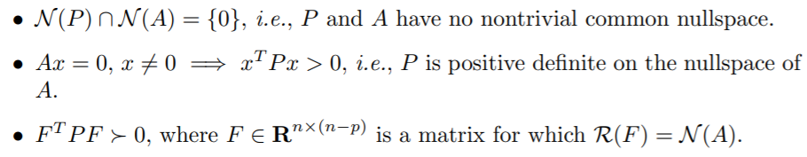

本章主要讨论有等式约束的函数的优化问题。

## Equality constrained minimization problems

本章主要考虑的是等式约束的凸优化问题：

$$
\begin{array}{lc}
\operatorname{minimize} & f(x)\\
\text{subject to} &  Ax=b
\end{array}
$$

其中 $A \in \mathrm{R}^{p\times n},\; \operatorname{rank}(A)=p<n$ .

对于矩阵 $A$ 的假设，说明了$Ax=b$ 至少是无穷多解的。此外，我们还假设这个问题是有最优解的。

应对这种等式约束的问题，主要有三种方法：**其一，解对偶问题；其二，消去等式约束；其三，通过KKT条件**。

#### Eliminating equality constraints

$Ax=b$的解集，本质上是一个仿射集，可以通过基础解系+特解的方式表示出来：

$$
\{x | A x=b\}=\left\{F z+\hat{x} | z \in \mathbf{R}^{n-p}\right\}
$$

从而这个问题变成一个$n-p$维的无条件约束问题：

$$
\operatorname{minimize} \;\; \tilde{f}(z)=f(F z+\hat{x})
$$

通过这个问题的解 $z^*$，就能得到原问题的解 $x^*=Fz+\hat{x}$

#### Solving equality constrained problems via the dual

借助共轭函数，可以表达出对偶函数：

$$
\begin{aligned}
g(\nu) &=-b^{T} \nu+\inf _{x}\left(f(x)+\nu^{T} A x\right) \\
&=-b^{T} \nu-\sup _{x}\left(\left(-A^{T} \nu\right)^{T} x-f(x)\right) \\
&=-b^{T} \nu-f^{*}\left(-A^{T} \nu\right)
\end{aligned}
$$

故，**原问题的对偶问题是一个无约束的凸优化问题**：

$$
\text { maximize } \quad-b^{T} \nu-f^{*}\left(-A^{T} \nu\right)
$$

如果Slater's conditions成立，也即意味着强对偶性成立。求出对偶问题最优解$\nu^*$之后再得到原问题的最优解$x^*$。

#### KKT condition

考虑等式约束的凸的二次规划问题：

$$
\begin{array}{ll}
\operatorname{minimize} & (1 / 2) x^{T} P x+q^{T} x+r \\
\text {subject to } & A x=b
\end{array}
$$

它的最优性条件是：
$$
A x^{\star}=b, \quad P x^{\star}+q+A^{T} \nu^{\star}=0
$$
写成更紧凑的矩阵形式：
$$
\left[\begin{array}{cc}
P & A^{T} \\
A & 0
\end{array}\right]\left[\begin{array}{c}
x^{\star} \\
\nu^{\star}
\end{array}\right]=\left[\begin{array}{c}
-q \\
b
\end{array}\right]
$$

如果这个KKT矩阵非奇异，那么就有唯一的最优解和最优值；如果KKT矩阵奇异，但是KKT条件有多组解，就说明最优解和最优值是不唯一的；如果KKT矩阵奇异并且KKT条件是无解的，就说明这个二次规划问题能够取到$-\infty$。

> 注意以上内容并没有对矩阵$P$有过多的约束。

以下几个条件可以保证KKT矩阵的非奇异性：

**如果KKT矩阵非奇异，那么它将恰好拥有$n$个正特征值和$p$个负特征值。**

## Newton’s method with equality constraints

牛顿法的思想，本质上是想寻找函数在某点**二阶近似**的最小值。有等式约束的话，那就变成了**求这个二阶近似在满足等式约束的条件下的最小值**，设我们寻找的方向是 $v$，得到：

$$
\begin{array}{ll}
\operatorname{minimize} & \widehat{f}(x+v)=f(x)+\nabla f(x)^{T} v+(1 / 2) v^{T} \nabla^{2} f(x) v \\
\text {subject to } & A(x+v)=b
\end{array}
$$

这其实就是一个二次规划问题！容易得到：

$$
\left[\begin{array}{cc}
\nabla^{2} f(x) & A^{T} \\
A & 0
\end{array}\right]\left[\begin{array}{c}
\Delta x_{\mathrm{nt}} \\
w
\end{array}\right]=\left[\begin{array}{c}
-\nabla f(x) \\
0
\end{array}\right]
$$

其中 $\Delta x_{\mathrm{nt}}$ 是待求的 Newton step，$\omega$ 是对偶变量。只要KKT矩阵非奇异，那么 $\Delta x_{\mathrm{nt}}$ 就是唯一的。如果$f$本身就是二次的，等式约束问题的牛顿法能够做到一步收敛！如果$f$近似于一个二次函数，那么这种方法能够有很好的效果！

## Infeasible start Newton method

