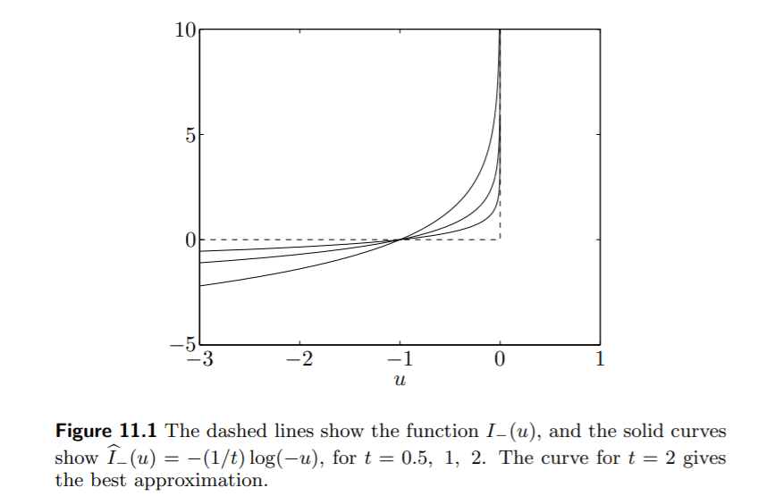

这是凸优化这本书的最后一章。

在之前已经介绍过了，如果凸优化问题**只有等式约束**，那么可以通过牛顿法（二阶近似）化为求解等式约束的二次规划问题，进而通过KKT条件或者消去等式约束的办法求解。

这最后一章，解决的正是最后一个问题，如何**把混合约束（不等式+等式）的问题转化为只含有等式约束的凸优化问题**。

## Inequality constrained minimization problems

本章讨论内点算法，适用于非常一般性的凸优化问题：
$$
\begin{array}{ll}
\operatorname{minimize} & f_{0}(x) \\
\text {subject to } & f_{i}(x) \leq 0, \quad i=1, \ldots, m \\
& A x=b
\end{array}
$$
始终假设凸优化问题存在**严格可行**的可行解。

## Logarithmic barrier function and central path

我们的目标是希望消除问题中的不等式约束，障碍函数（barrier function）是一种约束函数值的函数，比如：
$$
I_{-}(u)=\left\{\begin{array}{ll}0 & u \leq 0 \\ \infty & u>0\end{array}\right.
$$

将不等式约束的障碍函数加入到目标函数，可以得到一个等式约束的优化问题：
$$
\begin{array}{ll}
\operatorname{minimize} & f_{0}(x)+\sum_{i=1}^{m} I_{-}\left(f_{i}(x)\right) \\
\text {subject to } & A x=b
\end{array}
$$
当可行解触及不等式约束的边界的时候，目标函数会剧烈的增大，这就要求，解要严格满足不等式约束条件。这就是内点法的基本思想！

但是上面的这种障碍函数，加到目标函数里面，会严重破坏目标函数的光滑性，这就提示我们**选择一个光滑的、凸的障碍函数**。

### Logarithmic barrier

$$
\widehat{I}_{-}(u)=-(1 / t) \log (-u), \quad \operatorname{dom} \widehat{I}_{-}=-\mathbf{R}_{++}
$$

$\hat{I}_{-}(u)$ 是一个凸函数，参数 $t$ 确定了它与 $I_{-}(u)$ 的近似程度。其函数图像为：

利用上面这个障碍函数，将原优化问题变成：

$$
\begin{array}{ll}
\operatorname{minimize} & f_{0}(x)+\sum_{i=1}^{m}-(1 / t) \log \left(-f_{i}(x)\right) \\ 
\text{subject to } & A x=b
\end{array}
$$

引入函数：$\phi(x)=-\sum_{i=1}^{m} \log \left(-f_{i}(x)\right)$，可以把上述问题写成：

$$
\begin{array}{ll}
\operatorname{minimize} & t f_{0}(x)+\phi(x) \\
\text {subject to } & A x=b
\end{array}
$$

$t$ 越大，求解这个问题得到的最优解越接近原问题的最优解。但是，$t$ 越大，目标函数的 Hessian 矩阵在约束边界附近变动幅度越大，这里面就有一个trade-off。

> $\phi(x)$ 的梯度和 Hessian 矩阵分别是：
> $$
> \begin{aligned}
> \nabla \phi(x) &=\sum_{i=1}^{m} \frac{1}{-f_{i}(x)} \nabla f_{i}(x) \\
> \nabla^{2} \phi(x) &=\sum_{i=1}^{m} \frac{1}{f_{i}(x)^{2}} \nabla f_{i}(x) \nabla f_{i}(x)^{T}+\sum_{i=1}^{m} \frac{1}{-f_{i}(x)} \nabla^{2} f_{i}(x)
> \end{aligned}
> $$

#### Central path

对 $t>0$，记函数 $x^*(t)$ 为给定 $t$ 值得到的近似问题的最优值，所谓 central path 就是这个函数的图像，图像上的每个点叫做 central point。随着 $t$ 的增大，$x*(t)$ 愈发接近最优解。

## Barrier method

考虑到对一个很大的 $t$ 直接求解会存在这样那样的问题，我们可以先对一个较小的$t$求出对应的 $x^*$，再增大 $t$，同时以上次求出的最优解 $x^*$ 为初始点，再次进行迭代，最后可以得到一系列趋于最优解的点。

