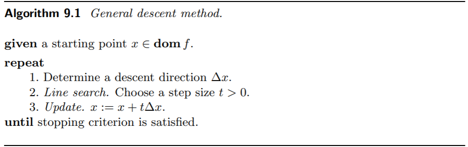

无约束优化问题是最基本的优化问题。当目标函数比较复杂的情况下，我们无法求出解析形式的一阶、二阶条件，因此可以考虑选取一个可行的初始点 $x^{(0)}$，再不断迭代逼近问题的最优解，使得 $f(x^{(k)}) - p^* \leq \epsilon$，达到我们需要的精度。

在以下的讨论中，我们都假定目标函数是闭（*closed* ）的。即，它的任意 $\alpha-\mathrm{sublevel}$集都是闭的，或者说，$f$ 的 $\operatorname{epigraph}$是闭集。一般而言，闭集上的连续函数都是闭的。

无约束优化的例子非常的多，比如：

###### Analytic center of linear inequalities

$$
\operatorname{minimize} \quad f(x)=-\sum_{i=1}^{m} \log \left(b_{i}-a_{i}^{T} x\right)
$$

###### Analytic center of a linear matrix inequality

$$
\operatorname{minimize} \quad f(x)=\log \operatorname{det} F(x)^{-1}\\
\Large\mathrm{where} \quad F(x)=F_{0}+x_{1} F_{1}+\cdots+x_{n} F_{n}
$$

#### Strong convexity and implications

在讨论无约束凸优化问题的时候，我们会假设$f:R^n\to R$是一个凸二次可微的函数。在这里，我们再加上一个**强凸（strong convex）**的条件：存在$m > 0$，使得：

$$
\nabla^2 f \succeq mI, \;\;\forall x \in \operatorname{dom}f
$$

> 强凸是比严格凸更强的条件，严格凸只要求 $\nabla^2 f >0$， 像 $\frac{1}{x}$ 这种函数大于0，但是不存在 $m >0 \;\;\mathrm{s.t.} \frac{1}{x} \geqslant m $。

简而言之，**$f$的Heisen矩阵的特征值有下确界**$m>0$。在这个条件下，由Taylor展开：

$$
f(y)=f(x)+\nabla f(x)^{T}(y-x)+\frac{1}{2}(y-x)^{T} \nabla^{2} f(z)(y-x)
$$

其中 $z$ 是线段 $[x,y]$ 上的一点。

继而，我们有：

$$
f(y) \geq f(x)+\nabla f(x)^{T}(y-x)+\frac{m}{2}\|y-x\|_{2}^{2}
$$

这给出了函数的一个更好的下界。

另一个我们常加的条件是，在闭集 $S$上，$f$ 的Heisen矩阵的特征值**有上确界**$M$（因为闭集，保证了上确界存在）。通过式(1)，我们可以得到类似式(2)的结论：

$$
f(y) \leq f(x)+\nabla f(x)^{T}(y-x)+\frac{M}{2} \|y-x\|_{2}^{2}\tag{3}
$$

这其实就给出了函数的一个**上界**。

> $\nabla^2 f \preceq MI$ 这个条件可以推出 $\nabla f$ 这个多元向量值函数满足 Lipschiz 条件。

综合这两个条件：

$$
m I \preceq \nabla^{2} f(x) \preceq M I \quad ,\forall x \in S
$$

接下来我们来推导，加上这两个条件，有什么用。

注意到(2)式的右边是一个关于$y$的凸函数，在$\tilde{y}=x-\frac{1}{m}\nabla f$时最小，从而：

上式说明，当$\nabla f$模长很小很小的时候，$f(x)$跟最优值$p^*$的距离也很小很小。虽然这个结论看起来很显然，但是我们从数学的角度证明了它！

$$
\|\nabla f(x)\|_{2} \leq(2 m \epsilon)^{1 / 2} \Longrightarrow f(x)-p^{\star} \leq \epsilon
$$

利用(5)式，我们可以通过梯度的模长，来控制与最优解之间的距离。

类似的推导能得到更强的结论：

对于第二种情况：

$$
\nabla^{2} f(x) \preceq M I \Rightarrow p^{\star} \leq f(x)-\frac{1}{2 M}\|\nabla f(x)\|_{2}^{2}
$$

总结一下，在一个闭集$S$上，理想情况下，凸函数的Heisen矩阵的特征值是“可控的”，我们从数学上推导出**当某处的梯度模长很接近0的时候，其实离最优解和最优值不远了**，这个“接近”的程度可以由估计式给出。尽管大部分时候我们没有办法确定$m$和$M$，但是只要梯度足够小，还是可以保证非常接近最优解的。

#### Condition number of sublevel sets

定义一个凸集的 $C$ 在方向$q$上的宽度为：

$$
W(C, q)=\sup _{z \in C} q^{T} z-\inf _{z \in C} q^{T} z
$$

从而一个凸集的最大宽度和最小宽度定义为：

$$
W_{\min }=\inf _{\|q\|_{2}=1} W(C, q), \quad W_{\max }=\sup _{\|q\|_{2}=1} W(C, q)
$$

**凸集$C$的条件数被定义为**：
$$
\operatorname{cond}(C)=\frac{W_{\max }^{2}}{W_{\min }^{2}}
$$
条件数在一定程度上反映了凸集的一个形状（比较圆，还是扁的）。

如果凸函数$f$在其$\alpha$下水平集$C_\alpha$上满足

$$
m I \preceq \nabla^{2} f(x) \preceq M I
$$

那么$C_\alpha$有一个上界$$\operatorname{cond}\left(C_{\alpha}\right) \leq \frac{M}{m}$$

下水平集的形状会对无约束的凸优化问题某些算法的收敛性产生巨大影响。就那梯度下降法来说，当条件数非常大的时候，梯度下降法的效率很低（zig-zag现象十分严重）。

### 凸优化问题的下降方法

下降方法（descent method），指的是，找一列$x^k$，使得函数值慢慢下降，最终收敛的一种算法。具体说是，每次迭代，我们想找到一个方向$\Delta x^k$，然后在这个方向上前进$t^k$，达到一个使函数值更小的点。

$$
x^{(k+1)}=x^{(k)}+t^{(k)} \Delta x^{(k)}\quad \text{and} \quad f\left(x^{(k+1)}\right)<f\left(x^{(k)}\right)
$$

搜索方向 $\Delta x^k$ 是下降方向，这就要求 $\nabla f\left(x^{(k)}\right)^{T} \Delta x^{(k)}<0$。

下图是下降算法的基本流程。

##### 线搜索 

线搜索（*line search*）可以分为精确线搜索和非精确线搜索两种，其区别就在于，给定下降方向，是否找到这个方向上的最小点，亦或只要求在这个方向上有一定程度的下降。

***Backtracking line search*** 是一种非精确线性搜索算法。

大致原理如图：

贴一张关于收敛性的结论：

#### Steepest decent method

这种方法企图寻找一个方向

$$
\Delta x_{\mathrm{nsd}}=\operatorname{argmin}\left\{\nabla f(x)^{T} v |\;\|v\|=1\right\}
$$

注意，因为选取的范数不一样，情况是会发生变化的。如果取欧几里得范数（也就是二范数），这就是梯度下降法了。

这种方法的经常会取一个 ***quadratic norm***：

$$
\|z\|_{P}=\left(z^{T} P z\right)^{1 / 2}=\left\|P^{1 / 2} z\right\|_{2}, P > 0
$$

最后得到方向

$$
\Delta x_{\mathrm{nsd}}=-\left(\nabla f(x)^{T} P^{-1} \nabla f(x)\right)^{-1 / 2} P^{-1} \nabla f(x)
$$

> $\min \;a^Tx, st. \;x^TPx=1$这个优化问题可以用它的KKT条件解出。

这样做的好处就在于，梯度下降法 当下水平集条件数特别大的时候，收敛性会特别差。但是如果加以适当的坐标变换，把椭圆形状的等高线变换为比较规则的圆形的等高线，就可以大大加快算法收敛的速度。

如果我们可以估计出在最优点$x^*$的Hessian矩阵$\hat{H}$，那么取$P=\hat{H}$，这时候的***steepest decent method*** 就可以取得很好的效果！

#### 次梯度 subgradient

当优化问题的目标函数不可微的时候，我们就会去考虑梯度的替代品：**次梯度**。

凸函数有一个很好的性质，那就是任意一点的切平面都位于函数图形的下方。

对于凸函数，如果$\forall y$，都有

$$
f(y) \geq f(x)+g^{T}(y-x)
$$

就说$g$是$x$这点的次梯度。函数的梯度是一个向量，注意次梯度方向可能不唯一，所以次梯度是一个**向量的集合**。$x$点的次梯度集记为$\partial f(x)$

> 对偶函数是凹函数，自然也可以对凹函数定义次梯度了。

如果要把次梯度的概念推广到一般函数的话，那么会发现，一般函数可能再某个点不存在次梯度（次梯度为空集），而凸函数不会存在这样的问题。在凸函数的定义域的**相对内点集**上，次梯度集总是非空（凸函数在定义域的边界的连续性比较复杂）。

以一维为例，$f$在$x_0$不一定可导，但是有左导数$a$，右导数$b$，那么$[a,b]$就是$f$在$x_0$这点的次梯度。比如$f=|x|$在$0$处的次梯度就是$[-1, 1]$。

> 一元的凸函数，在定义域的内点上左右导数一定存在！

**通过次梯度可以得到一个函数（不管是不是凸的）全局最优解的性质。**如果$0\in \partial f(x^*)$，那么$x^*$是全局最小点。

参考：
[【凸优化笔记5】-次梯度方法（Subgradient method）