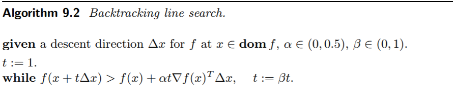

这一章介绍无约束的优化问题

## Unconstrained minimization problems

无约束优化问题是最基本的优化问题。这一章讨论怎么求无约束的凸函数的最小值，特别地，假设 $f$ 总是二阶可微的。

如果 $x^\ast$ 是 $f$ 的最小值点，那么必然 $\nabla f(x^\ast) = 0$，这说明我们可以解一个可能是非线性的方程组来计算函数的最值。

当然，更多的情况下，我们会使用迭代的方法。选取一个可行的初始点 $x^{(0)}$，再不断迭代逼近问题的最优解，使得 $f(x^{(k)}) - p^* \leq \epsilon$，达到我们需要的精度。

在以下的讨论中，我们都**假定目标函数是闭（closed ）的**。函数的闭性等价于它的下半连续性，或者任意 $\alpha-\mathrm{sublevel}$ 都是闭的，或者说其 $\operatorname{epigraph}$ 是闭集。一般而言，连续函数都是闭的（闭集的原像是闭的）。

无约束优化的例子非常的多，比如：

**Analytic center of linear inequalities**
$$
\operatorname{minimize} \quad f(x)=-\sum_{i=1}^{m} \log \left(b_{i}-a_{i}^{T} x\right)
$$

上述问题的解叫做这个多面体的 analytic center。

**Analytic center of a linear matrix inequality**
$$
\begin{aligned}
& \operatorname{minimize} \quad f(x)=\log \operatorname{det} F(x)^{-1}\\
& \mathrm{where} \quad F(x)=F_{0}+x_{1} F_{1}+\cdots+x_{n} F_{n}
\end{aligned}
$$

### Strong convexity

强凸 (strong convex) 是一个比严格凸更强的性质。$f$ 是强凸的，如果存在 $m > 0$，使得
$$
f(y) \geq f(x)+\nabla f(x)^{T}(y-x)+\frac{m}{2}\|y-x\|_{2}^{2}
$$
对于任意的 $x, y \in \operatorname{dom} f$ 都成立。容易发现强凸的函数一定是严格凸的。

强凸函数不一定需要可微，对不可微的函数，可以把上面的梯度换成次微分。也有不用到微分的等价定义：
$$
f(t x+(1-t) y) \leq t f(x)+(1-t) f(y)-\frac{1}{2} m t(1-t)\|x-y\|_{2}^{2}, \quad t \in [0, 1]
$$
如果 $f$ 二阶可微，那么强凸意味着存在 $m > 0$，使得
$$
\nabla^2 f \succeq mI, \;\;\forall x \in \operatorname{dom}f
$$

简而言之，**$f$的Heisen矩阵的特征值有下确界**$m>0$。在这个条件下，由Taylor展开：

$$
f(y)=f(x)+\nabla f(x)^{T}(y-x)+\frac{1}{2}(y-x)^{T} \nabla^{2} f(z)(y-x)
$$

其中 $z$ 是线段 $[x,y]$ 上的一点。

继而，我们有：

$$
f(y) \geq f(x)+\nabla f(x)^{T}(y-x)+\frac{m}{2}\|y-x\|_{2}^{2}
$$

这给出了函数的一个更好的下界。

另一个我们常加的条件是，在闭集 $S$上，$f$ 的Heisen矩阵的特征值**有上确界**$M$（因为闭集，保证了上确界存在）。通过式(1)，我们可以得到类似式(2)的结论：

$$
f(y) \leq f(x)+\nabla f(x)^{T}(y-x)+\frac{M}{2} \|y-x\|_{2}^{2}\tag{3}
$$

这其实就给出了函数的一个**上界**。

> $\nabla^2 f \preceq MI$ 这个条件可以推出 $\nabla f$ 这个多元向量值函数满足 Lipschiz 条件。

综合这两个条件：

$$
m I \preceq \nabla^{2} f(x) \preceq M I \quad ,\forall x \in S
$$

接下来我们来推导，加上这两个条件，有什么用。

注意到(2)式的右边是一个关于$y$的凸函数，在$\tilde{y}=x-\frac{1}{m}\nabla f$时最小，从而：

上式说明，当$\nabla f$模长很小很小的时候，$f(x)$跟最优值$p^*$的距离也很小很小。虽然这个结论看起来很显然，但是我们从数学的角度证明了它！

$$
\|\nabla f(x)\|_{2} \leq(2 m \epsilon)^{1 / 2} \Longrightarrow f(x)-p^{\star} \leq \epsilon
$$

利用(5)式，我们可以通过梯度的模长，来控制与最优解之间的距离。

类似的推导能得到更强的结论：

对于第二种情况：

$$
\nabla^{2} f(x) \preceq M I \Rightarrow p^{\star} \leq f(x)-\frac{1}{2 M}\|\nabla f(x)\|_{2}^{2}
$$

总结一下，在一个闭集$S$上，理想情况下，凸函数的Heisen矩阵的特征值是“可控的”，我们从数学上推导出**当某处的梯度模长很接近0的时候，其实离最优解和最优值不远了**，这个“接近”的程度可以由估计式给出。尽管大部分时候我们没有办法确定$m$和$M$，但是只要梯度足够小，还是可以保证非常接近最优解的。

#### Condition number of sublevel sets

定义一个凸集的 $C$ 在方向$q$上的宽度为：

$$
W(C, q)=\sup _{z \in C} q^{T} z-\inf _{z \in C} q^{T} z
$$

从而一个凸集的最大宽度和最小宽度定义为：

$$
W_{\min }=\inf _{\|q\|_{2}=1} W(C, q), \quad W_{\max }=\sup _{\|q\|_{2}=1} W(C, q)
$$

**凸集$C$的条件数被定义为**：
$$
\operatorname{cond}(C)=\frac{W_{\max }^{2}}{W_{\min }^{2}}
$$
条件数在一定程度上反映了凸集的一个形状（比较圆，还是扁的）。

如果凸函数$f$在其$\alpha$下水平集$C_\alpha$上满足

$$
m I \preceq \nabla^{2} f(x) \preceq M I
$$

那么$C_\alpha$有一个上界$$\operatorname{cond}\left(C_{\alpha}\right) \leq \frac{M}{m}$$

下水平集的形状会对无约束的凸优化问题某些算法的收敛性产生巨大影响。就那梯度下降法来说，当条件数非常大的时候，梯度下降法的效率很低（zig-zag现象十分严重）。

## Descent methods

下降方法的目标是找一列 $x^{(k)}$，使得函数值慢慢下降，最终收敛的一种算法。具体说是，每次迭代，我们想找到一个方向 (direction/step) $\Delta x^{(k)}$，然后在这个方向上前进步长(step size) $t^{(k)}$，达到一个使函数值更小的点：
$$
x^{(k+1)}=x^{(k)}+t^{(k)} \Delta x^{(k)}\quad \text{and} \quad f(x^{(k+1)})<f(x^{(k)})
$$

如何下降方向 $\Delta x^k$ 都要满足 $\nabla f\left(x^{(k)}\right)^{T} \Delta x^{(k)}<0$ .

下降算法的基本流程是：

+ given a starting point $x \in \mathbf{d o m} f$.
+ repeat
  1. Determine a descent direction $\Delta x$.
  2. *Line search*. Choose a step size $t>0$.
  3. Update. $x:=x+t \Delta x$.
+ until stopping criterion is satisfied.

##### 线搜索 

线搜索（*line search*）可以分为精确线搜索和非精确线搜索两种，其区别就在于，给定下降方向，是否找到这个方向上的最小点，亦或只要求在这个方向上有一定程度的下降。

***Backtracking line search*** 是一种非精确线性搜索算法。

大致原理如图：

贴一张关于收敛性的结论：

## Gradient descent method

梯度下降法是一种直接用梯度作为下降方向的方法。

## Steepest decent method

$f(x+v)$ 在 $x$ 处的 Taylor 展开是：
$$
f(x+v) \approx \widehat{f}(x+v)=f(x)+\nabla f(x)^{T} v
$$
最速下降法企图找到一个方向
$$
\Delta x_{\mathrm{nsd}}=\operatorname{argmin}\left\{\nabla f(x)^{T} v \mid \|v\|=1\right\}
$$

注意，因为选取的范数不一样，情况是会发生变化的。如果取欧几里得范数（也就是二范数），就是梯度下降法了。因此，可以认为最速下降法的思想是梯度下降法自然的推广。

这种方法的经常会取一个 ***quadratic norm***：

$$
\|z\|_{P}=\left(z^{T} P z\right)^{1 / 2}=\left\|P^{1 / 2} z\right\|_{2}, P > 0
$$

最后得到方向

$$
\Delta x_{\mathrm{nsd}}=-\left(\nabla f(x)^{T} P^{-1} \nabla f(x)\right)^{-1 / 2} P^{-1} \nabla f(x)
$$

> $\min \;a^Tx, st. \;x^TPx=1$这个优化问题可以用它的KKT条件解出。

这样做的好处就在于，梯度下降法 当下水平集条件数特别大的时候，收敛性会特别差。但是如果加以适当的坐标变换，把椭圆形状的等高线变换为比较规则的圆形的等高线，就可以大大加快算法收敛的速度。

如果我们可以估计出在最优点$x^*$的Hessian矩阵$\hat{H}$，那么取$P=\hat{H}$，这时候的***steepest decent method*** 就可以取得很好的效果！

## Newton’s method

$$
\Delta x_{\text{nt}}=-\nabla^{2} f(x)^{-1} \nabla f(x)
$$

叫做 $f$ 的 Newton step。如果 $\nabla^2 f$ 是正定的，那么
$$
\nabla f(x)^{T} \Delta x_{\mathrm{nt}}=-\nabla f(x)^{T} \nabla^{2} f(x)^{-1} \nabla f(x)<0
$$
Newton 方向自然成为了一个下降方向。

## Self-concordance

