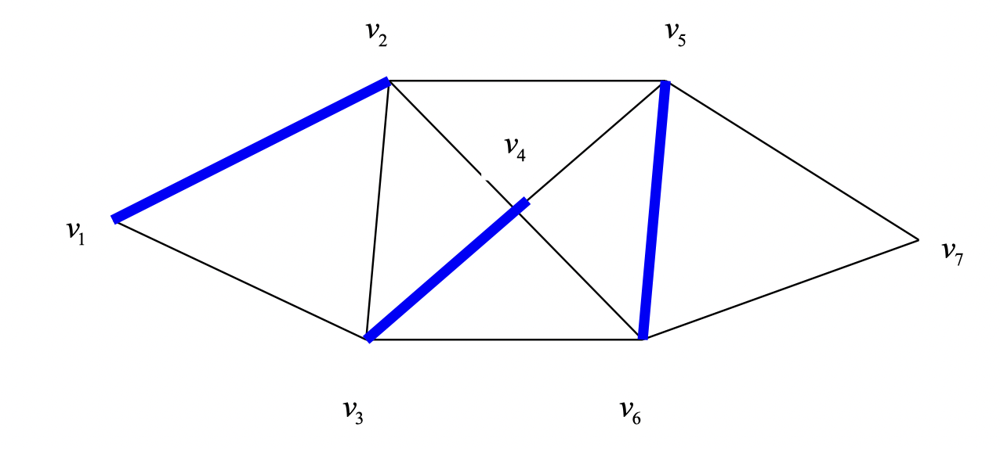

# Matching

图 $G(V, E)$ 上的一个匹配 (matching) 指的是一个集合 $M\subseteq E$，$M$ 中**任何两条边没有公共端点**。如果一个匹配包含了图的每一个顶点，就说这个匹配是完美的 (perfect matching)。

下图表示了一个图的匹配：



称一个匹配是极大的 (maximal)，如果增加一条边之后就不是一个匹配了。组合优化里一个很基础的问题就是最大基数匹配 (*maximum* cardinality matching)，完美匹配自然是最大基数匹配，但是完美匹配可能是不存在的。

用 $\delta(v)$ 表示与 $v\in V$ 相邻的边，对于图的一个 characteristic vector ${x}$，它是一个 matching vector 当且仅当：

$$
\sum_{e \in \delta(v)} x_e \leq 1 \;\; \forall v \in V, \quad x\in \{0, 1\}^E
$$

用 node-edge incidence matrix 来表示，就是 $\{x \in \{0, 1\}^E: A_G x \leq \mathbf{1}\}$，它的 linear relexation 是 $\{x: A_Gx \leq \mathbf{1}, x\geq \mathbf{0}\}$ 。

## Max Matching and Min Vertex Cover

图的最大基数匹配 (max matching) 问题是：
$$
\begin{aligned}
\max \; & \mathbf{1}^T x \\
\text{s.t. } & A_G x \leq \mathbf{1} \\
& x \in \{0, 1\}^E
\end{aligned}
$$
图的 vertex cover 指的的 $V$ 的一个子集，使得每一条边都至少包含这个子集的一个点。图的最小顶点覆盖 (min vertex cover) 问题是：
$$
\begin{aligned}
\min \; & \mathbf{1}^T y \\
\text{s.t. } & y_i + y_j \geq 1 \quad \forall (i, j) \in E \\
& y \in \{0, 1\}^V
\end{aligned}
$$

图的最大匹配小于等于其最小顶点覆盖。

**(König Theorem)**  二分图的最大基数匹配等于其最小顶点覆盖。 

Size of max matching = size of min vertex cover, in bipartite graphs.


## Matching polytope

定义 $G$ 的 matching polytope 为所有匹配的凸包，记：
$$
P_{\text{match}}(G) = \operatorname{conv} \{\chi_M: M \text{ is a matching of } G\}
$$
定义其 pefect matching polytope 为所有的完美匹配的凸包，记：
$$
P_{\text{perf-match}}(G) = \operatorname{conv} \{\chi_M: M \text{ is a perfect matching of } G\}
$$

如果 $G$ 是二分的，则 $A_G$ 是 TUM，所以：

$$
\begin{aligned}
P_{\text{match}}(G) & = \{x \in \mathbb{R}^E \mid A_G x \leq \mathbf{1}, \, x\geq 0 \} \\
P_{\text{perf-match}}(G) & = \{x \in \mathbb{R}^E \mid A_G x= \mathbf{1}, \, x \geq 0\}
\end{aligned}
$$

对于一般图，Edmonds 给出了如下的刻画：

### Matching Polytope Theorem

$$
\begin{aligned}
P_{\text{match}}(G) &= \{x \in \mathbb{R}^E \mid A_G x \leq \mathbf{1}, \, x \geq 0, \sum_{e \in E[U]} x_{e} \leq \frac{|U|-1}{2},\; \forall U \subseteq V,|U| \text { odd }\} \\
P_{\text{perf-match}}(G) & = \{x \in \mathbb{R}^E \mid A_G x= \mathbf{1}, \, x \geq 0, \sum_{e \in \delta(U)} x_{e} \geq 1, \; \forall U \subseteq V,|U| \text { odd }\}
\end{aligned}
$$

考虑一个三角形，约束条件
$$
\begin{aligned}
&x_{12}+x_{13}  \leq 1\\
&x_{12}+x_{23} \leq 1\\
&x_{13}+x_{23} \leq 1\\
&x \geq 0
\end{aligned}
$$
注意到 $(1/2, 1/2, 1/2)$ 也是这组约束表示的多面体的一个顶点，但它并不代表一个合法的匹配。所以说，刻画 matching polytope 的核心就是处理 odd cycle。

令 $E[U] = \{(i, j) \in E \mid i, j \in U\}$ 表示奇数个节点内部的匹配，对于三角形来说，$(1/2, 1/2, 1/2)$ 不满足 $\displaystyle\sum_{e \in E[U]} x_e \leq \frac{|U|-1}{2}=1, \, U=V$ 。添加这个条件可以刻画 matching polytope。


对于完全匹配，由 $\sum_{e \in \delta(v)} x_{e}=1, \; v \in V$ 对所有的 $v \in U \subseteq V$ 求和得
$$
|U|=\sum_{v \in U} \sum_{e \in \delta(v)} x_{e}=\sum_{e \in \delta(U)} x_{e}+2 \sum_{e \in E[U]} x_{e}
$$

结合 $\displaystyle\sum_{e \in E[U]} x_e \leq \frac{|U|-1}{2}$ ，有
$$
\sum_{e \in \delta(U)} x_{e} \geq 1, \; \forall U \subseteq V,|U| \text { odd }
$$
这个条件表示的是任何 odd set $U$，都有一个 $U$ 中的点与 $V \backslash U$ 中的点相匹配。这是关于 perfect matching 的限制。


## Matchings in Bipartite Graphs

二分图指的是图的点可以划分成不相交的两组点 $A, B$，使得每一条边都恰好连接 $A, B$ 的顶点；等价地，**二分图可以定义为无奇数圈 (odd-length circle) 的图**。下图是一个二分图，三角形不是二分图。

【二分图的图例】

### Hall’s Theorem

令 $G=(V, E)$ 是一个二分图且 $V=U\cup W$，对于 $S \subseteq U$，定义 $S$ 的 neibor $N(S) \subseteq W$ 为与 $S$ 相邻的点，则：
$$
G \text{ has a matching covering } U \Longleftrightarrow |N(S)| \geq |S| \quad \forall S\subseteq  U
$$
特别地，如果 $|U|=|W|$，$G$ 存在一个完美匹配。

Hall 定理的证明可以用到 König 定理。

## Matching in Non-Bipartite Graphs

### Augmenting Paths

给定一个匹配 $M$，称一条路为**交错路 ($M$-alternation path)** ，如果这条路每两条相邻的边都有一条在 $M$ 中；称其为**增广路 ($M$-augmenting path)**，如果它是一个交错路，并且路的两个端点不在 $M$ 中。

如果 $P$ 是一条增广路，那么 $N=M \triangle P=(M \backslash P) \cup(P \backslash M)$ 也是一个匹配，注意到 $| P \backslash M | = | P \cap M | + 1$，所以 $| N | = | M | + | P \backslash M | − | P ∩ M | = | M | + 1$ 是一个基数更大的匹配。

由此我们能得到一个最大基数匹配的充分必要条件：
$$
M \text{ is a maximum matching } \Leftrightarrow \text{ no } M\text{-augmenting path} 
$$

【证明】

所以说，要找最大匹配，其实就是要找 M-augmenting path。

### Edmonds’ Algorithm

If there are any vertices not covered by the current matching (“exposed” vertices), search for an $M$-augmenting path from each exposed vertex $v$. If an augmenting path $P$ is found, augment $M$ by updating $M$ to $M\Delta P$. If no $M$-augmenting paths can be found, $M$ is optimal.


At any step in the algorithm, let M be the current matching and let X be the set of exposed vertices (vertices not covered by M).


### Tutte-Berge Formula

这个公式是对图的最大匹配数的一个刻画。

记 
+ $\nu(G): \text{size of maximum matching}$
+ $o(G):\text{number of the connected components of the graph that have an odd number of vertices}$

则：
$$
\nu(G)=\min _{U \subseteq V} \frac{1}{2}(|V|+|U|-o(G-U))
$$

推论(Tutte’s theorem)：$G$ 存在完美匹配当且仅当 $\forall U \subseteq V, o(G-U) \leq |U|$ .


### Gallai’s theorem

记：

$$
\begin{aligned}
 \alpha(G):=&\max \{|C| \mid C  \text{ is a stable set }  \} \\
 \tau(G):=&\min \{|W| \mid W  \text{ is a vertex cover }  \} \\
 \nu(G):=&\max \{|M| \mid M  \text{ is a matching}  \} \\
 \rho(G):=&\min \{|F| \mid F  \text{ is an edge cover } \}  \\
\end{aligned}
$$

如果图 $G=(V, E)$ 没有孤立点，则：

$$
\alpha(G)+\tau(G)=|V|=\nu(G)+\rho(G)
$$

(1) $U$ is a stable set $\Longleftrightarrow V \backslash U$ is a vertex cover. 

(2) 给定一个最大匹配 $M$，对每一个没有匹配到的 $v \notin M$ 添加一条边连接至 $M$，再加上 $M$ 中的边，这样可以形成一个 vertex cover，这说明 $\rho(G) \leq |M| + (|V|-2|M|)=|V| - \nu(G)$； 另一方面，给定一个最小边覆盖 $|F|$，图 $(V, F)$ 由 $|V|-|F|$ 个不相交的 $G$ 的子图构成，用 $|V|-|F|$ 条边将它们连接起来，可以构成一个匹配，这说明 $\nu(G) \geq |V| - |F| = |V| - \rho(G)$


---


```python
def isBipartite(graph: List[List[int]]) -> bool:
    # 用深度优先搜索的方式判断一个图是否是二分的
    # graph[i]: 与顶点 i 相邻的其它顶点
    n = len(graph)
    visited = [False] * n
    not_visited = n
    color = [0] * n
    st = [0]
    while st:
        v = st.pop()
        c = (color[v] + 1) % 2
        not_visited -= 1
        for i in graph[v]:
            if visited[i]:
                if color[i] != c:
                    return False
            else:
                st.append(i)
                visited[i] = True
                color[i] = c

        if not st and not_visited:
            for i in range(n):
                if not visited[i]:
                    st.append(i)
                    visited[i] = True
                    break
    return True
# example
graph = [[1,3],[0,2],[1,3],[0,2]]
print(isBipartite(graph))  # True
```

