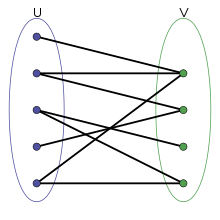

## Matching

图 $G(V, E)$ 上的一个匹配 (matching) 指的是一个集合 $M\subseteq E$，$M$ 中**任何两条边没有公共端点**。如果一个匹配包含了图的每一个顶点，就说这个匹配是完美的 (perfect matching)。

下图表示了一个图的匹配：


称一个匹配是极大的 (maximal)，如果增加一条边之后就不是一个匹配了。组合优化里一个很基础的问题就是最大基数匹配 (*maximum* cardinality matching)，完美匹配自然是最大基数匹配，但是完美匹配可能是不存在的。

用 $\delta(v)$ 表示与 $v\in V$ 相邻的边，对于图的一个 characteristic vector ${x}$，它是一个 matching vector 当且仅当：

$$
\sum_{e \in \delta(v)} x_e \leq 1 \;\; \forall v \in V, \quad x\in \{0, 1\}^E
$$

用 node-edge incidence matrix 来表示，就是 $\{x \in \{0, 1\}^E: A_G x \leq \mathbf{1}\}$，它的 linear relexation 是 $\{x: A_Gx \leq \mathbf{1}, x\geq \mathbf{0}\}$ 。

### Matching polytope

定义 $G$ 的 *matching polytope* 为所有合法的 matching vectors 的凸包，记：
$$
P_{\text{match}}(G) = \operatorname{conv} \{\chi_M: M \text{ is a matching of } G\}
$$
定义其 pefect matching polytope 为所有的完美匹配的凸包，记：
$$
P_{\text{perf-match}}(G) = \operatorname{conv} \{\chi_M: M \text{ is a perfect matching of } G\}
$$

### Augmenting Paths

给定一个匹配 $M$，称一条路为交错路 ($M$-alternation path) ，如果这条路每两条相邻的边都有一条在 $M$ 中；称其为增广路 ($M$-augmenting path)，如果它是一个交错路，并且路的两个端点不在 $M$ 中。

如果 $P$ 是一条增广路，那么 $N=M \triangle P=(M \backslash P) \cup(P \backslash M)$ 也是一个匹配，注意到 $| P \backslash M | = | P \cap M | + 1$，所以 $| N | = | M | + | P \backslash M | − | P ∩ M | = | M | + 1$ 是一个基数更大的匹配。

由此我们能得到一个最大基数匹配的充分必要条件：
$$
M \text{ is a maximum matching } \Leftrightarrow \text{ no } M\text{-augmenting path} 
$$

### Matchings in Bipartite Graphs

二分图指的是图的点可以划分成不相交的两组点 $U, V$，使得每一条边都恰好连接 $U, V$ 的顶点。等价地，二分图可以定义为无奇数圈 (odd-length circle) 的图。下图是一个二分图，三角形不是二分图。




---


```python
def isBipartite(graph: List[List[int]]) -> bool:
    # 用深度优先搜索的方式判断一个图是否是二分的
    # graph[i]: 与顶点 i 相邻的其它顶点
    n = len(graph)
    visited = [False] * n
    not_visited = n
    color = [0] * n
    st = [0]
    while st:
        v = st.pop()
        c = (color[v] + 1) % 2
        not_visited -= 1
        for i in graph[v]:
            if visited[i]:
                if color[i] != c:
                    return False
            else:
                st.append(i)
                visited[i] = True
                color[i] = c

        if not st and not_visited:
            for i in range(n):
                if not visited[i]:
                    st.append(i)
                    visited[i] = True
                    break
    return True
# example
graph = [[1,3],[0,2],[1,3],[0,2]]
print(isBipartite(graph))  # True
```

