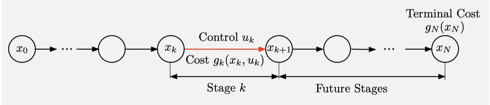
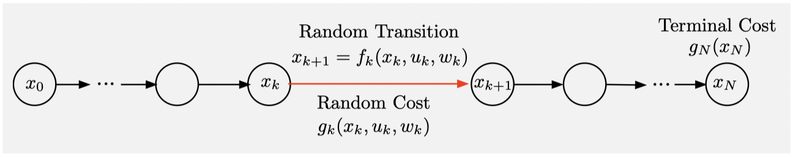

## Exact Dynamic Programming

### Deterministic Dynamic Programming

A deterministic DP problem involves a discrete-time dynamic system of the form
$$
x_{k+1} = f_k(x_k, u_k), \quad k = 0, 1, \dots, N-1
$$
where

+ $k$ is the time index
+ $x_k$ is the state of the system
+ $u_k$ is the control or decision, to be selected from some given set $U_k(x_k)$
+ $f_k$ is a function of $(x_k, u_k)$ that describes the mechanism by which the state is updated from time $k$ to time $k+1$
+ $N$ is the horizon

A cost incurred at time $k$, denoted by $g_k(x_k, u_k)$, accumulates over time. For a given initial state $x_0$, **the total costs of a control sequence** $\{u_0, \dots, u_{N-1}\}$ is
$$
J\left(x_{0} ; u_{0}, \ldots, u_{N-1}\right)=g_{N}\left(x_{N}\right)+\sum_{k=0}^{N-1} g_{k}\left(x_{k}, u_{k}\right)
$$
where $g_N(x_N)$ is a terminal cost incurred at the end of the process.

We want to minimize the total cost over all sequences $\{u_0, \dots, u_{N-1}\}$ that satisfy the control constraints, thereby obtaining the optimal value
$$
J^{*}\left(x_{0}\right)=\min _{\substack{u_{k} \in U_{k}\left(x_{k}\right) \\ k=0, \ldots, N-1}} J\left(x_{0} ; u_{0}, \ldots, u_{N-1}\right)
$$
The picture below illustrates the main elements of the problem.

#### Dynamic Programming Algorithm

The DP algorithm rests on a simple idea, the *principle of optimality*.

##### Principle of Optimality

Let $\left\{u_{0}^{*}, \ldots, u_{N-1}^{*}\right\}$ be an optimal control sequence, which together with $x_{0}$ determines the corresponding state sequence $\left\{x_{1}^{*}, \ldots, x_{N}^{*}\right\}$ via the system equation. Consider the subproblem whereby we start at $x_{k}^{*}$ at time $k$ and wish to minimize the "cost-to-go" from time $k$ to time $N$
$$
g_{k}\left(x_{k}^{*}, u_{k}\right)+\sum_{m=k+1}^{N-1} g_{m}\left(x_{m}, u_{m}\right)+g_{N}\left(x_{N}\right)
$$
over $\left\{u_{k}, \ldots, u_{N-1}\right\}$ with $u_{m} \in U_{m}\left(x_{m}\right), m=k, \ldots, N-1$. Then the truncated optimal control sequence $\left\{u_{k}^{*}, \ldots, u_{N-1}^{*}\right\}$ is optimal for this subproblem.

Stated succinctly, the principle of optimality says that *the tail of an optimal sequence is optimal for the tail subproblem*.

##### DP Algorithm for Deterministic Finite Horizon Problems

Start with
$$
J_N^\ast (x_N) = g_N(x_N), \quad \text{ for all } x_N
$$
and for $k=0, \dots, N-1$, let
$$
J_{k}^{*}\left(x_{k}\right)=\min _{u_{k} \in U_{k}\left(x_{k}\right)}\left[g_{k}\left(x_{k}, u_{k}\right)+J_{k+1}^{*}\left(f_{k}\left(x_{k}, u_{k}\right)\right)\right], \quad \text { for all } x_{k}
$$
The algorithm constructs functions $J_N^\ast(x_N), J_{N-1}^\ast(x_{N-1}), \dots, J_0^\ast(x_0)$ sequentially, starting from $J_N^\ast$, and proceeding backwards to $J_{N-1}^\ast, J_{N-2}^\ast, \dots$ .

$J_k^\ast(x_k)$ is the *optimal cost-to-go* at state $x_k$ and time $k$ . We refer $J_k^\ast$ as the *optimal cost-to-go function*.

##### Construction of Optimal Control Sequence

Set
$$
u_{0}^{*} \in \underset{u_{0} \in U_{0}{\left(x_{0}\right)} }{\arg\min}\left[g_{0}\left(x_{0}, u_{0}\right)+J_{1}^{*}\left(f_{0}\left(x_{0}, u_{0}\right)\right)\right]
$$
and
$$
x_{1}^{*}=f_{0}\left(x_{0}, u_{0}^{*}\right) .
$$
Sequentially, going forward, for $k=1,2, \ldots, N-1$, set
$$
u_{k}^{*} \in \underset{u_{k} \in U_{k}\left(x_{k}^{*}\right)}{\arg\min}\left[g_{k}\left(x_{k}^{*}, u_{k}\right)+J_{k+1}^{*}\left(f_{k}\left(x_{k}^{*}, u_{k}\right)\right)\right],
$$
and
$$
x_{k+1}^{*}=f_{k}\left(x_{k}^{*}, u_{k}^{*}\right) .
$$

#### Approximation in Value Space

In practice, exact DP is often prohibitively time-consuming, because the number of possible $x_k$ and $k$ can be very large. An alternative by *approximation in value space* constructs a suboptimal solution $\{\tilde{u}_0, \dots, \tilde{u}_{N-1}\}$ in place of the optimal $\{u_0^\ast, \dots, u_{N-1}^\ast\}$ based on using $\tilde{J}_k$ in place of $J_k^\ast$ in the DP procedure.

### Stochastic Dynamic Programming

$$
x_{k+1}=f_{k}\left(x_{k}, u_{k}, w_{k}\right), \quad k=0,1, \ldots, N-1
$$

In a 

## Approximation in Value Space

Curse of di

