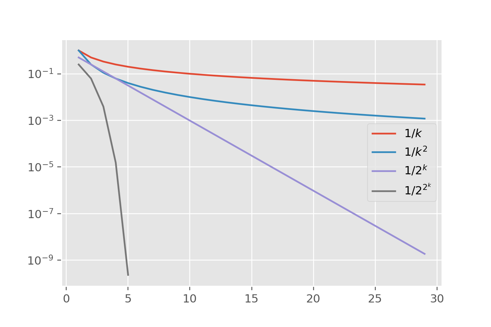

当我们设计迭代算法的时候，总是不可避免地要提到收敛速度这个概念。

比如，我们常说牛顿法是平方收敛的，弦截法是1.618阶收敛的，梯度下降法是线性收敛的，随机梯度下降法是次线性收敛的。

在数值分析或者优化方法中，我们经常能看到如下这一段话：

$$
\lim _{k \rightarrow \infty} \frac{\left\|x^{(k+1)}-x^{\ast}\right\|}{\left\|x^{(k)}-x^{\ast}\right\|}=C
$$

+ 如果 $C=1$, 我们就说序列 $x^{(k)}$ 是次线性收敛 (sublinear convergence) 到 $x^{\ast}$ 的。
+ 如果 $0<C<1$, 那么就说是线性收敛 (linear convergence) 。
+ 如果 $C=0$ ， 那么就说是超线性收敛 (superlinear convergence)。

在超线性收敛的基础上, 如果对 $p>1$ 成立 $\lim\limits_{k \rightarrow \infty} \displaystyle\frac{\left\|x^{(k+1)}-x^{\ast}\right\|}{\left\|x^{(k)}-x^{\ast}\right\|^{p}}=C$ 为常数, 就说序列 $x^{(k)}$ 是 $p$ 阶收敛到 $x^{\ast}$ 的。

此处 $\|\cdot\|$ 表示一种范数, 若范数具有等价性, 则通常选取为 2 范数。


**这样的一套定义其实是非常抽象的**，我敢说正常人第一次接触这个东西肯定没法正确想象平方收敛到底比线性收敛快多少。要在脑子里直观地想象它们的收敛速度，最好的方式是找几个例子，再画个图，来比较一下。

令:
- $a_{k}=1 / k$，这里 $a_{k}$ 是次线性收敛的
- $b_{k}=1 / k^{2}$，这里 $b_{k}$ 也是次线性收敛的
- $c_{k}=1 / 2^{k}$，这里 $c_{k}$ 是线性收敛的
- $d_{k}=1 / 2^{2^{k}}$，这里 $d_{k}$ 是平方收敛的

这四个序列都以0为极限，可以感受到， 哪怕是**普通的线性收敛都已经达到指数级别的收敛速度了**（这也是我们为什么把线性收敛也叫指数收敛的原因！）超线性收敛的效果更是难以想象！

画出四个数列的对数图：



代码：

```python
import numpy as np
import matplotlib.pyplot as plt

plt.style.use("ggplot")
plt.semilogy(np.arange(1, 30), 1/np.arange(1, 30))
plt.semilogy(np.arange(1, 30), 1/np.arange(1, 30)**2)
plt.semilogy(np.arange(1, 30), 1/2**np.arange(1, 30))
plt.semilogy(np.arange(1, 6), 1/2**(2**np.arange(1, 6)))
plt.legend([r"$1/k$", r"$1/k^2$", r"$1/2^k$", r"$1/2^{2^k}$"])
```


线性收敛在对数坐标图上已经是一条直线了，平方收敛就更是一条急速向下的曲线，这也就是为什么牛顿法能够在短短四五步迭代就达到我们期望的误差限的原因。

至于次线性收敛，则一般**是以多项式的速度逼近**，如 $\displaystyle\frac{1}{\sqrt{k}},\; \displaystyle\frac{1}{k^{3}}$ 这些都是次线性收敛的。但即便都是次线性收敛，其实快慢也是可以有区别的。上面这种描述收敛性的方式无法对次线性收敛进行更加精确的比较！


#### 收敛速度的其它表示方法

优化里面，很多算法都还不能达到线性收敛（指数速度收敛）这样的速度，为了比较各种次线性收敛，就必须要**引入更精细的表示收敛速度的方式**！

比如, 在某一条件下, 以 $t$ 为固定学习率的梯度下降法的函数值序列满足:
$$
f\left(x^{(k)}\right)-f^{\ast} \leq \frac{\left\|x^{(0)}-x^{\ast}\right\|_{2}^{2}}{2 t k}
$$
这时候我们就会说序列 $f\left(x^{(k)}\right)$ 收敛到 $f^{\ast}$ 的速度是 $O(1 / k)$ 的，这里的 $1 / k$ 表示误差 $k$ 越大，误差越小；如果 $k$ 扩大2倍, 也就是迭代步数乘以 2 , 误差缩小为原来的一半。

另一种表示这种收敛速度的方式是 $O(1 / \epsilon), \; 1 / \epsilon$ 的意思是, 如果我们希望将误差控制在 $\epsilon$ 内，令 $\displaystyle\frac{\left\|x^{(0)}-x^{\ast}\right\|_{2}^{2}}{2 t k} \leq \epsilon$，得到迭代次数 $k \geq \displaystyle\frac{\left\|x^{(0)}-x^{\ast}\right\|_{2}^{2}}{2 t \epsilon}$ 是 $O(1 / \epsilon)$ 阶的。**换句话说, 要让误差减少为原来的一半, 就必须将迭代次数扩大一倍!**

更好一点的算法, 比如 $O\left(1 / k^{2}\right)$ 的 (对应是 $O(1 / \sqrt{\epsilon})$ ), 它也是次线性收敛的, 但是速度要 比 $O(1 / k)$ 快很多。

用这两种方式我们就能对次线性收敛进行比较啦！

同时：

- 线性收敛的表示: $O\left(\gamma^{-k}\right)(\gamma>1)$ ；或者 $O(\log \displaystyle\frac{1}{\epsilon})$
- 平方收敛的表示: $O(\gamma^{-2^{k}})(\gamma>1)$； 或者 $O(\log \log \displaystyle\frac{1}{\epsilon})$

 

**总结：本文用图比较了各种收敛性的收敛速度，并给出了收敛速度三种表示方式的描述和分析。**


