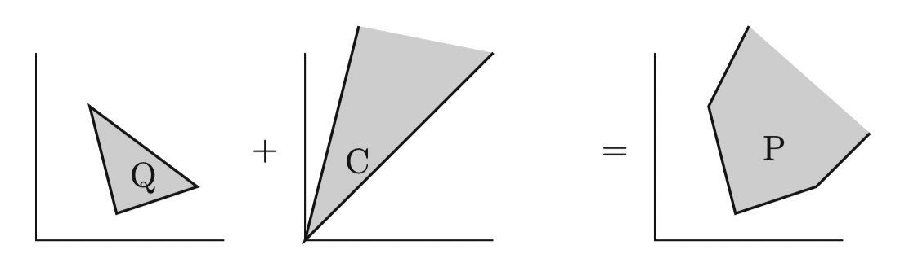

线性规划的可行域 $P$ 是一个多面体，混合整数线性规划有时候可以转换成多面体上的线性优化因。此，多面体组合学是线性规划，包括整数线性规划在内的组合优化的一个重要理论。

首先是一些基本概念：

**Polyhedron**

$$
P=\left\{x \in \mathbb{R}^{n}: A x \leq b\right\}
$$

polyhedron 的复数形式的 polyhedra，bounded polyhedron 称为 polytope。

**Rational polyhedron**

如果 $A \in \mathbb{Q}^{m\times n}, b \in \mathbb{Q}^m$ 都是有理数。

**Polyhedral cone**

$$
C:=\left\{x \in \mathbb{R}^{n}: A x \leq 0\right\}
$$

既是多面体又是锥。

### Minkowski–Weyl Theorem

Minkowski–Weyl 定理给出了多面体的一个刻画。

一个集合 $C$ 是有限生成的 (finitely generated)，如果它是有限个点的凸锥包。

+ **A subset of $\mathbb{R}^n$ is a finitely generated cone if and only if it is a polyhedral cone**

这句话说明 polyhedral cone 有两种表示方法：

$$
C = \left\{x \mid A x \leq 0\right\} = \{By \mid y \geq 0\}
$$

+ **A subset $P$ of $\mathbb{R}^{n}$ is a polyhedron if and only if $P=Q+C$ for some polytope $Q \subset \mathbb{R}^{n}$ and finitely generated cone $C \subseteq \mathbb{R}^{n}$.**

这句话说明了一个 polyhedron 的表达方式：

$$
P=\operatorname{conv}\left(v^{1}, \ldots, v^{p}\right)+\operatorname{cone}\left(r^{1}, \ldots, r^{q}\right)
$$

> 参考：https://scaron.info/robotics/polyhedra-and-polytopes.html

图示如下：

### Lineality Space and Recession Cone

定义 polyhedron $P$ 的 recession cone 是：

$$
\operatorname{rec}(P):=\left\{r \in \mathbb{R}^{n}: x+\lambda r \in P \text { for all } x \in P \text { and } \lambda \in \mathbb{R}_{+}\right\}
$$

定义 polyhedron $P$ 的 lineality space 是：

$$
\operatorname{lin}(P):=\left\{r \in \mathbb{R}^{n}: x+\lambda r \in P \text { for all } x \in P \text { and } \lambda \in \mathbb{R}\right\} \text {. }
$$

注意到 $\operatorname{lin}(P)=\operatorname{rec}(P) \cap-\operatorname{rec}(P)$，当 $\operatorname{lin}(P)=\{0\}$ 时，称多面体 $P$ 是 pointed.

直观上看，a nonempty polyhedron is pointed when it does not contain any line.

 

如果 $P:=\left\{x \in \mathbb{R}^{n}: A x \leq b\right\}=\operatorname{conv}\left(v^{1}, \ldots, v^{p}\right)+ \operatorname{cone}\left(r^{1}, \ldots, r^{q}\right)$ 非空，那么

$$
\begin{aligned}
\operatorname{rec}(P)&=\left\{r \in \mathbb{R}^{n}: A r \leq 0\right\}=\operatorname{cone}\left(r^{1}, \ldots, r^{q}\right) \\
\operatorname{lin}(P)&=\left\{r \in \mathbb{R}^{n}: A r=0\right\} \\
\end{aligned}
$$

### Implicit Equalities

多面体 $P=\left\{x \in \mathbb{R}^{n}: A x \leq b\right\}$ 是由一组不等式系统 $a_i^T x \leq b_i, \, i \in M$ 组成的，称不等式 $a_i^T x \leq b_i$ 是一个 implicit equality，如果 $P$ 被包含在超平面 $\{x \mid a_i^T x = b_i\}$ 中。

记  $M^{=}=\left\{i \in M \mid a^T_{i} x=b_{i},\, \forall x \in P\right\}$，$M^{<}=\left\{i \in M \mid a^T_{i} x<b_{i},\, \exists x \in P\right\}$。并引入记号 $(A^=, b^=), \, (A^<, b^<)$ 使得：

$$
P=\left\{x \in \mathbb{R}^{n}: A^{=} x \leq b^{=}, A^{<} x \leq b^{<}\right\}=\left\{x \in \mathbb{R}^{n}: A^{=} x=b^{=}, A^{<} x \leq b^{<}\right\}
$$

+ 称 $x$ 是 $P$ 的 *interior point*，如果 $a_i^T x < b_i \, \text{ for all }\, i \in M$

+ 称 $x$ 是 $P$ 的 *inner point*，如果 $a_i^T x < b_i \, \text{ for all }\, i \in M^{<}$

显然，一个多面体可能没有 interior point。但是，可以证明非空的多面体一定有 inner point。

根据 $M^{<}$ 的定义，$\forall i \in M^{<}$，都存在 $x_i \in P$ 使得 $a_i^T x_i \leq b_i$，由于多面体是凸集，不难发现 $\bar{x}:=\displaystyle\frac{1}{\left|M^{<}\right|} \sum_{i \in M^{<}} x_{i}$ 是一个满足条件的点。

由此不难证明：
$$
\operatorname{aff}(P)=\left\{x \in \mathbb{R}^{n}: A^{=} x=b^{=}\right\}=\left\{x \in \mathbb{R}^{n}: A^{=} x \leq b^{=}\right\}
$$
于是，我们有 $\operatorname{dim}(P)+\operatorname{rank}\left(A^{=}\right)=n$ .

称一个多面体 $P \subseteq \mathbb{R}^n$ full-dimensional，如果它有一个内点。这意味着 $\operatorname{dim} P=n$ ，也意味这 $P$ 没有 implicit equality。

例：
$$
P:= \left\{x \in \mathbb{R}^{n^2}: \quad \begin{aligned}
\sum_{j=1}^{n} x_{i j} &=1, \quad i=1, \ldots n \\
\sum_{i=1}^{n} x_{i j} &=1, \quad j=1, \ldots n \\
x_{i j} & \geq 0, \quad i, j=1, \ldots n
\end{aligned} \,\right\}
$$
的维数是 $n^2-2n+1$ .

### Faces

一个不等式 $c^T x \leq \delta$ 称作对 $P$ 有效 (valid)，如果 $c^T x \leq \delta, \, \forall x \in P$ .

有效性可以通过一组线性系统的有解性来判断：
$$
c^T x \leq \delta, \, \forall x \in P = \{x \mid Ax \leq b\} \Leftrightarrow \exists u \geq 0, \,\text{s.t.} \; u^TA=c^T, u^Tb \leq \delta
$$
上面的命题可以通过线性规划的对偶原理轻松证明。

多面体 $P$ 的一个 **face**，定义为：
$$
F:=P \cap\left\{x \in \mathbb{R}^{n}: c^Tx=\delta\right\}
$$
其中 $c^Tx \leq \delta$ 是一个 valid inequality for $P$ .

如果这样定义的 $F$ 非空，就称超平面 $\{x \mid c^T x = \delta\}$ 是 $P$ 的支撑超平面。

$\emptyset$ 和 $P$ 本身都是 $P$ 的 face，称 $P$ 的其它 face 都是 *proper* 的。

直观上理解，face 就是多面体与它的一个支撑超平面的交。

**Characterization of the Faces**

非空集合 $F$ 是 $P$ 的 face 当且仅当，对某个 $I \subseteq M$， $F$ 可以写成：
$$
F =\left\{x \in \mathbb{R}^{n}: a_{i}^T x=b_{i}, \,i \in I, a_{i}^T x \leq b_{i}, \,i \in M \backslash I\right\}
$$

多面体 $P$ 的 face 有以下性质：

+ face 的数量是有限的

### Facets

$P$ 的一个 face $F$ 称为 **facet**，如果 $F$  非空且 $\operatorname{dim} F = \operatorname{dim}P - 1$ .

比如说正方体的一条棱是 face，一个面就是 facet 。

