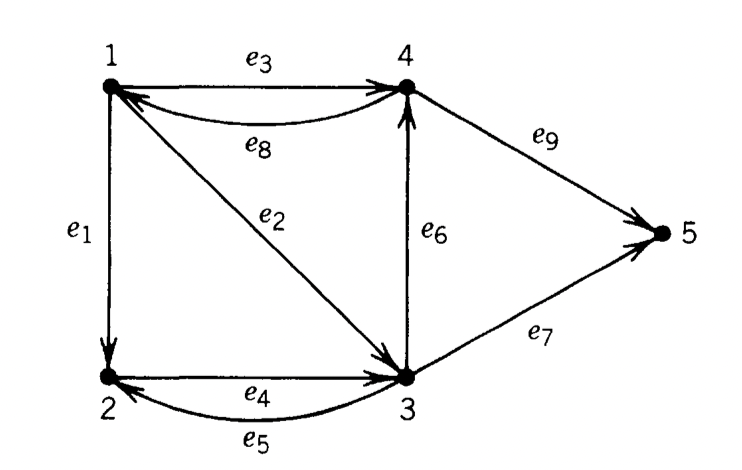
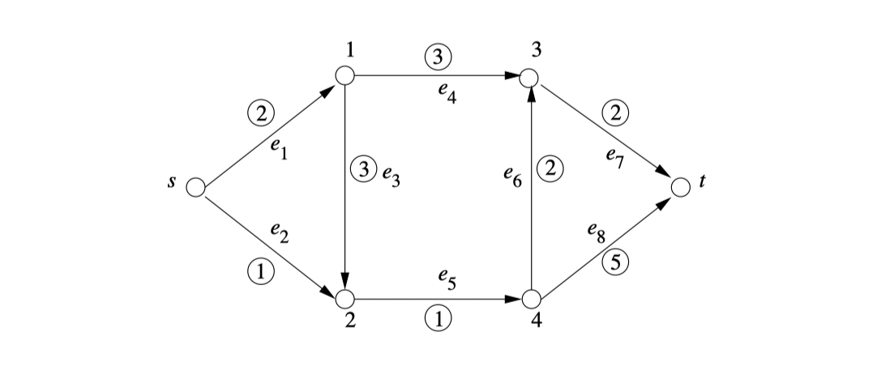
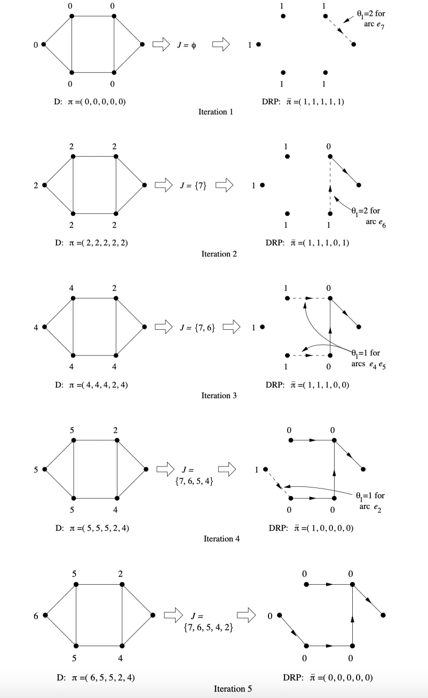
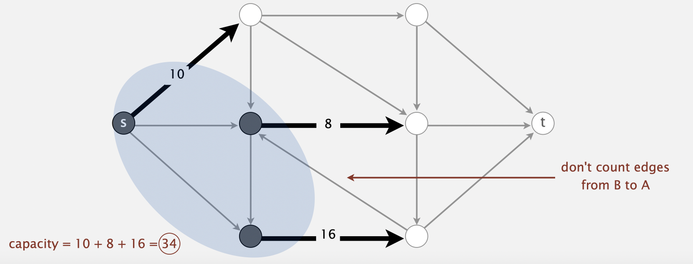
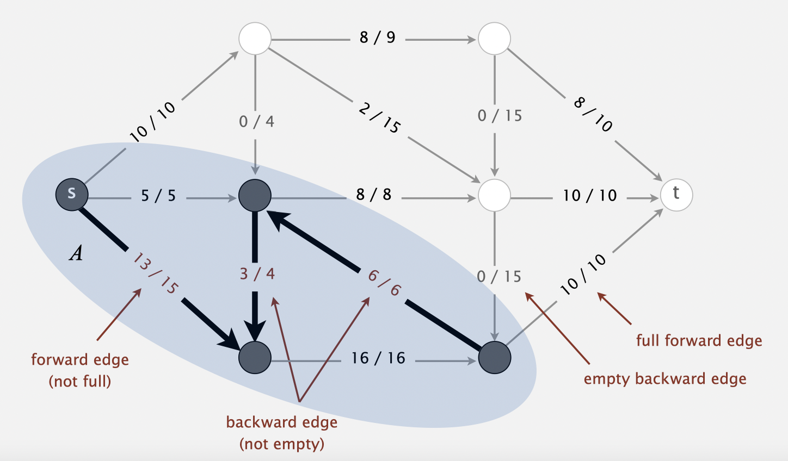
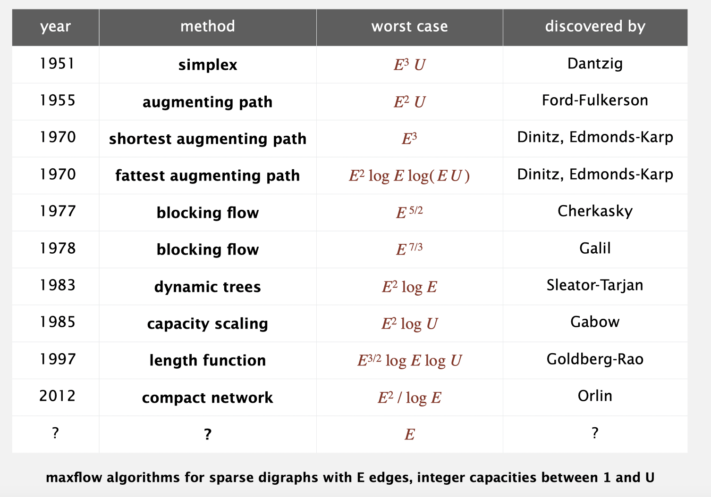

# Primal-dual Method to Network Flow

原始对偶算法是解决组合优化问题的通法。最短路和最大流是网络流中最经典的两个问题，它们都可以在原始对偶算法的框架下进行解决。

网络流问题大都可以写成线性规划，不同的网络流问题有着不同的LP形式，但解决的思路是通用的。

对于有向图 $(V, E)$，它的 **node-arc incidence matrix** 是一个 $|V| \times |E|$ 的矩阵：
$$
A_{v, \,e} = \begin{cases} 
+1, &\text{if arc } e \text{ starts at node } v \\
-1, &\text{if arc } e \text{ ends at node } v \\
0, &\text{otherwise}
\end{cases}
$$
矩阵的每一行对应于一个 vertex，每一列对应于一个 arc (edge)。

上图的点—弧关联矩阵是：
$$
\begin{aligned}
 & \quad\;\, e_1  \quad\; e_2 \quad\;\, e_3 \quad\;\, e_4 \quad\;\, e_5 \quad\; e_6 \quad\;\, e_7 \quad\; e_8  \quad\; e_9 \\
A=&\left(\begin{array}{rrrrrrrrr}
1 & 1 & 1 & 0 & 0 & 0 & 0 & -1 & 0 \\
-1 & 0 & 0 & 1 & -1 & 0 & 0 & 0 & 0 \\
0 & -1 & 0 & -1 & 1 & 1 & 1 & 0 & 0 \\
0 & 0 & -1 & 0 & 0 & -1 & 0 & 1 & 1 \\
0 & 0 & 0 & 0 & 0 & 0 & -1 & 0 & -1
\end{array}\right)\; \begin{array}{r}
v_1 \\
v_2 \\
v_3 \\
v_4 \\
v_5
\end{array}
\end{aligned}
$$
在点 $i \in V$ 处的流量守恒 (flow conservation) 是：
$$
a_i^T f = 0
$$
其中 $f \in \mathrm{R}^{|E|}$，表示每条边的流量。

如果 $a_i^T f > 0$，表示 $i$ 处有流量流出；如果 $a_i^T f < 0$，表示 $i$ 处有流量流入。

**注意上面的点—弧关联矩阵是一个缺秩的矩阵，它有一个多余的约束。** 这点也好理解，当你知道 $|V|-1$ 个点的流量的时候，你自然就知道剩下一个点的流量了。

### Shortest Path

容易写出，$s\to t$ 的最短路问题的流量守恒是：
$$
Af =\left[\begin{array}{c}
1\\
-1 \\
0 \\
\vdots \\
0 \\
\end{array} \right]\;
\begin{array}{l}
s: \text{a unit flow leaving} \\
t: \text{a unit flow entering}\\
\text{flow conservation}  \\
\vdots\\
\text{flow conservation} \\
\end{array}
$$
从 $s$ 到 $t$ 的一条路可以设想为：一个单位流，从 $s$ 流向 $t$，这样的流必然满足：

+ 起点 $s$ 流出一个单位的流
+ 终点 $t$ 流入一个单位的流
+ 其余点流量守恒

由于 $A$ 是缺秩的，去掉任意一行约束都可以，但是我们一般删去关于 $t$ 的那一行，记矩阵 $\bar{A}$。最后得到最短路线性规划模型为：
$$
\begin{aligned}
\min_f \; \; & c^T f \\
\text{s.t. } & \bar{A} f = \begin{bmatrix}
1 \\
0 \\
\vdots \\
0 \\
\end{bmatrix}, \quad f \geq 0
\end{aligned} \tag{SP}
$$
其中 $c$ 是每条边的权重（费用），决策目标是最小化 $s$ 到 $t$ 的单位流的费用。

**最短路问题的原问题，决策变量是每一条边，约束条件是每个点的流量守恒。**

### Max Flow

假设从 $s$ 到 $t$ 有一条容量为 $\mathrm{v}$ 的流，记 $d = \begin{bmatrix}-1 & +1 & 0 & \cdots & 0 \end{bmatrix}^T$，最大流的流量守恒表示为：
$$
Af + d\mathrm{v} = 0
$$
不难发现 $Af + d \mathrm{v} = 0 \Leftrightarrow Af + d\mathrm{v}  \leq 0$ .

因此最大流的数学规划模型为：

$$
\begin{aligned}
\max_{f, \,\mathrm{v}} \;\; & \mathrm{v} \\
\text{s.t. } \; &  Af + d \mathrm{v} \leq 0 \\
 & f \leq b \\
 & f \geq 0 \\
\end{aligned} \tag{MF}
$$
其中 $b$ 是每条边的容量上限。

### Primal Dual — Shortest Path

最短路的对偶问题是：
$$
\begin{aligned}
\max_y \; & y_s - y_t \\
\text{s.t. } & y_i - y_j \leq c_{ij} \, , \;\; \forall (i, j) \in E \\
 & y \text{ free}
\end{aligned}
$$
注意到对偶问题的决策变量是每个顶点，约束条件是每条边。

因为原问题多了一个约束条件，所以对偶问题多了一个决策变量，通常我们令 $y_t = 0$ .
$$
\begin{aligned}
\max \; & y_s \\
\text{s.t. } & y_i - y_j \leq c_{ij} \, , \;\; \forall\, (i, j) \in E \\
 & y \text{ free}, \;\; y_t= 0
\end{aligned} \tag{SP-D}
$$
下面介绍用原始对偶算法解决最短路问题的思路：

从一个可行解 $y=0$ 出发，记 $J$ 是有效约束指标集，我们可以直接写出 DRP：
$$
\begin{aligned}
\max \; & y_s \\
\text{s.t. } & y_i - y_j \leq 0 \, , \;\; \forall\, (i, j) \in J \\
& y_i \leq 1, \;\; y_t=0
\end{aligned}
\tag{SP-DRP}
$$
一般原始对偶算法是解RP，但事实上，对最短路这个例子来说，解DRP是足够容易的！因为 $y_s$ 要么为 1 要么为 0 。

+ 如果 $J$ 中存在 $s \to t$ 的路径，那么可以让 $y_s = 0$ ，说明已经达到最优
+ 如果 $J$ 中不存在 $s \to t$ 的路径，那么 $y_s$ 最大可以取到 1，继续迭代

SP-DRP 的最优解可以直接根据 $J$ 和图的结构给出：
$$
\bar{y}_i = \begin{cases}
1, & i\, \text{ reachable from } s \text{ using arcs in } J \\
0, & i\, \text{ from which } t \text{ is reachable using arcs in } J \\
1, & \text{all other nodes}
\end{cases}
$$
记：
$$
\theta=\min _{\substack{(i, j) \notin J \\ y_{i}-y_{j}>0}}\left\{c_{i j}-\left(y_{i}-y_{j}\right)\right\}
$$
则 $y_{\text{new}} = y + \theta \bar{y}$，使 $\theta$ 最小的 $(i, j)$ 将进入到 $J_{\text{new}}$ 中。**这一过程的思想就是，不断向 $J$ 中添加边，直到 $J$ 包含一条从 $s$ 到 $t$ 的路径。**

于是，我们把解最短路问题转化为求解多个可达性子问题。算法终止当且仅当存在一条使用 $J$ 中的边的 $s\to t$ 的路径。

严格来说，PD算法的有限终止性在这里并不适用，因为PD算法有限终止的前提是用单纯型法解RP问题。但是，finiteness follows from two simple observations about DRP:

+ Once edge $(i, j)$ becomes admissible (enters $J$) it never leaves $J$ at any later stage.
+ At every iteration of DRP, at least one new $(i, j)$, the one that defines $\theta$ , becomes admissible.

以上两点结合一个例子就能很轻易的理解了。

对于图：

它的迭代过程是：

其实这个算法的本质就是Dijkstra算法，从 $t$ 点开始做动态规划，它是一个多项式时间的算法！

### Max Flow — Min cuts

一个割 (cut) 指的是 $V$ 的一个子集 $W$，割的容量 (capacity)指的是 $c(W, \overline{W})=\displaystyle\sum_{(i, j):\, i\in W, j \in \overline{W}} b_{ij}$

$s-t$ cut 指的是一个子集 $W \subset V$ 使得 $s\in W, t \in \overline{W}$ .

最大流的原问题是：
$$
\begin{aligned}
\max_{f, \,\mathrm{v}} \;\; & \mathrm{v} \\
\text{s.t. } \; &  Af + d \mathrm{v} = 0 \\
 & f \leq b \\
 & f \geq 0 \\
\end{aligned}
$$
引入对偶变量 $p_i \;(i\in V)$ 和 $\gamma_{ij} \; (i, j) \in E$，上面问题的对偶问题就是：
$$
\begin{aligned}
\min \; & \sum_{i, j) \in E} \gamma_{ij} b_{ij} \\
\text{s.t. } & p_i - p_j + \gamma_{ij} \geq 0 \\
& -p_s + p_t \geq 1 \\
& \gamma_{ij} \geq 0, \;\; p \text{ free }
\end{aligned}
$$
给定一个 $s-t$ cut $(W, \overline{W})$，定义：
$$
\gamma_{ij} = \begin{cases}
1 & \text{if } (i, j) \in E \text{ and } i \in W, j \in \overline{W} \\
0 & \text{otherwise} \\
\end{cases}, \qquad p_i = \begin{cases}
0 & i \in W \\
1 & i \in \overline{W} \\
\end{cases}
$$
可以确定一个对偶问题的可行解。这其实说明了最小割问题是最大流问题的上界。

注意到：

+ 如果 $(i, j) \in E$ 并且 $i \in W, j \in \overline{W}$ ，则约束条件 $p_i - p_j - \gamma_{ij} = 0 \geq 0$ 是紧的
+ 如果 $(i, j) \in E$ 并且 $i \in\overline{W}, j \in W$ ，则约束条件 $p_i - p_j - \gamma_{ij} = 1 \geq 0$ 是严格成立的

**Max-flow min-cut theorem**

Max-flow = min-cut 如果互补松弛条件成立：
$$
\begin{aligned}
f_{ij} = 0 \quad & \forall  (i, j) \in E \;\; \text{ s.t. } i \in \overline{W}, j \in W \\
f_{ij} = b \quad & \forall (i, j) \in E \;\; \text{ s.t. } i \in W, j \in \overline{W}
\end{aligned}
$$

下图展示了如何从最大流的结果得到最小割：

最优性可以体现在找到一个割使得割的容量与流量相等。

### Primal Dual — Max Flow

对于最大流问题，我们可以直接把问题看成是某个问题的对偶问题：
$$
\begin{aligned}
\max_{f, \,\mathrm{v}} \;\; & \mathrm{v} \\
\text{s.t. } \; &  Af + d \mathrm{v} \leq 0 \\
 & f \leq b \\
 & f \geq 0 \\
\end{aligned} \tag{MF-D}
$$
因为 $Af + d\mathrm{v} \leq 0$ 等号总是成立的，所以DRP是：
$$
\begin{array}{crl}
\max\; & \mathrm{v}  \\
\text{s.t.} & A f+d \mathrm{v} & \leq 0 \quad \text { for all rows } \\
&f & \leq 0 \quad \text { for rows where } f=b \text { in } D \\
&-f & \leq 0 \quad \text { for rows where } f=0 \text { in } D \\
&f & \leq 1 \\
&\mathrm{v} & \leq 1
\end{array} \tag{MF-DRP}
$$
如果 DRP 的最优解是 0，那么这表明问题达到最优。

令 $\mathrm{v}=1$，对 DRP 而言，这意味着存在一条从 $s\to t$ 的路 $P$，其饱和弧 (saturated arc, $f_e=b_e$) 必然是反向弧 (in backward direction)，其空弧 (unused arc, $f_e=0$) 必然是前向弧 (in forward direction)，其它弧可以是任意方向的。  

**这样的路我们叫做增广路 (augmenting path)。求解 DRP 就等价于找增广路。沿着增广路就可以增加网络的流量。**

> Augmenting path: an undirect path restricted to using an edge in forward direction if that edge is unsaturated and using an edge in backward direction if that edge had positive flow.

此时：
$$
\theta = \min_{(i, j) \in P}\begin{cases}
b_{ij} - f_{ij} & \forall (i, j) \text{ forward } \\
f_{ij} & \forall (i, j) \text{ backward }
\end{cases}
$$

Ford-Fulkerson 算法的基本思路与通过多次求解DRP来找到最大流是一样的。

**Ford-Fulkerson method**

Start with 0 flow.

While there exists an augmenting path:

- find an augmenting path
- compute bottleneck capacity
- increase flow on that path by bottleneck capacity

Ford-Fulkerson 方法值的并不是一个确定的算法，**增广路可能不是唯一的，怎么确定好的增广路是非常重要的。**

**Ford-Fulkerson Labeling Algorithm**

这是一个具体算法，由 Ford 和 Fulkerson 在1955年提出。

例子在：https://www.doc88.com/p-16816167056590.html

如果流量是有理数（整数），那么算法保证在有限步终止，时间复杂度为 $O(E^2U)$，其中 $U$ 表示边的最大容量。如果流量是无理数，那么算法可能不能在有限步终止。

其它算法：

