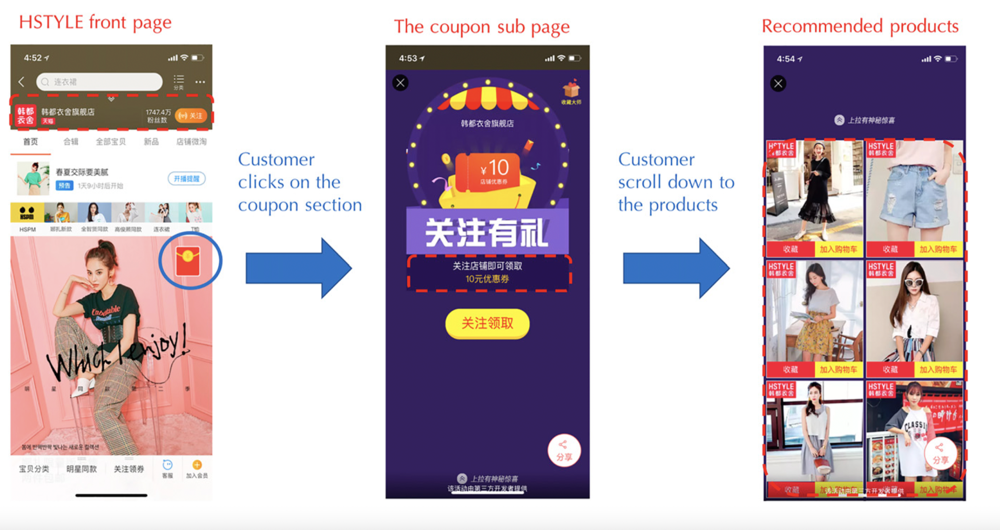

发表于 Operations Research, 2021(Articles in Advance). DOI: https://doi.org/10.1287/opre.2021.2158.

Subject Classifications: Buyer behavior, Choice models, Computational complexity 

Area of Review: OR Practice

Keywords: choice models • product assortment • machine learning • field experiment • retail operations

---

这篇文章记录了阿里巴巴算法团队在 2018 年针对商品推荐的两种方法 machine learning VS customer choice models 的过程和结果。

### Product-Display Problem

天猫的一次活动中，店铺会给予新人顾客一个红包，然后指定六件商品，红包只能用在这六件商品中。天猫当然希望用户有更高的购买率和购买金额，所以算法团队的任务就是找出六件商品推荐给用户。

推荐算法的核心可以看成是一个优化问题（assortment optimization）：
$$
\max _{S \subseteq \mathcal{N}:|S|=6} \sum_{j \in S} r_{j} \cdot P_{j t}
$$
$P_{jt}$ 是顾客 $t$ 购买商品 $j$ 的概率，$r_j$ 是商品的利润。$\mathcal{N}$ 表示全体商品，优化的目标是找到一个子集 $S$，使得期望利润最大。

这个问题最重要的一步就是计算 $P_{jt}$ （estimation）

阿里巴巴团队在过去一直使用的是一套复杂的机器学习算法来估计 $P_{jt}$，**在 2018 年 3 月的为期两周的实验中，阿里团队比较了机器学习方法和 multinomial logit (MNL) model 的效果，并发现 MNL 方法能给平台带来显著更高的收益。**

> Our field experiments revealed that the MNL-based approach generated 5.17 renminbi (RMB) per customer visit, compared with the 4.04 RMB per customer visit generated by the machine-learning-based approach when both approaches were given access to the same set of the 25 most important features.

### The Estimation Problem

在机器学习方法中，预测 $P_{jt}$ 主要用的是产品特征（价格、评价、浏览次数）、顾客特征（历史消费行为、人口统计信息）。团队提取出了其中最重要的 25 个特征。

训练数据由 $\mathcal{PH}_{ML} = \{ (\mathbf{X_{jt}}, c_{jt}, z_{jt}): 1 \leq t \leq T,\; j \in S_t \}$ 组成，这些都是历史的推荐结果。由于模型保密原因，文章没有过多透露机器学习方法是怎样实践的。它一共分为两步，第一步是训练模型 $f(\mathbf{X_{jt}})$ 预测 $\mathbb{P}(c_{jt} = 1)$，第二部是训练模型 $g(\mathbf{X_{jt}})$ 预测 $\mathbb{P}\left(z_{i t}=1 \mid c_{i t}=1\right)$，最后顾客的购买概率就是 $\mathbb{P}_{jt} (\mathbf{X_{jt}})  =  f(\mathbf{X_{jt}}) \cdot g(\mathbf{X_{jt}})$。

MNL Choice Model 更加简单，它就是一个参数模型：
$$
P_{j t}\left(S_{t}, X_{t}\right)=\mathbb{P}\left[U_{j t}=\max _{i \in S_{t}} U_{i t}\right]=\frac{e^{\beta^{T} X_{j t}}}{1+\sum_{i \in S_{t}} e^{\beta^{T} X_{j t}}}
$$
$\mathcal{PH}_{MNL} = \{(S_t, \mathbf{X_{jt}}, z_t): t = 1, \dots, \tau\}$ 。文章用极大似然法来估计 $\mathbf{\beta}$：
$$
\max _{\beta}\;
\mathcal{L} \mathcal{L}\left(\boldsymbol{\beta} ; \mathcal{P} \mathcal{H}_{M N L}\right)=\sum_{t=1}^{\tau}\left(\boldsymbol{\beta}^{T} X_{z_{t} t}-\log \left(1+\sum_{j \in S_{t}} e^{\boldsymbol{\beta}^{T} \mathbf{X}_{\mathbf{j t}}}\right)\right)
$$
目标函数是凹的，因此是一个凸优化问题。$\tau$ 在两千万到三千万之间，阿里团队选择使用 TensorFlow 用随机梯度下降法来解。

### The Assortment Problem

机器学习方法的 assortment 非常简单，挑选使得 $r_j \cdot P(\mathbf{X_{jt}})$ 最大的六种商品即可。

### Experiment Design and Data & Main Results

这一部分文章叙述了实验的设计过程并从统计学的角度说明了实验的有效性。

在第一周的实验里，团队对比了一下三种方法：

1. The MNL-based approach (MNL approach) 使用 top25 特征的MNL
2. The same-feature-ML-based approach (SF-ML approach) 使用 top25 特征的机器学习
3. The all-feature-ML-based approach (AF-ML approach) 使用全部特征的机器学习

