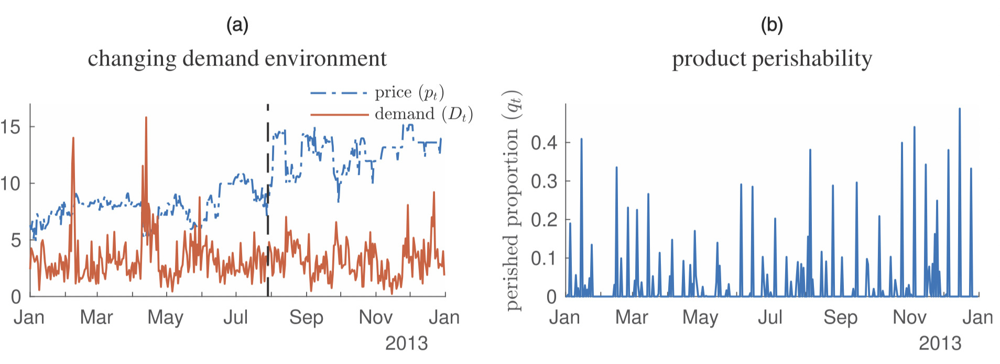
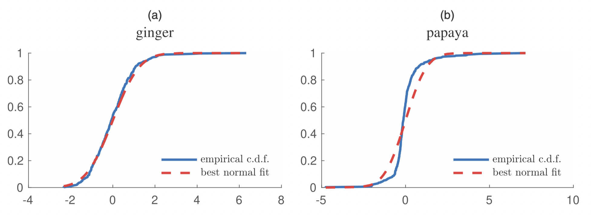

发表于 Management Science, 2022. DOI: https://doi.org/10.1287/mnsc.2021.4011.

Area of review: Management Science Special Section on Data-Driven Prescriptive Analytics.

Keywords: dynamic pricing; inventory control; perishable inventory; nonstationary environment; data-driven analysis; estimation; exploration-exploitation

---

这篇文章的内容非常之多，因为文章考虑的东西很多，joint pricing and inventory、perishable、changing environment、data-driven .

文章有三个主要贡献：

1. Formulating a Model Motivated by Observations on Real-Life Data
2. Theoretical Analysis: Deriving Rate-Optimal Regret Bounds
3. Data-Driven Case Study: Managerial Insights for Practice

> Furthermore, our analysis sheds light on the value of accounting for inventory perishability and changing environments in pricing and inventory decisions.

首先文章结合实际数据（生鲜销售），指出 demand-pricing 的关系会随着时间变化（可能的原因有 pandemic, weather, technology 等

接着又指出易逝品的损坏率是随机的。

最后还指出了 demand noise 可能是非参数的。

文章设计了两种 **data-driven pricing and ordering (DDPO)** 策略，一种针对 nonparametric demand noise，另一种针对 exponential-family demand noise，两者的 regret 分别为：$O\left(T^{{2 / 3}}(\log T)^{1 / 2}\right)$ and $O\left(T^{1 / 2} \log T\right)$，这说明，如果未知的东西能参数化，能使问题更简单。

基本设定，在 $t = 1, \dots, T$ 时期内：

1. 期初观测到库存 $x_t$
2. 选择价格 $p_t \in [p_\min, p_\max]=\mathscr{P}$，以及 order-up-to level $y_t \in [y_\min, y_\max]=\mathscr{Y}$ 
3. lead-time 为0.  (overnight delivery) $q_t$ 比例的商品损坏/腐烂。
4. 需求 $D_t$  observable
5. 期末库存水平 $x_{t+1}=\left[\left(1-q_{t}\right) y_{t}-D_{t}\right]^{+}$

需求是价格的函数：
$$
\begin{aligned}
D_{t}=&g\left(\alpha_{t}+\beta_{t} p_{t}\right)+\varepsilon_{t} \text { for } t=1,2, \ldots \\
=& g\left(\boldsymbol{X}_{t}^{\top} \boldsymbol{\theta}_{t}\right)+\varepsilon_{t} \text { for } t=1,2, \ldots
\end{aligned}
$$
记 $\boldsymbol{X}_{t}=\left(1, p_{t}\right)^{\top}$ and $\boldsymbol{\theta}_{t}=\left(\alpha_{t}, \beta_{t}\right)^{\top}$

参数 $\boldsymbol{\theta}(t)$ 会在几个时间点内发生变化，但是决策者并不知道准确的时刻。

腐烂率 $q_t$ 服从参数 $\boldsymbol{\xi} = (\lambda, \nu)$ 的 beta 分布。

#### DDPO Policy

以 full-information anticipatory policy 为 benchmark，一个 admissible policy 指的是 $\pi_t : \mathbf{I}_t \to \mathscr{P} \times \mathscr{Y}$

评价标准是 *regret / profit loss*
$$
\Delta_{\boldsymbol{\theta}, \boldsymbol{\xi}}^{\pi}(T)=\mathbb{E}_{\boldsymbol{\theta}, \boldsymbol{\xi}}^{\pi}\left[\sum_{t=1}^{T}\left(Q\left(p_{t}^{*}, y_{t}^{*} ; \boldsymbol{\theta}_{t}, \boldsymbol{\xi}\right)-Q\left(p_{t}^{\pi}, y_{t}^{\pi} ; \boldsymbol{\theta}_{t}, \boldsymbol{\xi}\right)\right)\right]
$$

考虑以下两种 setting

- Setting N: The demand noise distribution $F_{\varepsilon}$ does not necessarily bear a parametric form.
- Setting E: The demand noise distribution $F_{\varepsilon}$ is known to belong to the exponential family of distributions with a continuous density.

对于两种 setting，文章分别给出了 DDPO-N 和 DDPO-E 两种 policy. 

首先把时间划分成若干段：$\tau=0,1, \ldots,\lfloor T / n\rfloor$

 
