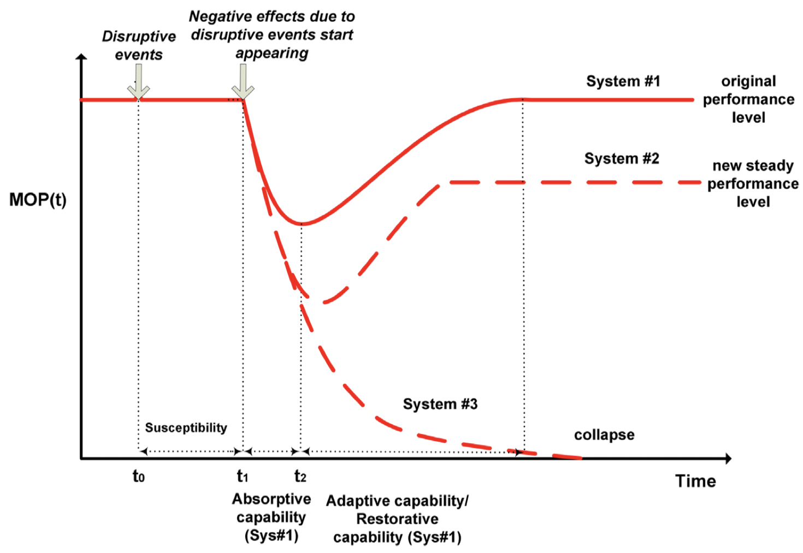

发表于 Reliability Engineering and System Safety, 2017. DOI: https://doi.org/10.1016/j.ress.2016.08.013.

Keywords: Interdependent critical infrastructure; Resilience; Reliability; Agent-based modeling; Interdependency

---

**这篇文章提出了一个定量地评估系统韧性的方法。**

> In this paper, a quantitative method for the assessment of the system resilience is proposed. The method consists of two components: an integrated metric for system resilience quantification and a hybrid modeling approach for representing the failure behavior of infrastructure systems.

韧性一词最早由生态学家 Holling 提出，他定义韧性 resilience: a measure of the persistence of systems and of their ability to absorb change and disturbance and still maintain the same relationships between populations or state variables. 随后韧性这个概念被用在各个领域中。在文章里，韧性指的是: the ability of a system to resist the effects of a disruptive force and to reduce performance deviations.

系统韧性 (resilience capabilities) 可以分解为三种能力：

+ Absorptive capability
+ Adaptive capability
+ Restorative capability

下图描述了这三种能力：

纵坐标 MOP 指的是 *measurement of performance* 。

