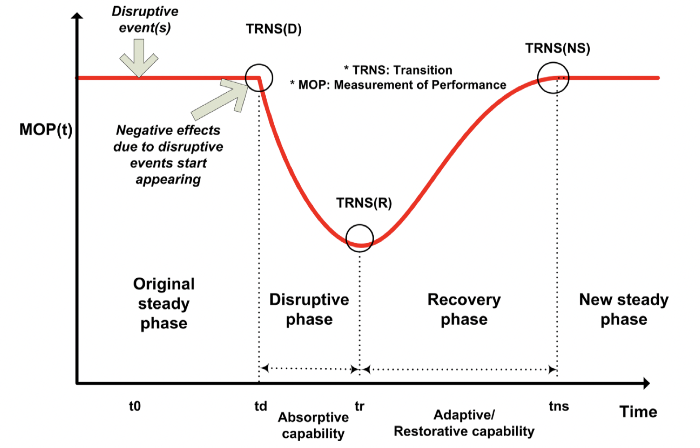

发表在 Reliability Engineering and System Safety, 2017. DOI: https://doi.org/10.1016/j.ress.2016.08.013.

Keywords: Interdependent critical infrastructure; Resilience; Reliability; Agent-based modeling; Interdependency

---

**这篇文章提出了一个定量地评估系统韧性的方法。**

> In this paper, a quantitative method for the assessment of the system resilience is proposed. The method consists of two components: an integrated metric for system resilience quantification and a hybrid modeling approach for representing the failure behavior of infrastructure systems.

韧性一词最早由生态学家 Holling 提出，他定义韧性 resilience: a measure of the persistence of systems and of their ability to absorb change and disturbance and still maintain the same relationships between populations or state variables. 随后韧性这个概念被用在各个领域中。在文章里，韧性指的是: the ability of a system to resist the effects of a disruptive force and to reduce performance deviations.

系统韧性 (resilience capabilities) 可以分解为三种能力：

+ Absorptive capability
+ Adaptive capability
+ Restorative capability

下图描述了这三种能力：

纵坐标 MOP 指的是 *measurement of performance* ，一般是0-1之间的数值。

接着文章给出了一些 resilience metrics。

+ robustness $R = \min \{MOP(t) \text{ for } \mathrm{td} \leq t \leq \mathrm{tns}\}$
+ rapidity $R A P I_{D P}=\displaystyle\frac{M O P\left(t_{d}\right)-M O P\left(t_{r}\right)}{t_{r}-t_{d}}$
+ performance loss $\mathrm{PL}_{\mathrm{DP}}=\displaystyle\int_{t_{d}}^{t_{\mathrm{r}}}\left(\operatorname{MOP}\left(t_{\mathrm{o}}\right)-\operatorname{MOP}(t)\right) \mathrm{d} t$
+ time averaged performance loss $T A P L_{D P}=\displaystyle\frac{\displaystyle\int_{t_{d}}^{t_{r}}\left(\operatorname{MOP}\left(t_{0}\right)-M O P(t)\right) \mathrm{d} t}{t_{r}-t_{d}}$

+ recovery ability $R A=\left|\displaystyle\frac{M O P\left(t_{n s}\right)-M O P\left(t_{r}\right)}{M O P\left(t_{o}\right)-M O P\left(t_{r}\right)}\right|$

**Integrated resilience metric**

文章提炼出了一个整体的指标，用于综合评估系统韧性：
$$
\begin{aligned}
G R=& f\left(R, R A P I_{D P}, R A P I_{R P}, T A P L, R A\right)=R \times\left(\frac{R A P I_{R P}}{R A P I_{D P}}\right) \times(T A P L)^{-1} \times R A
\end{aligned}
$$
$GR$ 是无量纲的，越大代表系统韧性越强

