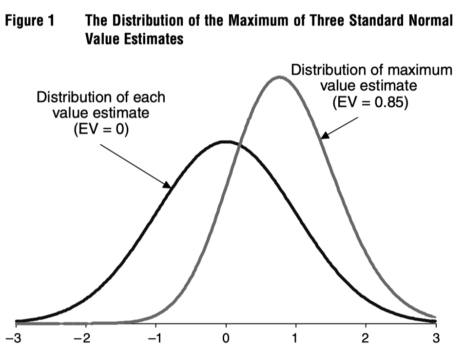
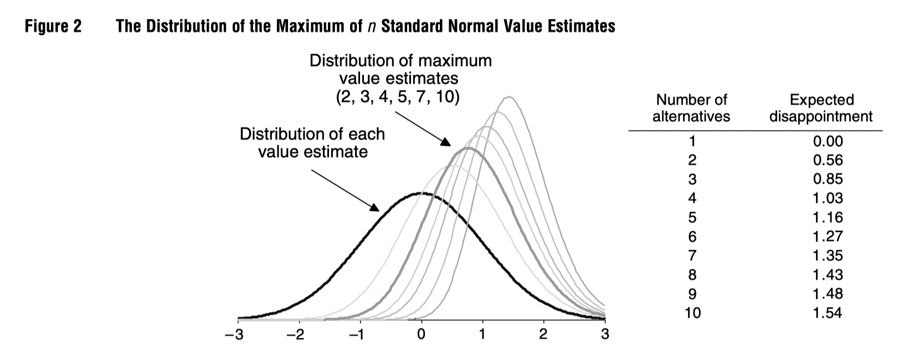
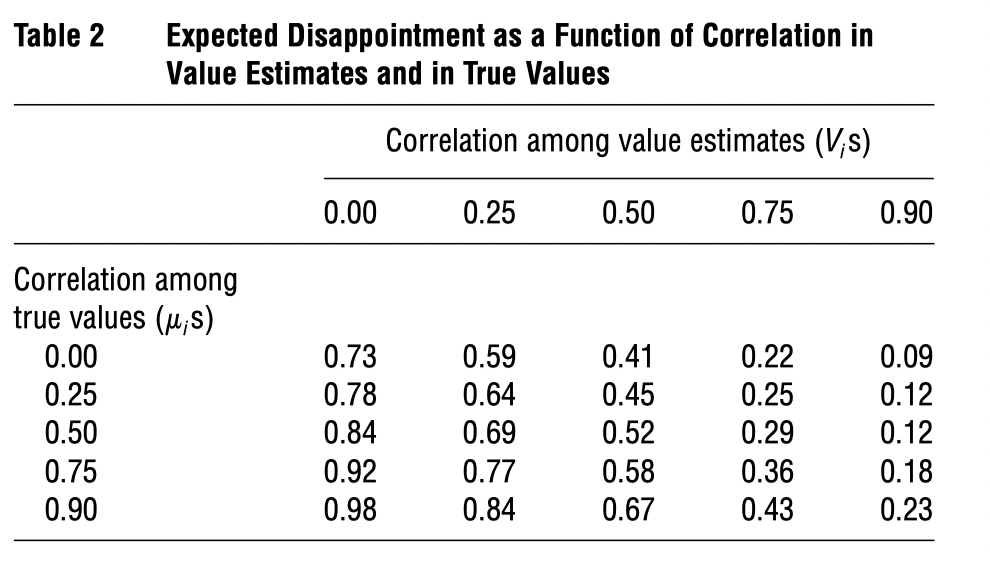

发表在 Management Science, 2006. DOI: https://doi.org/10.1287/mnsc.1050.0451.

Key words: decision analysis; optimization; optimizer’s curse; Bayesian models; postdecision surprise; disappointment

---

一个分析团队刚刚将复杂分析的结果提交给负责决策的高管。分析人士建议做一项创新投资，并声称，尽管该投资并非没有风险，但它具有巨大的正预期净现值。这位高管倾向于遵循团队的建议，但她回忆，在过去遵循这些建议后，结果有些失望。虽然分析似乎公平公正，但她还是忍不住感到有点怀疑。她的怀疑有道理吗？

这是文章开头抛出的问题。这个问题的背后，就是 optimizer's curse。

### Optimizer’s Curse

假如决策者要考虑 $n$ 个 alternative，它们的真实效用值是 $\mu_1, \dots, \mu_n$，但是决策者是不知道的；决策者只能通过分析得到 $n$ 个效用的估计值 $V_1, \dots, V_n$，然后选择估计效用最大的那个选项。

假设 $V_{i^\ast} = \displaystyle\max_i\, V_i$，那么平均来说 postdecision suprise 等于 $\mathrm{E}[\mu_{i^\ast} - V_{i^\ast}]$，这是实际效用与期望效用的差值。**即便 $V_i$ 都是 $\mu_i$ 的无偏估计，$\mathrm{E}[\mu_{i^\ast} - V_{i^\ast}]$ 仍然可能是负的。**

文章接着用一些例子来说明这个。

假定 $\mu_1=\mu_2=\mu_3$，估计值 $V_i \sim \mathcal{N}(0, 1)$，那实际上我们期待的效用值 $V_{i^\ast}$ 是三个标准正态分布取最大，$\mathrm{E}[\mu_{i^\ast} - V_{i^\ast}]$ 是负的。

如下图，我们做决策的 disappointment 随着选择的增加而增加。

$\mu_i$ 的（正）相关性会增大这种影响，$V_i$ 的正相关性会减小这种影响。

此外，文章还谈论了 optimizer's curse 对 "value added" 的影响。

> Value added: the difference between the estimated value of the optimal alternative identified in the analysis and the estimated value of a default alternative (or current plan) that would have been chosen if no analysis were done.

### What to Do

文章用例子说明了 optimizer's curse 可能对决策产生实质性的影响，接着文章提出了两个问题：

1. How should we adjust our value estimates to eliminate this effect? 
2. How should it affect decision making?

文章提出用贝叶斯统计的方式来处理。

假设真实效用 $\boldsymbol{\mu} = (\mu_1, \dots, \mu_n)$，估计值 $\boldsymbol{V} = (V_1, \dots, V_n)$ 由 $\boldsymbol{V} \mid \boldsymbol{\mu}$ 来刻画，于是我们可以使用贝叶斯法则得到后验分布 $\boldsymbol{\mu} \mid \boldsymbol{V}$ . 令 $\boldsymbol{v} = \mathrm{E}[\boldsymbol{\mu \mid \boldsymbol{V}}]$，则 $\hat{v}_{i^\ast}$ 是一个好的估计。

#### A Multivariate Normal Model

如果 $\boldsymbol{\mu}$ 是一个高斯分布 $\mathcal{N}(\bar{\boldsymbol{\mu}}, M)$，

### Related Biases and “Curses”

文章在第四部分比较了其它的 "curses"。

比如 winner’s curse，拍卖中出价最高的一方往往支付了超过拍品本身价值的钱。

比如幸存者偏差，optimizer's curse 可以看成是只有一个幸存者的情况。

### 总结

这篇文章只有12页。思想深刻，理论精炼。

文章提到，虽然 optimizer's curse 在实践中经常遇到，但是用实际数据证明它可能是很难的。

文章提炼了一下 optimizer's curse: If decision makers take the value estimates resulting from an analysis at face value and select according to these estimates, then they should expect to be disappointed on average, **not because of any inherent bias in the estimates themselves, but because of the selection process itself**.

解决问题的思路：treat the results of the analysis as uncertain and **combine these results with prior estimates of value** using Bayes’ rule before choosing an alternative.

最后，文章回答了一开始提出的问题。是的，怀疑非常有道理；要做出好的决策，必须要克服 optimizers' curse。
