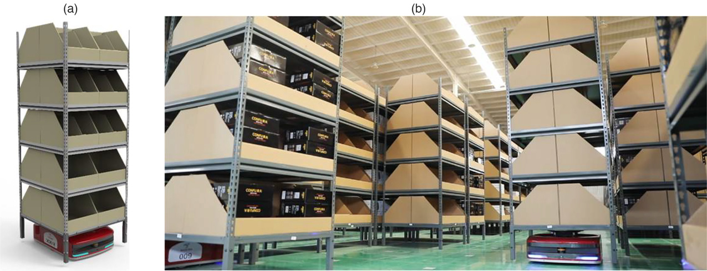

发表在 Informs Journal on Applied Analytics, 2021. DOI: https://doi.org/10.1287/inte.2021.1100

Key words: intelligent warehouse • robotic system • automatic guided vehicle (AGV) • integer program
• cutting planes • dispatching • e-commerce • order picking • order fulfillment • Edelman Award

---

在这篇文章里面，京东的团队叙述了智能仓库的建设历程，并在附录里面简要介绍了涉及到的一个核心算法的简化版本。

首先，文章以“亚洲一号”起笔，叙述了京东物流的发展目标、发展历程和发展现状。

文章重点介绍了京东无人仓库建设期遇到的种种问题。不仅是技术上（运筹、机器人、软件、网络）的问题，**财务上**、（公司）政策也存在很多问题。整个项目历经立项、研究可行性、模拟、部门批准、实地建设、算法改进、压测等多个环节。

中间插叙了智能仓库的核心组成部分和遇到的问题。

传统的人工仓库是 picker-to-parts 模式，工人走到货架上取到货物再拿回打包中心装箱。而无人仓库采用 parts-to-picker 模式，AGVs 把 racks 移动到 workstation，再由 workstation 的机器手臂取下 racks 上的货物进行组装打包。

> An AGV picks up a rack within the picking area and brings it to a workstation, where some requested SKUs are retrieved.

文章在附录将以上过程建模为一个纯整数规划问题，并设计了近似算法进行求解。

【此处挖坑待填】

<!-- 用到了 Lagrange multiplier -->
