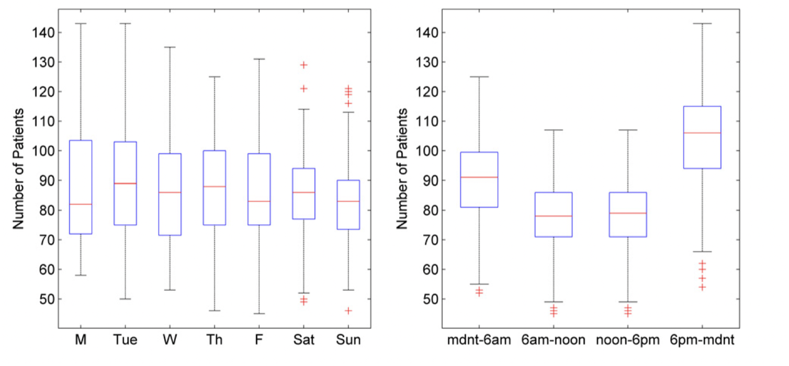
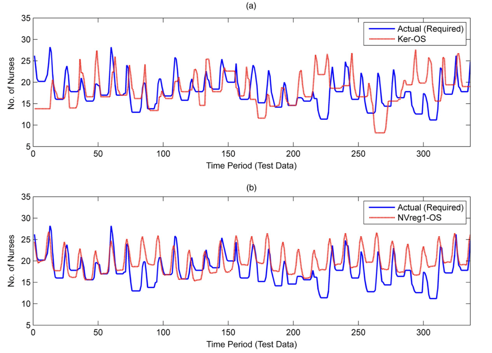

发表于 Operations Research, 2019. DOI: https://doi.org/10.1287/opre.2018.1757.

Subject Classifications: inventory/production; stochastic: programming; stochastic: statistics; estimation 

Area of Review: Operations and Supply Chains

Keywords: big data • newsvendor • machine learning • sample average approximation • statistical learning theory • quantile regression

---

文章是2015年初写的，2018年初接收。这篇文章把对需求的刻画，从统计学跃进到了数据科学。明天的需求，可能跟方方面面的因素有关系（天气、汇率、节假日等等），这汇聚成了 big data。文章提出了一种 **distribution-free, one-step** machine-learning 的算法来解决大数据时代下的 newsvendor 问题。

> We investigate the data-driven newsvendor problem when one has n observations of p features related to the demand as well as historical demand data.

文章围绕四个问题展开：

1. How should the DM use a feature-demand data set to solve the newsvendor problem?
2. What is the value of incorporating features in newsvendor decision making in the first place?
3. What theoretical guarantees does the DM using such data have, and how do these scale with the various problem parameters?
4. How do newsvendor decisions based on the feature-demand data set compare with other benchmarks in practice?

传统的 newsvendor 问题是：
$$
\begin{array}{c}
C(q ; D):=b(D-q)^{+}+h(q-D)^{+} \\
\displaystyle\min _{q \geq 0} E C(q):=\mathbb{E}[C(q ; D)] \\
\end{array}
$$
这是一个随机规划问题，SAA方法给出的解是：
$$
\hat{q}_{n}=\inf \left\{y: \hat{F}_{n}(y) \geq \frac{b}{b+h}\right\}
$$
而 big-data newsvendor 问题是：
$$
\min _{q(\cdot) \in \mathscr{L},\{q: \mathscr{x} \rightarrow \mathbb{R}\}} \mathbb{E}[C(q(\mathbf{x}) ; D(\mathbf{x})) \mid \mathbf{x}]
$$
其中 $\mathbf{x}$ 是 high-dimensional features。优化的目的是找到一个规则，输入特征，输出订货量，并使得期望的损失最小。$\mathscr{L}$ 是一族可行的规则。

说白了，就是直接训练一个模型，输入特征，输出订货量。

关于这类问题的求解，文章给出了参数和非参数式两种方法。

假定有数据集 $S_n = [(\mathbf{x}_1, d_1), \dots, (\mathbf{x}_n, d_n)]$.

#### Empirical Risk Minimization

假定这个可行集 $\mathscr{L}$  是线性参数化的：
$$
\mathscr{L}=\left\{q: \mathscr{X} \rightarrow \mathbb{R}: q(\mathbf{x})=\mathbf{q}^{\prime} \mathbf{x}=\sum_{j=1}^{p} q^{j} x^{j}\right\}
$$
并且以经验风险作为优化目标：
$$
\min _{q(\cdot) \in \mathscr{L} \;\{q: \mathscr{x} \rightarrow \mathbb{R}\}} \hat{R}\left(q(\cdot) ; S_{n}\right) =\frac{1}{n} \sum_{i=1}^{n}\left[b\left(d_{i}-q\left(\mathbf{x}_{i}\right)\right)^{+}+h\left(q\left(\mathbf{x}_{i}\right)-d_{i}\right)^{+}\right]
$$
最终这个问题归结为线性参数的线性规划问题。

我们还可以把特征的交叉项，甚至参数的正则化考虑进去。

#### Kernel Optimization Method

随后，文章列举了一些相近的文献并 argue 了本文的优点。

---

在下一部分，文章举了两个示例，并证明了 SAA 方法不是一致的，而 ERM 方法是一致的。

> **Two-Population Model**
> $$
> D=D_{0}(1-x)+D_{1} x
> $$

最后，文章做了一个 case study

> Although some analytical comparisons are possible under assumptions about the true demand model, the ultimate test of data-driven methods must be on real data sets.

研究的问题是医院在某一天应该安排多少个护士，数据显示病人的数量与时间有一定的相关性：

文章设定了一些特征，如星期几、时间、前几天的病人数量，然后比较了多种方法的效果。

论文提出的方法在效果上可圈可点。

<!-- 
因为 newsvendor 问题是 zero lead-time 的，如果把它应用到 inventory control 上，如何设计好的特征将是一个重要的问题！

算法层面，每天都能新增一个训练样本，怎样设计计算效率高的算法。
 -->
